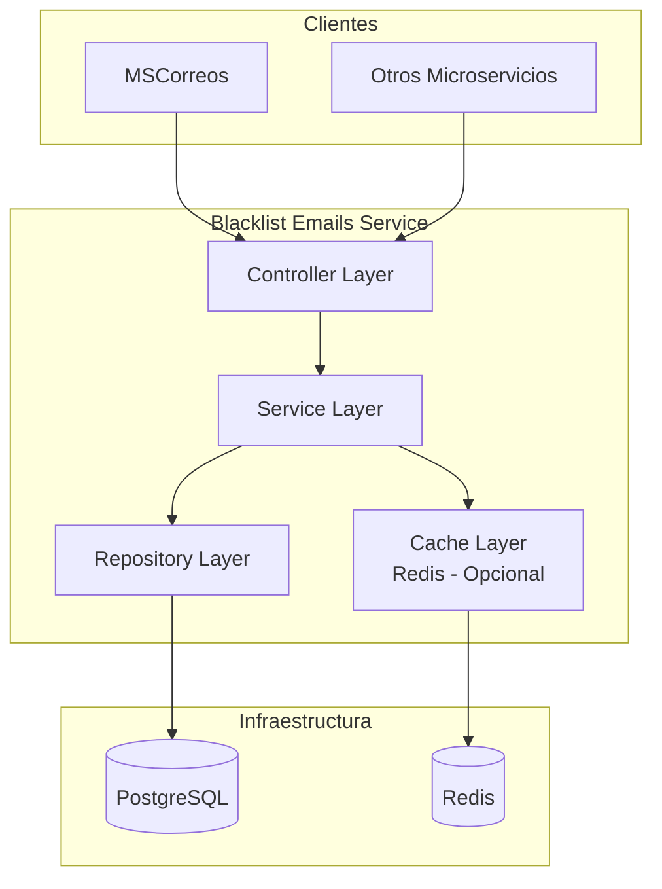

# Design Document: Blacklist Emails Component

## Overview

Componente global reutilizable para gestión de blacklist de correos electrónicos. Este componente será consumido por múltiples servicios del sistema (incluyendo MSCorreos) para verificar si un correo está bloqueado antes de enviar notificaciones. El componente es GLOBAL, sin asociación a ninguna empresa (no tiene tenant_id ni empresa_id), permitiendo su uso centralizado por todos los servicios del ecosistema.

## Arquitectura



## Modelo de Datos

### Tabla: blacklist_emails

```sql
CREATE TABLE blacklist_emails (
    id BIGSERIAL PRIMARY KEY,
    email VARCHAR(255) NOT NULL,
    razon VARCHAR(500),
    fecha_bloqueo TIMESTAMP NOT NULL DEFAULT CURRENT_TIMESTAMP,
    bloqueado_por VARCHAR(100),
    activo BOOLEAN NOT NULL DEFAULT true,
    
    -- Auditoría
    fecha_creacion TIMESTAMP NOT NULL DEFAULT CURRENT_TIMESTAMP,
    fecha_actualizacion TIMESTAMP,
    usuario_creacion VARCHAR(100),
    usuario_actualizacion VARCHAR(100)
);

-- Índice único para búsquedas rápidas de emails
CREATE UNIQUE INDEX idx_blacklist_email_unico ON blacklist_emails(email) WHERE activo = true;

-- Índice para búsquedas por estado
CREATE INDEX idx_blacklist_email_activo ON blacklist_emails(activo);

-- Índice para búsquedas por fecha
CREATE INDEX idx_blacklist_fecha_bloqueo ON blacklist_emails(fecha_bloqueo);
```

### Entidad Java

```java
package com.acosux.blacklist.entity;

import javax.persistence.*;
import java.time.LocalDateTime;

@Entity
@Table(name = "blacklist_emails")
public class BlacklistEmail {
    
    @Id
    @GeneratedValue(strategy = GenerationType.IDENTITY)
    private Long id;
    
    @Column(nullable = false, unique = true, length = 255)
    private String email;
    
    @Column(length = 500)
    private String razon;
    
    @Column(name = "fecha_bloqueo", nullable = false)
    private LocalDateTime fechaBloqueo;
    
    @Column(name = "bloqueado_por", length = 100)
    private String bloqueadoPor;
    
    @Column(nullable = false)
    private Boolean activo = true;
    
    @Column(name = "fecha_creacion", nullable = false, updatable = false)
    private LocalDateTime fechaCreacion;
    
    @Column(name = "fecha_actualizacion")
    private LocalDateTime fechaActualizacion;
    
    @Column(name = "usuario_creacion", length = 100)
    private String usuarioCreacion;
    
    @Column(name = "usuario_actualizacion", length = 100)
    private String usuarioActualizacion;
    
    // Getters and Setters
}
```

## Capas de la Arquitectura

### Controller Layer

```java
package com.acosux.blacklist.controller;

@RestController
@RequestMapping("/api/v1/blacklist-emails")
public class BlacklistEmailController {
    
    @Autowired
    private BlacklistEmailService service;
    
    // GET /api/v1/blacklist-emails/{email}
    // Verifica si un email está en blacklist
    @GetMapping("/{email}")
    public ResponseEntity<BlacklistCheckResponse> checkEmail(@PathVariable String email) {
        boolean bloqueado = service.isEmailBloqueado(email);
        return ResponseEntity.ok(new BlacklistCheckResponse(email, bloqueado));
    }
    
    // POST /api/v1/blacklist-emails
    // Agrega un email a la blacklist
    @PostMapping
    public ResponseEntity<BlacklistEmailResponse> agregarEmail(
            @Valid @RequestBody BlacklistEmailRequest request,
            @RequestHeader(value = "X-Usuario", required = false) String usuario) {
        BlacklistEmail email = service.agregarEmail(request, usuario);
        return ResponseEntity.status(HttpStatus.CREATED).body(toResponse(email));
    }
    
    // DELETE /api/v1/blacklist-emails/{email}
    // Elimina (desactiva) un email de la blacklist
    @DeleteMapping("/{email}")
    public ResponseEntity<Void> eliminarEmail(
            @PathVariable String email,
            @RequestHeader(value = "X-Usuario", required = false) String usuario) {
        service.eliminarEmail(email, usuario);
        return ResponseEntity.noContent().build();
    }
    
    // GET /api/v1/blacklist-emails
    // Lista emails en blacklist con paginación
    @GetMapping
    public ResponseEntity<Page<BlacklistEmailResponse>> listarEmails(
            @PageableDefault(size = 20, sort = "fechaBloqueo") Pageable pageable) {
        Page<BlacklistEmail> emails = service.listarEmails(pageable);
        return ResponseEntity.ok(emails.map(this::toResponse));
    }
}
```

### Service Layer

```java
package com.acosux.blacklist.service;

@Service
public class BlacklistEmailService {
    
    @Autowired
    private BlacklistEmailRepository repository;
    
    @Autowired
    private BlacklistEmailCache cache; // Redis cache
    
    private static final Logger logger = LoggerFactory.getLogger(BlacklistEmailService.class);
    
    /**
     * Verifica si un email está bloqueado.
     * Primero consulta cache, luego base de datos.
     */
    public boolean isEmailBloqueado(String email) {
        String emailNormalizado = normalizarEmail(email);
        
        // 1. Consultar cache primero
        Boolean cached = cache.get(emailNormalizado);
        if (cached != null) {
            logger.debug("Cache hit para email: {}", emailNormalizado);
            return cached;
        }
        
        // 2. Consultar base de datos
        boolean bloqueado = repository.existsByEmailAndActivoTrue(emailNormalizado);
        
        // 3. Actualizar cache
        cache.put(emailNormalizado, bloqueado);
        
        return bloqueado;
    }
    
    /**
     * Agrega un email a la blacklist.
     */
    @Transactional
    public BlacklistEmail agregarEmail(BlacklistEmailRequest request, String usuario) {
        String email = normalizarEmail(request.getEmail());
        
        // Verificar si ya existe
        Optional<BlacklistEmail> existente = repository.findByEmail(email);
        
        if (existente.isPresent()) {
            BlacklistEmail emailExistente = existente.get();
            if (emailExistente.getActivo()) {
                throw new EmailYaExisteException("El email ya está en blacklist");
            }
            // Reactivar email existente
            emailExistente.setActivo(true);
            emailExistente.setRazon(request.getRazon());
            emailExistente.setBloqueadoPor(usuario);
            emailExistente.setFechaBloqueo(LocalDateTime.now());
            emailExistente.setUsuarioActualizacion(usuario);
            emailExistente.setFechaActualizacion(LocalDateTime.now());
            
            BlacklistEmail guardado = repository.save(emailExistente);
            cache.invalidate(email);
            return guardado;
        }
        
        // Crear nuevo registro
        BlacklistEmail nuevo = new BlacklistEmail();
        nuevo.setEmail(email);
        nuevo.setRazon(request.getRazon());
        nuevo.setBloqueadoPor(usuario);
        nuevo.setFechaBloqueo(LocalDateTime.now());
        nuevo.setActivo(true);
        nuevo.setUsuarioCreacion(usuario);
        nuevo.setFechaCreacion(LocalDateTime.now());
        
        BlacklistEmail guardado = repository.save(nuevo);
        cache.put(email, true);
        
        return guardado;
    }
    
    /**
     * Elimina (desactiva) un email de la blacklist.
     */
    @Transactional
    public void eliminarEmail(String email, String usuario) {
        String emailNormalizado = normalizarEmail(email);
        
        BlacklistEmail emailExistente = repository.findByEmail(emailNormalizado)
            .orElseThrow(() -> new EmailNoEncontradoException("Email no encontrado en blacklist"));
        
        emailExistente.setActivo(false);
        emailExistente.setUsuarioActualizacion(usuario);
        emailExistente.setFechaActualizacion(LocalDateTime.now());
        
        repository.save(emailExistente);
        cache.invalidate(emailNormalizado);
    }
    
    /**
     * Normaliza email: lowercase y trim.
     */
    private String normalizarEmail(String email) {
        return email != null ? email.toLowerCase().trim() : null;
    }
}
```

### Repository Layer

```java
package com.acosux.blacklist.repository;

@Repository
public interface BlacklistEmailRepository extends JpaRepository<BlacklistEmail, Long> {
    
    Optional<BlacklistEmail> findByEmail(String email);
    
    boolean existsByEmailAndActivoTrue(String email);
    
    Page<BlacklistEmail> findByActivoTrue(Pageable pageable);
    
    long countByActivoTrue();
}
```

### Cache Layer (Redis - Opcional)

```java
package com.acosux.blacklist.cache;

@Component
public class BlacklistEmailCache {
    
    @Autowired
    private StringRedisTemplate redisTemplate;
    
    private static final String KEY_PREFIX = "blacklist:email:";
    private static final Duration TTL = Duration.ofHours(24);
    
    public Boolean get(String email) {
        String value = redisTemplate.opsForValue().get(KEY_PREFIX + email);
        return value != null ? Boolean.parseBoolean(value) : null;
    }
    
    public void put(String email, boolean bloqueado) {
        redisTemplate.opsForValue().set(KEY_PREFIX + email, String.valueOf(bloqueado), TTL);
    }
    
    public void invalidate(String email) {
        redisTemplate.delete(KEY_PREFIX + email);
    }
}
```

## Endpoints del API

| Método | Endpoint | Descripción | Respuesta |
|--------|----------|-------------|-----------|
| GET | /api/v1/blacklist-emails/{email} | Verificar si email está bloqueado | 200: { email, bloqueado } |
| POST | /api/v1/blacklist-emails | Agregar email a blacklist | 201: BlacklistEmailResponse |
| DELETE | /api/v1/blacklist-emails/{email} | Eliminar email de blacklist | 204: No Content |
| GET | /api/v1/blacklist-emails | Listar emails (paginado) | 200: Page<BlacklistEmailResponse> |
| GET | /api/v1/blacklist-emails/count | Contar emails activos | 200: { count } |

### DTOs

```java
// Request/Response DTOs
public class BlacklistCheckResponse {
    private String email;
    private boolean bloqueado;
    private LocalDateTime timestamp;
}

public class BlacklistEmailRequest {
    @NotBlank
    @Email
    private String email;
    
    @Size(max = 500)
    private String razon;
}

public class BlacklistEmailResponse {
    private Long id;
    private String email;
    private String razon;
    private LocalDateTime fechaBloqueo;
    private String bloqueadoPor;
    private Boolean activo;
}
```

## Patrones de Diseño

### 1. Repository Pattern
- Abstracción de la capa de datos
- Métodos de consulta específicos para el dominio
- Facilita testing con mocks

### 2. Service Layer Pattern
- Lógica de negocio centralizada
- Transacciones gestionadas a nivel de servicio
- Coordinación entre repository y cache

### 3. Cache-Aside Pattern
- Primero consulta cache, luego BD
- Actualiza cache en writes
- Invalida cache en deletes
- TTL de 24 horas para datos

### 4. DTO Pattern
- Separación entre entidades y contratos de API
- Control sobre qué campos se exponen
- Validación en capa de entrada

## Consideraciones de Performance

### Optimizaciones de Consulta
- **Índice único en email**: Búsqueda O(log n) en PostgreSQL
- **Cache en memoria (Redis)**: Latencia ~1ms vs ~10ms en BD
- **Conexiones pooleadas**: HikariCP con configuración óptima

### Configuración de Conexiones
```properties
# application.properties
spring.datasource.hikari.maximum-pool-size=20
spring.datasource.hikari.minimum-idle=5
spring.datasource.hikari.connection-timeout=30000
```

### Métricas Esperadas
- Consulta con cache: ~1-5ms
- Consulta sin cache (BD): ~5-15ms
- Inserción: ~10-20ms
- Throughput esperado: >1000 req/s

## Consideraciones de Escalabilidad

### Horizontal
- El componente puede desplegarse en múltiples instancias
- Redis como cache distribuido compartido
- Balanceador de carga frente al servicio

### Vertical
- PostgreSQL con índices optimizados
- Redis con suficiente memoria para cache
- Conexiones pooleadas para alta concurrencia

### Crecimiento Fututo
- Particionamiento de tabla si supera millones de registros
- Read replicas para lecturas frecuentes
- Considerar migración a tabla distribuida si es necesario

## Seguridad

- Validación de formato de email (RFC 5322)
- Sanitización de entrada para prevenir SQL injection
- Auditoría completa de operaciones
- Rate limiting en endpoints sensibles

## Excepciones Personalizadas

```java
@ResponseStatus(HttpStatus.CONFLICT)
public class EmailYaExisteException extends RuntimeException {
    public EmailYaExisteException(String message) {
        super(message);
    }
}

@ResponseStatus(HttpStatus.NOT_FOUND)
public class EmailNoEncontradoException extends RuntimeException {
    public EmailNoEncontradoException(String message) {
        super(message);
    }
}
```

## Dependencias Requeridas

```xml
<!-- pom.xml -->
<dependencies>
    <dependency>
        <groupId>org.springframework.boot</groupId>
        <artifactId>spring-boot-starter-web</artifactId>
    </dependency>
    <dependency>
        <groupId>org.springframework.boot</groupId>
        <artifactId>spring-boot-starter-data-jpa</artifactId>
    </dependency>
    <dependency>
        <groupId>org.springframework.boot</groupId>
        <artifactId>spring-boot-starter-data-redis</artifactId>
    </dependency>
    <dependency>
        <groupId>org.springframework.boot</groupId>
        <artifactId>spring-boot-starter-validation</artifactId>
    </dependency>
    <dependency>
        <groupId>org.postgresql</groupId>
        <artifactId>postgresql</artifactId>
        <scope>runtime</scope>
    </dependency>
</dependencies>
```

## Integración con MSCorreos

```java
// Ejemplo de uso en MSCorreos
@Service
public class NotificacionService {
    
    @Autowired
    private BlacklistEmailClient blacklistClient;
    
    public void enviarCorreo(CorreoDTO correo) {
        // Verificar blacklist antes de enviar
        if (blacklistClient.estaBloqueado(correo.getDestinatario())) {
            logger.warn("Email {} está en blacklist, no se enviará", correo.getDestinatario());
            return;
        }
        
        // Continuar con envío normal
        // ...
    }
}

// Feign Client para comunicación entre servicios
@FeignClient(name = "blacklist-emails-service", url = "${blacklist.service.url}")
public interface BlacklistEmailClient {
    
    @GetMapping("/api/v1/blacklist-emails/{email}")
    BlacklistCheckResponse checkEmail(@PathVariable("email") String email);
}
```

## Correctness Properties

*A property is a characteristic or behavior that should hold true across all valid executions of a system-essentially, a formal statement about what the system should do. Properties serve as the bridge between human-readable specifications and machine-verifiable correctness guarantees.*

### Property 1: Email Normalization

*For any* email string provided to the BlacklistEmailService, it SHALL be normalized to lowercase and trimmed before any operation

**Validates: Requirements 1.6**

### Property 2: Cache-Aside Pattern

*For any* email check request, the BlacklistEmailService SHALL first check the cache before querying the database

**Validates: Requirements 1.1, 1.2, 1.3**

### Property 3: Cache Update on Database Query

*For any* email check that results in a database query, the BlacklistEmailService SHALL update the cache with the result

**Validates: Requirements 1.4, 1.5**

### Property 4: Duplicate Email Prevention

*For any* attempt to add an email that already exists with activo = true, the BlacklistEmailService SHALL throw EmailYaExisteException

**Validates: Requirements 2.2**

### Property 5: Email Reactivation

*For any* email that exists with activo = false, when a new entry is attempted, the BlacklistEmailService SHALL reactivate the existing entry

**Validates: Requirements 2.3**

### Property 6: Soft Delete

*For any* email removal request, the BlacklistEmailService SHALL set activo = false rather than deleting the record

**Validates: Requirements 3.1**

### Property 7: Cache Invalidation on Write

*For any* successful write operation (add or remove), the BlacklistEmailService SHALL invalidate the corresponding cache entry

**Validates: Requirements 2.6, 3.4, 6.3**

### Property 8: Active Email Filtering

*For any* list query, the BlacklistEmailService SHALL only return entries where activo = true

**Validates: Requirements 4.1**

### Property 9: Cache TTL

*For any* cache entry stored by BlacklistEmailCache, it SHALL have a TTL of 24 hours

**Validates: Requirements 6.1**

### Property 10: Cache Key Prefix

*For any* cache operation, BlacklistEmailCache SHALL use the prefix "blacklist:email:" for all keys

**Validates: Requirements 6.2**

### Property 11: Unique Active Email Constraint

*For any* attempt to insert an email with activo = true when another entry with the same email and activo = true exists, the database SHALL reject the operation

**Validates: Requirements 7.1**

### Property 12: Email Format Validation

*For any* POST request to add an email, the API SHALL validate the email format using @Email annotation and reject invalid formats

**Validates: Requirements 8.6**

### Property 13: MSCorreos Integration - Skip Blocked Emails

*For any* email notification attempt in MSCorreos, when the email is found to be blocked, the service SHALL skip sending the notification

**Validates: Requirements 9.2, 9.3**

### Property 14: Round-Trip Email Check

*For any* email that is added to the blacklist, subsequent isEmailBloqueado calls SHALL return true for that email

**Validates: Requirements 1.4, 2.1**

### Property 15: Audit Fields on Create

*For any* new blacklist entry, the BlacklistEmailService SHALL set usuario_creacion and fecha_creacion fields

**Validates: Requirements 2.4, 2.5**

### Property 16: Audit Fields on Update

*For any* blacklist entry update, the BlacklistEmailService SHALL set usuario_actualizacion and fecha_actualizacion fields

**Validates: Requirements 3.3**