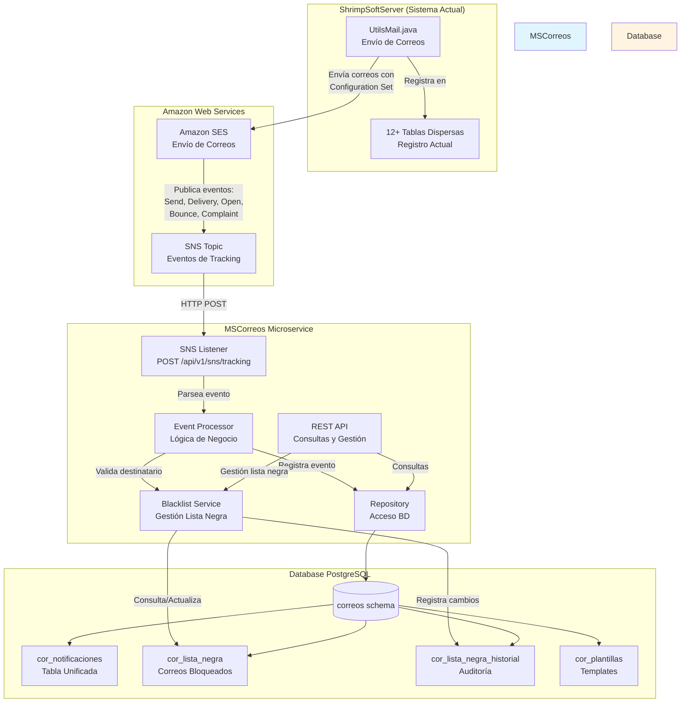
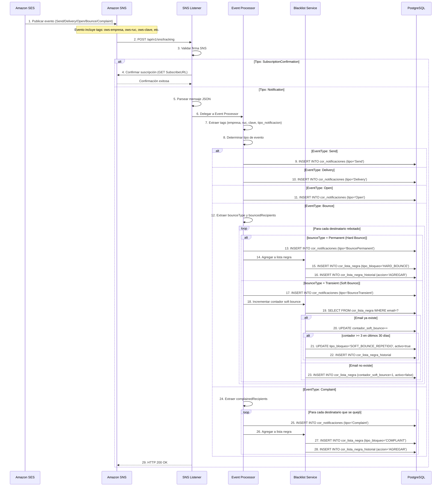
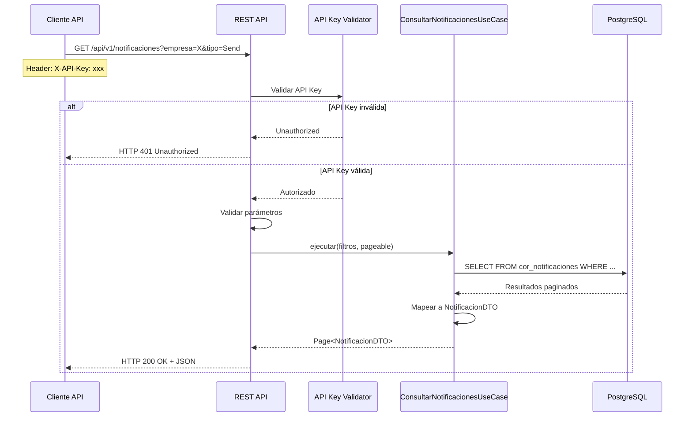
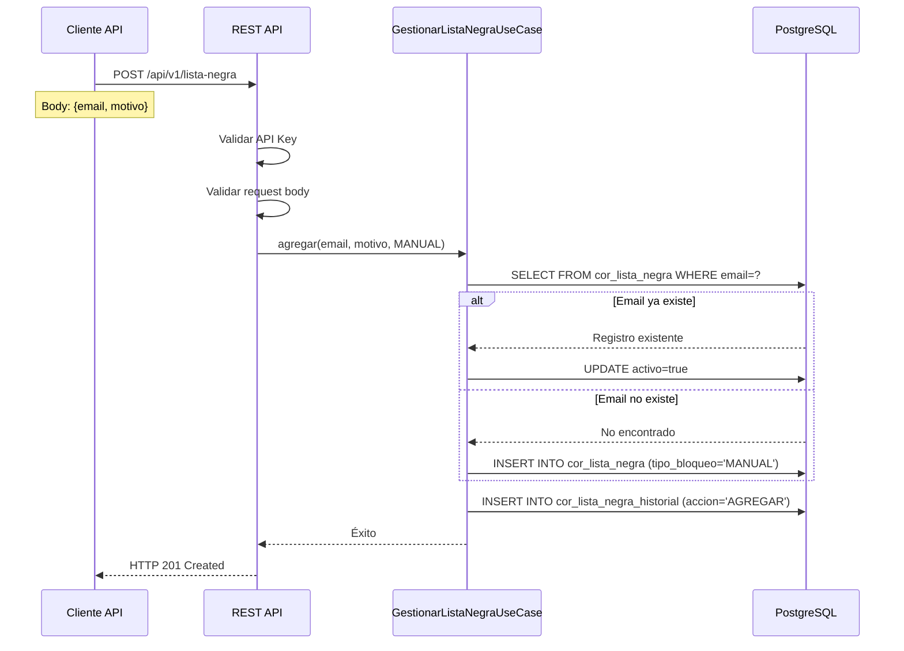
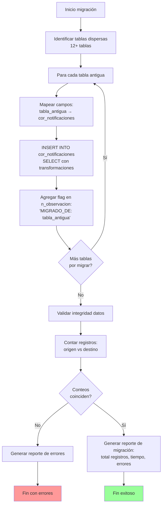

# Documento de Diseño Técnico: Consolidación de Tablas de Notificaciones

## Overview

Este documento describe el diseño técnico para consolidar las 12+ tablas dispersas de notificaciones en una única tabla `correos.cor_notificaciones` dentro del microservicio MSCorreos.

### Contexto del Problema

El sistema actual de ShrimpSoftServer envía correos usando `UtilsMail.java` y registra notificaciones en **12+ tablas dispersas** por módulo (anexo, inventario, recursoshumanos, cartera, contabilidad). Esta dispersión dificulta consultas globales, mantenimiento y gestión de lista negra.

### Solución Propuesta

MSCorreos será el **receptor centralizado de eventos de tracking** enviados por Amazon SNS cuando ShrimpSoftServer envía correos mediante SES. MSCorreos registrará todos los eventos (Send, Delivery, Open, Bounce, Complaint) en la tabla unificada y gestionará automáticamente la lista negra.

**IMPORTANTE**: SOLO MSCorreos será modificado. ShrimpSoftServer continuará usando `UtilsMail.java` para enviar correos.

### Objetivos del Diseño

1. **Centralización**: Consolidar todas las notificaciones en `correos.cor_notificaciones`
2. **Tracking Completo**: Registrar todos los eventos de Amazon SNS en tabla unificada
3. **Lista Negra**: Gestionar automáticamente correos bloqueados para evitar multas de AWS
4. **Migración**: Consolidar datos históricos de tablas dispersas sin pérdida de información
5. **API REST**: Exponer endpoints para consultas y gestión de lista negra

### Alcance

El diseño cubre:
- Arquitectura de MSCorreos (Clean Architecture con capas Domain, Application, Infrastructure, Presentation)
- Modelo de datos (tabla unificada, lista negra, plantillas)
- Componentes principales (SNS Listener, Repository, Blacklist Service, API REST)
- Flujos de proceso (recepción SNS, registro en BD, gestión lista negra)
- Migración de datos históricos
- Mapeo de campos específicos a tabla unificada


## Architecture

### Arquitectura de Alto Nivel



### Flujo de Datos Principal

1. **Envío de Correo (Sistema Actual - NO se modifica)**:
   - ShrimpSoftServer usa `UtilsMail.java` para enviar correos
   - UtilsMail envía mediante Amazon SES con Configuration Set configurado
   - UtilsMail establece tags en el mensaje: `ows-empresa`, `ows-ruc`, `ows-clave`, `ows-tipo-notificacion`, `ows-clave-acceso`
   - UtilsMail registra en tabla dispersa correspondiente (comportamiento actual)

2. **Tracking de Eventos (MSCorreos - NUEVO)**:
   - Amazon SES publica eventos a SNS Topic: Send, Delivery, Open, Bounce, Complaint
   - SNS envía HTTP POST a MSCorreos endpoint `/api/v1/sns/tracking`
   - MSCorreos valida firma SNS para seguridad
   - MSCorreos extrae tags del evento (empresa, RUC, clave, tipo_notificacion)
   - MSCorreos registra evento en `cor_notificaciones` con JSON completo

3. **Gestión Automática de Lista Negra**:
   - Si evento es Bounce Permanent: agregar email a `cor_lista_negra` con tipo `HARD_BOUNCE`
   - Si evento es Complaint: agregar email a `cor_lista_negra` con tipo `COMPLAINT`
   - Si evento es Bounce Transient: incrementar contador de soft bounces
   - Si email alcanza 3+ Soft Bounce en 30 días: agregar a lista negra con tipo `SOFT_BOUNCE_REPETIDO`
   - Registrar todos los cambios en `cor_lista_negra_historial`

4. **Consulta de Notificaciones**:
   - Cliente invoca API REST con filtros (empresa, RUC, tipo, fechas)
   - API valida API Key en header X-API-Key
   - Repository consulta `cor_notificaciones` con paginación
   - API retorna resultados en formato JSON

5. **Migración de Datos Históricos**:
   - Scripts SQL consolidan datos de 12+ tablas dispersas
   - Mapeo de campos específicos a `n_clave` y `n_informe`
   - Marcado de registros migrados en `n_observacion`
   - Validación de integridad de datos

### Componentes Principales de MSCorreos

#### SNS Listener
- **Responsabilidad**: Recibir eventos de tracking desde Amazon SNS
- **Tecnología**: Spring Web (REST Controller)
- **Endpoint**: `POST /api/v1/sns/tracking`
- **Validación**: Verifica firma de mensaje SNS usando AWS SDK
- **Procesamiento**: 
  - Confirma suscripción SNS automáticamente
  - Parsea eventos de tracking (JSON)
  - Delega procesamiento a Event Processor

#### Event Processor
- **Responsabilidad**: Procesar eventos de tracking y aplicar lógica de negocio
- **Funciones**:
  - Extraer tags del evento (empresa, RUC, clave, tipo_notificacion)
  - Determinar tipo de evento (Send, Delivery, Open, Bounce, Complaint)
  - Registrar evento en tabla unificada
  - Invocar Blacklist Service si es Bounce o Complaint
- **Patrón**: Strategy pattern para diferentes tipos de eventos

#### Blacklist Service
- **Responsabilidad**: Gestionar lista negra de correos bloqueados
- **Funciones**:
  - Consultar si email está en lista negra
  - Agregar email a lista negra (automático o manual)
  - Remover email de lista negra
  - Incrementar contador de soft bounces
  - Validar regla de 3+ soft bounces en 30 días
- **Performance**: Cache en memoria (Caffeine) con TTL 5 minutos
- **Patrón**: Service layer con inyección de dependencias

#### Repository
- **Responsabilidad**: Acceso a base de datos
- **Tecnología**: Spring Data JPA con PostgreSQL
- **Entidades**: 
  - `CorreosNotificaciones`: Tabla unificada de notificaciones
  - `ListaNegra`: Correos bloqueados
  - `ListaNegraHistorial`: Auditoría de cambios
  - `Plantilla`: Templates de correo (futuro)
- **Patrón**: Repository pattern

#### REST API
- **Responsabilidad**: Exponer endpoints para consultas y gestión
- **Tecnología**: Spring Web MVC
- **Seguridad**: API Key authentication (header X-API-Key)
- **Endpoints**:
  - `GET /api/v1/notificaciones`: Listar notificaciones con filtros
  - `GET /api/v1/notificaciones/{id}`: Obtener detalle de notificación
  - `GET /api/v1/lista-negra`: Consultar lista negra
  - `POST /api/v1/lista-negra`: Agregar email manualmente
  - `DELETE /api/v1/lista-negra/{email}`: Remover email de lista negra
  - `GET /api/v1/lista-negra/{email}/historial`: Historial de cambios

### Clean Architecture de MSCorreos

```
MSCorreos/
├── src/main/java/ec/com/todocompu/mscorreos/
│   ├── domain/                          # Capa de Dominio
│   │   ├── entities/                    # Entidades JPA
│   │   │   ├── CorreosNotificaciones.java
│   │   │   ├── ListaNegra.java
│   │   │   ├── ListaNegraHistorial.java
│   │   │   └── Plantilla.java
│   │   ├── valueobjects/                # Value Objects
│   │   │   ├── EmailAddress.java
│   │   │   └── ClaveAcceso.java
│   │   ├── enums/                       # Enumeraciones
│   │   │   ├── TipoEvento.java
│   │   │   ├── TipoBloqueo.java
│   │   │   └── TipoNotificacion.java
│   │   └── repositories/                # Interfaces de repositorio
│   │       ├── NotificacionesRepository.java
│   │       ├── ListaNegraRepository.java
│   │       └── ListaNegraHistorialRepository.java
│   │
│   ├── application/                     # Capa de Aplicación
│   │   ├── usecases/                    # Casos de uso
│   │   │   ├── ProcesarEventoTrackingUseCase.java
│   │   │   ├── ConsultarNotificacionesUseCase.java
│   │   │   └── GestionarListaNegraUseCase.java
│   │   ├── dtos/                        # DTOs
│   │   │   ├── TrackingEventDTO.java
│   │   │   ├── NotificacionDTO.java
│   │   │   └── ListaNegraDTO.java
│   │   └── services/                    # Servicios de aplicación
│   │       ├── EventProcessorService.java
│   │       └── BlacklistService.java
│   │
│   ├── infrastructure/                  # Capa de Infraestructura
│   │   ├── adapters/                    # Adaptadores
│   │   │   ├── sns/                     # Adaptador SNS
│   │   │   │   └── SNSMessageValidator.java
│   │   │   └── jpa/                     # Adaptador JPA
│   │   │       └── JpaRepositoryImpl.java
│   │   ├── config/                      # Configuración
│   │   │   ├── DatabaseConfig.java
│   │   │   ├── SecurityConfig.java
│   │   │   └── CacheConfig.java
│   │   └── exceptions/                  # Excepciones
│   │       └── MSCorreosException.java
│   │
│   └── presentation/                    # Capa de Presentación
│       ├── controllers/                 # Controllers REST
│       │   ├── SNSListenerController.java
│       │   ├── NotificacionesController.java
│       │   └── ListaNegraController.java
│       └── filters/                     # Filtros
│           └── ApiKeyAuthFilter.java
```

### Patrones de Diseño

1. **Clean Architecture**:
   - **Domain**: Entidades, Value Objects, Interfaces de repositorio (sin dependencias externas)
   - **Application**: Casos de uso, DTOs, Servicios de aplicación (lógica de negocio)
   - **Infrastructure**: Adaptadores JPA, SNS, Configuración (implementaciones concretas)
   - **Presentation**: Controllers REST, Filtros (capa de entrada)

2. **Repository Pattern**:
   - Abstrae acceso a datos
   - Permite testing con mocks
   - Facilita cambio de tecnología de persistencia

3. **Strategy Pattern**:
   - Procesamiento de diferentes tipos de eventos de tracking
   - Cada tipo de evento (Send, Delivery, Bounce, Complaint) tiene su estrategia

4. **Value Object Pattern**:
   - `EmailAddress`: Validación de formato de email
   - `ClaveAcceso`: Validación de clave de acceso de 49 dígitos

5. **Adapter Pattern**:
   - SNS Adapter: Abstrae validación de mensajes SNS
   - JPA Adapter: Abstrae acceso a base de datos


## Components and Interfaces

### Domain Layer

#### Entidades JPA

**CorreosNotificaciones**
```java
@Entity
@Table(name = "cor_notificaciones", schema = "correos")
public class CorreosNotificaciones {
    @Id
    @GeneratedValue(strategy = GenerationType.IDENTITY)
    @Column(name = "n_secuencial")
    private Integer nSecuencial;
    
    @NotNull
    @Column(name = "n_destinatario")
    private String nDestinatario;
    
    @NotNull
    @Temporal(TemporalType.TIMESTAMP)
    @Column(name = "n_fecha")
    private Date nFecha;
    
    @NotNull
    @Column(name = "n_tipo")
    private String nTipo; // Send, Delivery, Open, Bounce, BounceTransient, BouncePermanent, Complaint, Blocked
    
    @Column(name = "n_observacion", columnDefinition = "TEXT")
    private String nObservacion;
    
    @NotNull
    @Column(name = "n_informe", columnDefinition = "TEXT")
    private String nInforme; // JSON completo del evento SNS
    
    @NotNull
    @Column(name = "n_empresa")
    private String nEmpresa;
    
    @Column(name = "n_ruc")
    private String nRuc;
    
    @Column(name = "n_clave")
    private String nClave; // periodo_motivo_numero o sector_motivo_numero o contable
    
    @NotNull
    @Column(name = "n_tipo_notificacion")
    private String nTipoNotificacion; // NOTIFICAR_VENTA_ELECTRONICA_EMITIDA, etc.
    
    // Getters y Setters
}
```

**ListaNegra**
```java
@Entity
@Table(name = "cor_lista_negra", schema = "correos")
public class ListaNegra {
    @Id
    @GeneratedValue(strategy = GenerationType.IDENTITY)
    private Long id;
    
    @NotNull
    @Column(unique = true, length = 255)
    private String email;
    
    @NotNull
    @Column(columnDefinition = "TEXT")
    private String motivo;
    
    @NotNull
    @Temporal(TemporalType.TIMESTAMP)
    @Column(name = "fecha_registro")
    private Date fechaRegistro;
    
    @NotNull
    @Enumerated(EnumType.STRING)
    @Column(name = "tipo_bloqueo", length = 50)
    private TipoBloqueo tipoBloqueo; // HARD_BOUNCE, SOFT_BOUNCE_REPETIDO, COMPLAINT, MANUAL
    
    @NotNull
    private Boolean activo;
    
    @Column(name = "contador_soft_bounce")
    private Integer contadorSoftBounce;
    
    @Temporal(TemporalType.TIMESTAMP)
    @Column(name = "ultimo_soft_bounce")
    private Date ultimoSoftBounce;
    
    // Métodos de negocio
    public void incrementarSoftBounce() {
        this.contadorSoftBounce = (this.contadorSoftBounce == null) ? 1 : this.contadorSoftBounce + 1;
        this.ultimoSoftBounce = new Date();
        
        if (this.contadorSoftBounce >= 3) {
            this.tipoBloqueo = TipoBloqueo.SOFT_BOUNCE_REPETIDO;
            this.activo = true;
        }
    }
    
    public boolean debeSerBloqueado() {
        if (!activo) return false;
        
        if (tipoBloqueo == TipoBloqueo.SOFT_BOUNCE_REPETIDO && ultimoSoftBounce != null) {
            // Verificar si han pasado más de 30 días desde último soft bounce
            long diasDesdeUltimoBounce = ChronoUnit.DAYS.between(
                ultimoSoftBounce.toInstant(), 
                Instant.now()
            );
            return diasDesdeUltimoBounce <= 30;
        }
        
        return true;
    }
    
    // Getters y Setters
}
```

**ListaNegraHistorial**
```java
@Entity
@Table(name = "cor_lista_negra_historial", schema = "correos")
public class ListaNegraHistorial {
    @Id
    @GeneratedValue(strategy = GenerationType.IDENTITY)
    private Long id;
    
    @NotNull
    @Column(length = 255)
    private String email;
    
    @NotNull
    @Enumerated(EnumType.STRING)
    @Column(length = 20)
    private AccionListaNegra accion; // AGREGAR, REMOVER
    
    @NotNull
    @Column(columnDefinition = "TEXT")
    private String motivo;
    
    @Column(length = 100)
    private String usuario; // Usuario que realizó la acción (NULL para acciones automáticas)
    
    @NotNull
    @Temporal(TemporalType.TIMESTAMP)
    private Date fecha;
    
    // Getters y Setters
}
```

**Plantilla** (Futuro)
```java
@Entity
@Table(name = "cor_plantillas", schema = "correos")
public class Plantilla {
    @Id
    @GeneratedValue(strategy = GenerationType.IDENTITY)
    private Long id;
    
    @NotNull
    @Column(length = 100)
    private String empresa;
    
    @NotNull
    @Column(name = "tipo_notificacion", length = 100)
    private String tipoNotificacion;
    
    @NotNull
    @Column(name = "asunto_template", columnDefinition = "TEXT")
    private String asuntoTemplate;
    
    @NotNull
    @Column(name = "cuerpo_html_template", columnDefinition = "TEXT")
    private String cuerpoHtmlTemplate;
    
    @NotNull
    @Column(name = "cuerpo_texto_template", columnDefinition = "TEXT")
    private String cuerpoTextoTemplate;
    
    @Temporal(TemporalType.TIMESTAMP)
    @Column(name = "fecha_creacion")
    private Date fechaCreacion;
    
    @Temporal(TemporalType.TIMESTAMP)
    @Column(name = "fecha_modificacion")
    private Date fechaModificacion;
    
    // Getters y Setters
}
```

#### Enumeraciones

```java
public enum TipoBloqueo {
    HARD_BOUNCE,           // Rebote permanente (dirección no existe)
    SOFT_BOUNCE_REPETIDO,  // 3+ rebotes temporales en 30 días
    COMPLAINT,             // Queja de spam
    MANUAL                 // Bloqueado manualmente por administrador
}

public enum AccionListaNegra {
    AGREGAR,   // Email agregado a lista negra
    REMOVER    // Email removido de lista negra
}

public enum TipoEvento {
    SEND,               // Correo enviado
    DELIVERY,           // Correo entregado
    OPEN,               // Correo abierto
    CLICK,              // Link clickeado
    BOUNCE_TRANSIENT,   // Rebote temporal (soft bounce)
    BOUNCE_PERMANENT,   // Rebote permanente (hard bounce)
    COMPLAINT,          // Queja de spam
    BLOCKED             // Bloqueado por lista negra
}
```


#### Value Objects

**EmailAddress**
```java
public class EmailAddress {
    private final String value;
    
    public EmailAddress(String email) {
        if (!isValid(email)) {
            throw new IllegalArgumentException("Email inválido: " + email);
        }
        this.value = email.toLowerCase().trim();
    }
    
    private boolean isValid(String email) {
        // Validación con regex RFC 5322
        return email != null && 
               email.matches("^[a-zA-Z0-9._%+-]+@[a-zA-Z0-9.-]+\\.[a-zA-Z]{2,}$");
    }
    
    public String getValue() {
        return value;
    }
    
    @Override
    public boolean equals(Object o) {
        if (this == o) return true;
        if (o == null || getClass() != o.getClass()) return false;
        EmailAddress that = (EmailAddress) o;
        return Objects.equals(value, that.value);
    }
    
    @Override
    public int hashCode() {
        return Objects.hash(value);
    }
}
```

**ClaveAcceso**
```java
public class ClaveAcceso {
    private final String value;
    
    public ClaveAcceso(String clave) {
        if (clave == null || clave.length() != 49) {
            throw new IllegalArgumentException("Clave de acceso debe tener 49 dígitos");
        }
        if (!clave.matches("\\d{49}")) {
            throw new IllegalArgumentException("Clave de acceso debe contener solo dígitos");
        }
        this.value = clave;
    }
    
    public String getTipoComprobante() {
        // Posiciones 9-10 (0-indexed: 8-9)
        return value.substring(8, 10);
    }
    
    public String getValue() {
        return value;
    }
    
    @Override
    public boolean equals(Object o) {
        if (this == o) return true;
        if (o == null || getClass() != o.getClass()) return false;
        ClaveAcceso that = (ClaveAcceso) o;
        return Objects.equals(value, that.value);
    }
    
    @Override
    public int hashCode() {
        return Objects.hash(value);
    }
}
```

#### Interfaces de Repositorio

```java
public interface NotificacionesRepository extends JpaRepository<CorreosNotificaciones, Integer> {
    
    // Consulta por empresa y tipo de notificación con rango de fechas
    Page<CorreosNotificaciones> findByNEmpresaAndNTipoNotificacionAndNFechaBetween(
        String empresa, 
        String tipoNotificacion, 
        Date fechaInicio, 
        Date fechaFin, 
        Pageable pageable
    );
    
    // Consulta por destinatario (búsqueda parcial)
    Page<CorreosNotificaciones> findByNDestinatarioContaining(
        String destinatario, 
        Pageable pageable
    );
    
    // Consulta por RUC y clave
    List<CorreosNotificaciones> findByNRucAndNClave(String ruc, String clave);
    
    // Consulta por tipo de evento
    Page<CorreosNotificaciones> findByNTipo(String tipo, Pageable pageable);
    
    // Contar notificaciones por empresa y tipo
    @Query("SELECT COUNT(n) FROM CorreosNotificaciones n " +
           "WHERE n.nEmpresa = :empresa AND n.nTipoNotificacion = :tipoNotificacion")
    Long countByEmpresaAndTipoNotificacion(
        @Param("empresa") String empresa, 
        @Param("tipoNotificacion") String tipoNotificacion
    );
}

public interface ListaNegraRepository extends JpaRepository<ListaNegra, Long> {
    
    // Buscar email activo en lista negra
    Optional<ListaNegra> findByEmailAndActivoTrue(String email);
    
    // Buscar por tipo de bloqueo
    List<ListaNegra> findByTipoBloqueoAndActivoTrue(TipoBloqueo tipoBloqueo);
    
    // Buscar soft bounces recientes (últimos 30 días)
    @Query("SELECT ln FROM ListaNegra ln " +
           "WHERE ln.activo = true " +
           "AND ln.tipoBloqueo = 'SOFT_BOUNCE_REPETIDO' " +
           "AND ln.ultimoSoftBounce >= :fecha")
    List<ListaNegra> findSoftBouncesRecientes(@Param("fecha") Date fecha);
    
    // Contar emails en lista negra
    Long countByActivoTrue();
}

public interface ListaNegraHistorialRepository extends JpaRepository<ListaNegraHistorial, Long> {
    
    // Historial de un email específico
    List<ListaNegraHistorial> findByEmailOrderByFechaDesc(String email);
    
    // Historial reciente (últimos 30 días)
    List<ListaNegraHistorial> findByFechaAfterOrderByFechaDesc(Date fecha);
}

public interface PlantillaRepository extends JpaRepository<Plantilla, Long> {
    
    // Buscar plantilla por empresa y tipo de notificación
    Optional<Plantilla> findByEmpresaAndTipoNotificacion(
        String empresa, 
        String tipoNotificacion
    );
}
```

### Application Layer

#### DTOs

**TrackingEventDTO** (Evento SNS)
```java
public class TrackingEventDTO {
    private String eventType; // Send, Delivery, Open, Bounce, Complaint
    private MailInfo mail;
    private DeliveryInfo delivery;
    private BounceInfo bounce;
    private ComplaintInfo complaint;
    private OpenInfo open;
    private ClickInfo click;
    
    // Getters y Setters
}

public class MailInfo {
    private String timestamp;
    private String messageId;
    private CommonHeaders commonHeaders;
    private Map<String, List<String>> tags; // Tags de SES: ows-empresa, ows-ruc, etc.
    
    // Getters y Setters
}

public class CommonHeaders {
    private List<String> to;
    private String from;
    private List<String> replyTo;
    private String subject;
    
    // Getters y Setters
}

public class BounceInfo {
    private String bounceType; // Permanent, Transient, Undetermined
    private String bounceSubType;
    private List<BouncedRecipient> bouncedRecipients;
    private String timestamp;
    private String feedbackId;
    
    // Getters y Setters
}

public class BouncedRecipient {
    private String emailAddress;
    private String diagnosticCode;
    private String status;
    private String action;
    
    // Getters y Setters
}

public class ComplaintInfo {
    private List<ComplainedRecipient> complainedRecipients;
    private String timestamp;
    private String complaintFeedbackType; // abuse, fraud, virus, etc.
    private String feedbackId;
    
    // Getters y Setters
}

public class ComplainedRecipient {
    private String emailAddress;
    
    // Getters y Setters
}
```

**NotificacionDTO** (Response API)
```java
public class NotificacionDTO {
    private Integer id;
    private String destinatario;
    private Date fecha;
    private String tipo;
    private String observacion;
    private String empresa;
    private String ruc;
    private String clave;
    private String tipoNotificacion;
    
    // Getters y Setters
}

public class NotificacionDetalleDTO extends NotificacionDTO {
    private String informeJson; // JSON completo del evento
    
    // Getters y Setters
}

public class FiltrosNotificacion {
    private String empresa;
    private String ruc;
    private String tipoNotificacion;
    private Date fechaInicio;
    private Date fechaFin;
    private String destinatario;
    private String tipo;
    
    // Getters, Setters y Builder
}
```

**ListaNegraDTO**
```java
public class ListaNegraDTO {
    private Long id;
    private String email;
    private String motivo;
    private Date fechaRegistro;
    private String tipoBloqueo;
    private Boolean activo;
    private Integer contadorSoftBounce;
    private Date ultimoSoftBounce;
    
    // Getters y Setters
}

public class AgregarListaNegraRequest {
    @NotNull(message = "Email es requerido")
    @Email(message = "Email debe ser válido")
    private String email;
    
    @NotNull(message = "Motivo es requerido")
    private String motivo;
    
    private String tipoBloqueo; // Default: MANUAL
    
    // Getters y Setters
}

public class FiltrosListaNegra {
    private String tipoBloqueo;
    private Date fechaDesde;
    private Date fechaHasta;
    private Boolean activo;
    
    // Getters, Setters y Builder
}
```

#### Casos de Uso

```java
public interface ProcesarEventoTrackingUseCase {
    /**
     * Procesa un evento de tracking recibido desde Amazon SNS
     * @param evento Evento de tracking parseado
     * @throws TrackingException si hay error en el procesamiento
     */
    void ejecutar(TrackingEventDTO evento) throws TrackingException;
}

public interface ConsultarNotificacionesUseCase {
    /**
     * Consulta notificaciones con filtros y paginación
     * @param filtros Filtros de búsqueda
     * @param pageable Configuración de paginación
     * @return Página de notificaciones
     */
    Page<NotificacionDTO> ejecutar(FiltrosNotificacion filtros, Pageable pageable);
    
    /**
     * Obtiene detalle completo de una notificación
     * @param id ID de la notificación
     * @return Detalle de la notificación
     * @throws NotificacionNotFoundException si no existe
     */
    NotificacionDetalleDTO obtenerDetalle(Integer id) throws NotificacionNotFoundException;
}

public interface GestionarListaNegraUseCase {
    /**
     * Agrega un email a la lista negra
     * @param email Email a bloquear
     * @param motivo Motivo del bloqueo
     * @param tipo Tipo de bloqueo
     */
    void agregar(String email, String motivo, TipoBloqueo tipo);
    
    /**
     * Remueve un email de la lista negra (desactiva)
     * @param email Email a desbloquear
     * @param motivo Motivo de la remoción
     * @param usuario Usuario que realiza la acción
     */
    void remover(String email, String motivo, String usuario);
    
    /**
     * Verifica si un email está en lista negra
     * @param email Email a verificar
     * @return true si está bloqueado
     */
    boolean estaEnListaNegra(String email);
    
    /**
     * Consulta lista negra con filtros
     * @param filtros Filtros de búsqueda
     * @param pageable Configuración de paginación
     * @return Página de emails bloqueados
     */
    Page<ListaNegraDTO> consultar(FiltrosListaNegra filtros, Pageable pageable);
    
    /**
     * Obtiene historial de cambios de un email
     * @param email Email a consultar
     * @return Lista de cambios históricos
     */
    List<ListaNegraHistorial> obtenerHistorial(String email);
}
```


## Data Models

### Esquema de Base de Datos

#### Tabla: correos.cor_notificaciones

```sql
CREATE TABLE correos.cor_notificaciones (
    n_secuencial SERIAL PRIMARY KEY,
    n_destinatario TEXT NOT NULL,
    n_fecha TIMESTAMP WITHOUT TIME ZONE NOT NULL,
    n_tipo TEXT NOT NULL, -- Send, Delivery, Open, Bounce, BounceTransient, BouncePermanent, Complaint, Blocked
    n_observacion TEXT,
    n_informe TEXT NOT NULL, -- JSON completo del evento
    n_empresa TEXT NOT NULL,
    n_ruc TEXT,
    n_clave TEXT,
    n_tipo_notificacion TEXT NOT NULL
);

-- Índices para performance
CREATE INDEX idx_cor_notificaciones_empresa ON correos.cor_notificaciones(n_empresa);
CREATE INDEX idx_cor_notificaciones_tipo_notificacion ON correos.cor_notificaciones(n_tipo_notificacion);
CREATE INDEX idx_cor_notificaciones_fecha ON correos.cor_notificaciones(n_fecha DESC);
CREATE INDEX idx_cor_notificaciones_destinatario ON correos.cor_notificaciones(n_destinatario);
CREATE INDEX idx_cor_notificaciones_ruc_clave ON correos.cor_notificaciones(n_ruc, n_clave);
CREATE INDEX idx_cor_notificaciones_tipo ON correos.cor_notificaciones(n_tipo);

-- Índice compuesto para consultas frecuentes
CREATE INDEX idx_cor_notificaciones_empresa_tipo_fecha 
    ON correos.cor_notificaciones(n_empresa, n_tipo_notificacion, n_fecha DESC);
```

#### Tabla: correos.cor_lista_negra

```sql
CREATE TABLE correos.cor_lista_negra (
    id BIGSERIAL PRIMARY KEY,
    email VARCHAR(255) NOT NULL UNIQUE,
    motivo TEXT NOT NULL,
    fecha_registro TIMESTAMP WITHOUT TIME ZONE NOT NULL DEFAULT CURRENT_TIMESTAMP,
    tipo_bloqueo VARCHAR(50) NOT NULL, -- HARD_BOUNCE, SOFT_BOUNCE_REPETIDO, COMPLAINT, MANUAL
    activo BOOLEAN NOT NULL DEFAULT TRUE,
    contador_soft_bounce INTEGER DEFAULT 0,
    ultimo_soft_bounce TIMESTAMP WITHOUT TIME ZONE
);

-- Índices
CREATE INDEX idx_lista_negra_email_activo ON correos.cor_lista_negra(email, activo);
CREATE INDEX idx_lista_negra_tipo_bloqueo ON correos.cor_lista_negra(tipo_bloqueo) WHERE activo = TRUE;
CREATE INDEX idx_lista_negra_fecha_registro ON correos.cor_lista_negra(fecha_registro DESC);
CREATE INDEX idx_lista_negra_ultimo_soft_bounce ON correos.cor_lista_negra(ultimo_soft_bounce) 
    WHERE tipo_bloqueo = 'SOFT_BOUNCE_REPETIDO' AND activo = TRUE;

-- Constraints
ALTER TABLE correos.cor_lista_negra
ADD CONSTRAINT chk_tipo_bloqueo 
CHECK (tipo_bloqueo IN ('HARD_BOUNCE', 'SOFT_BOUNCE_REPETIDO', 'COMPLAINT', 'MANUAL'));
```

#### Tabla: correos.cor_lista_negra_historial

```sql
CREATE TABLE correos.cor_lista_negra_historial (
    id BIGSERIAL PRIMARY KEY,
    email VARCHAR(255) NOT NULL,
    accion VARCHAR(20) NOT NULL, -- AGREGAR, REMOVER
    motivo TEXT NOT NULL,
    usuario VARCHAR(100), -- Usuario que realizó la acción (NULL para acciones automáticas)
    fecha TIMESTAMP WITHOUT TIME ZONE NOT NULL DEFAULT CURRENT_TIMESTAMP
);

-- Índices
CREATE INDEX idx_lista_negra_historial_email ON correos.cor_lista_negra_historial(email);
CREATE INDEX idx_lista_negra_historial_fecha ON correos.cor_lista_negra_historial(fecha DESC);

-- Constraints
ALTER TABLE correos.cor_lista_negra_historial
ADD CONSTRAINT chk_accion 
CHECK (accion IN ('AGREGAR', 'REMOVER'));
```

#### Tabla: correos.cor_plantillas

```sql
CREATE TABLE correos.cor_plantillas (
    id BIGSERIAL PRIMARY KEY,
    empresa VARCHAR(100) NOT NULL,
    tipo_notificacion VARCHAR(100) NOT NULL,
    asunto_template TEXT NOT NULL,
    cuerpo_html_template TEXT NOT NULL,
    cuerpo_texto_template TEXT NOT NULL,
    fecha_creacion TIMESTAMP WITHOUT TIME ZONE NOT NULL DEFAULT CURRENT_TIMESTAMP,
    fecha_modificacion TIMESTAMP WITHOUT TIME ZONE,
    UNIQUE(empresa, tipo_notificacion)
);

-- Índices
CREATE INDEX idx_plantillas_empresa_tipo ON correos.cor_plantillas(empresa, tipo_notificacion);
```

### Mapeo de Campos Específicos a Tabla Unificada

#### Comprobantes Electrónicos (Ventas, Compras, Guías)

**Tablas origen**:
- `anexo.anx_venta_electronica_notificaciones`
- `anexo.anx_compra_electronica_notificaciones`
- `anexo.anx_guia_remision_electronica_notificaciones`

**Mapeo**:
```sql
-- Campos específicos: ven_periodo, ven_motivo, ven_numero
-- Mapeo a tabla unificada:
n_clave = ven_periodo || '_' || ven_motivo || '_' || ven_numero
n_ruc = extraer de JSON si existe
n_tipo_notificacion = 'NOTIFICAR_VENTA_ELECTRONICA_EMITIDA'
```

#### Órdenes de Compra

**Tablas origen**:
- `inventario.inv_pedidos_orden_compra_notificaciones`
- `inventario.inv_pedidos_orden_compra_anulada_notificaciones`

**Mapeo**:
```sql
-- Campos específicos: oc_sector, oc_motivo, oc_numero
-- Mapeo a tabla unificada:
n_clave = oc_sector || '_' || oc_motivo || '_' || oc_numero
n_tipo_notificacion = 'NOTIFICAR_PROVEEDOR_ORDEN_COMPRA' o 'NOTIFICAR_PROVEEDOR_ANULACION_ORDEN_COMPRA'
```

#### Roles de Pago

**Tabla origen**:
- `recursoshumanos.rh_rol_pago_notificaciones`

**Mapeo**:
```sql
-- Campos específicos: rpn_contable
-- Mapeo a tabla unificada:
n_clave = rpn_contable
n_tipo_notificacion = 'NOTIFICAR_ROL_PAGOS'
```

#### Clientes

**Tabla origen**:
- `inventario.inv_cliente_notificaciones`

**Mapeo**:
```sql
-- Campos específicos: cli_codigo, asunto, motivo
-- Mapeo a tabla unificada:
n_clave = cli_codigo
n_observacion = asunto || ' - ' || motivo
n_tipo_notificacion = extraer de contexto
```

### Agregados del Dominio

#### Agregado Notificacion

**Root**: CorreosNotificaciones

**Invariantes**:
- `n_destinatario` debe ser un email válido
- `n_fecha` no puede ser futura
- `n_tipo` debe ser uno de los valores permitidos
- `n_informe` debe ser JSON válido
- `n_empresa` no puede estar vacía

#### Agregado ListaNegra

**Root**: ListaNegra

**Invariantes**:
- `email` debe ser único y válido
- Si `tipo_bloqueo` es `SOFT_BOUNCE_REPETIDO`, `contador_soft_bounce` >= 3
- Si `activo` es false, debe existir registro en historial con accion `REMOVER`
- `ultimo_soft_bounce` debe ser <= `fecha_registro` + 30 días para `SOFT_BOUNCE_REPETIDO`

**Comportamientos**:
```java
public class ListaNegra {
    public void incrementarSoftBounce() {
        this.contadorSoftBounce++;
        this.ultimoSoftBounce = new Date();
        
        if (this.contadorSoftBounce >= 3) {
            this.tipoBloqueo = TipoBloqueo.SOFT_BOUNCE_REPETIDO;
            this.activo = true;
        }
    }
    
    public boolean debeSerBloqueado() {
        if (!activo) return false;
        
        if (tipoBloqueo == TipoBloqueo.SOFT_BOUNCE_REPETIDO) {
            // Verificar si han pasado más de 30 días desde último soft bounce
            long diasDesdeUltimoBounce = ChronoUnit.DAYS.between(
                ultimoSoftBounce.toInstant(), 
                Instant.now()
            );
            return diasDesdeUltimoBounce <= 30;
        }
        
        return true;
    }
}
```


## Flujos de Proceso

### Flujo 1: Recepción de Evento SNS y Registro en BD




### Flujo 2: Consulta de Notificaciones vía API REST



### Flujo 3: Gestión Manual de Lista Negra



### Flujo 4: Migración de Datos Históricos




## Migración de Datos Históricos

### Scripts SQL de Migración

#### Script 1: Migrar Ventas Electrónicas

```sql
-- Migrar anexo.anx_venta_electronica_notificaciones
INSERT INTO correos.cor_notificaciones 
    (n_destinatario, n_fecha, n_tipo, n_observacion, n_informe, 
     n_empresa, n_ruc, n_clave, n_tipo_notificacion)
SELECT 
    e_destinatario,
    e_fecha,
    e_tipo,
    COALESCE(e_observacion, '') || ' [MIGRADO_DE: anx_venta_electronica_notificaciones]',
    e_informe,
    ven_empresa,
    NULL, -- RUC se extrae del JSON si existe
    ven_periodo || '_' || ven_motivo || '_' || ven_numero,
    'NOTIFICAR_VENTA_ELECTRONICA_EMITIDA'
FROM anexo.anx_venta_electronica_notificaciones;
```

#### Script 2: Migrar Compras Electrónicas

```sql
-- Migrar anexo.anx_compra_electronica_notificaciones
INSERT INTO correos.cor_notificaciones 
    (n_destinatario, n_fecha, n_tipo, n_observacion, n_informe, 
     n_empresa, n_ruc, n_clave, n_tipo_notificacion)
SELECT 
    e_destinatario,
    e_fecha,
    e_tipo,
    COALESCE(e_observacion, '') || ' [MIGRADO_DE: anx_compra_electronica_notificaciones]',
    e_informe,
    com_empresa,
    NULL,
    com_periodo || '_' || com_motivo || '_' || com_numero,
    'NOTIFICAR_COMPRA_ELECTRONICA_EMITIDA'
FROM anexo.anx_compra_electronica_notificaciones;
```

#### Script 3: Migrar Guías de Remisión

```sql
-- Migrar anexo.anx_guia_remision_electronica_notificaciones
INSERT INTO correos.cor_notificaciones 
    (n_destinatario, n_fecha, n_tipo, n_observacion, n_informe, 
     n_empresa, n_ruc, n_clave, n_tipo_notificacion)
SELECT 
    e_destinatario,
    e_fecha,
    e_tipo,
    COALESCE(e_observacion, '') || ' [MIGRADO_DE: anx_guia_remision_electronica_notificaciones]',
    e_informe,
    guia_empresa,
    NULL,
    guia_periodo || '_' || guia_motivo || '_' || guia_numero,
    'NOTIFICAR_GUIA_REMISION'
FROM anexo.anx_guia_remision_electronica_notificaciones;
```

#### Script 4: Migrar Órdenes de Compra

```sql
-- Migrar inventario.inv_pedidos_orden_compra_notificaciones
INSERT INTO correos.cor_notificaciones 
    (n_destinatario, n_fecha, n_tipo, n_observacion, n_informe, 
     n_empresa, n_ruc, n_clave, n_tipo_notificacion)
SELECT 
    ocn_destinatario,
    ocn_fecha,
    ocn_tipo,
    COALESCE(ocn_observacion, '') || ' [MIGRADO_DE: inv_pedidos_orden_compra_notificaciones]',
    ocn_informe,
    oc_empresa,
    NULL,
    oc_sector || '_' || oc_motivo || '_' || oc_numero,
    'NOTIFICAR_PROVEEDOR_ORDEN_COMPRA'
FROM inventario.inv_pedidos_orden_compra_notificaciones;
```

#### Script 5: Migrar Roles de Pago

```sql
-- Migrar recursoshumanos.rh_rol_pago_notificaciones
INSERT INTO correos.cor_notificaciones 
    (n_destinatario, n_fecha, n_tipo, n_observacion, n_informe, 
     n_empresa, n_ruc, n_clave, n_tipo_notificacion)
SELECT 
    rpn_destinatario,
    rpn_fecha,
    rpn_tipo,
    COALESCE(rpn_observacion, '') || ' [MIGRADO_DE: rh_rol_pago_notificaciones]',
    rpn_informe,
    rpn_empresa,
    NULL,
    rpn_contable,
    'NOTIFICAR_ROL_PAGOS'
FROM recursoshumanos.rh_rol_pago_notificaciones;
```

### Script de Validación

```sql
-- Validar integridad de migración
DO $$
DECLARE
    total_origen INTEGER;
    total_destino INTEGER;
    tabla_nombre TEXT;
BEGIN
    -- Contar registros en tablas origen
    SELECT COUNT(*) INTO total_origen FROM anexo.anx_venta_electronica_notificaciones;
    SELECT COUNT(*) INTO total_destino FROM correos.cor_notificaciones 
        WHERE n_observacion LIKE '%MIGRADO_DE: anx_venta_electronica_notificaciones%';
    
    RAISE NOTICE 'Ventas Electrónicas - Origen: %, Destino: %', total_origen, total_destino;
    
    -- Repetir para cada tabla...
    
    -- Validar que no hay registros duplicados
    SELECT COUNT(*) INTO total_destino FROM (
        SELECT n_destinatario, n_fecha, n_empresa, n_tipo_notificacion, COUNT(*)
        FROM correos.cor_notificaciones
        GROUP BY n_destinatario, n_fecha, n_empresa, n_tipo_notificacion
        HAVING COUNT(*) > 1
    ) AS duplicados;
    
    IF total_destino > 0 THEN
        RAISE WARNING 'Se encontraron % registros duplicados', total_destino;
    ELSE
        RAISE NOTICE 'No se encontraron duplicados';
    END IF;
END $$;
```


## Error Handling

### Estrategia de Manejo de Errores

#### Errores de Validación SNS

```java
@RestController
@RequestMapping("/api/v1/sns")
public class SNSListenerController {
    
    @PostMapping("/tracking")
    public ResponseEntity<Void> receiveTrackingEvent(@RequestBody String payload) {
        try {
            // Validar firma SNS
            if (!snsMessageValidator.validarFirma(payload)) {
                log.error("Firma SNS inválida");
                return ResponseEntity.status(HttpStatus.UNAUTHORIZED).build();
            }
            
            // Procesar evento
            procesarEventoTrackingUseCase.ejecutar(evento);
            return ResponseEntity.ok().build();
            
        } catch (JsonProcessingException e) {
            log.error("Error parseando JSON del evento SNS", e);
            return ResponseEntity.status(HttpStatus.BAD_REQUEST).build();
        } catch (Exception e) {
            log.error("Error inesperado procesando evento SNS", e);
            return ResponseEntity.status(HttpStatus.INTERNAL_SERVER_ERROR).build();
        }
    }
}
```

#### Errores de Base de Datos

```java
@Service
public class EventProcessorServiceImpl implements EventProcessorService {
    
    @Transactional
    public void procesarEvento(TrackingEventDTO evento) {
        try {
            // Registrar en BD
            notificacionesRepository.save(notificacion);
            
        } catch (DataIntegrityViolationException e) {
            log.error("Error de integridad de datos", e);
            throw new TrackingException("Datos inválidos en evento", e);
        } catch (DataAccessException e) {
            log.error("Error de acceso a base de datos", e);
            throw new TrackingException("Error guardando notificación", e);
        }
    }
}
```

#### Errores de Lista Negra

```java
@Service
public class BlacklistServiceImpl implements BlacklistService {
    
    public void agregarAListaNegra(String email, String motivo, TipoBloqueo tipo) {
        try {
            EmailAddress emailAddress = new EmailAddress(email);
            
            // Buscar si ya existe
            Optional<ListaNegra> existente = listaNegraRepository.findByEmailAndActivoTrue(email);
            
            if (existente.isPresent()) {
                // Actualizar existente
                ListaNegra listaNegra = existente.get();
                listaNegra.setActivo(true);
                listaNegra.setTipoBloqueo(tipo);
                listaNegraRepository.save(listaNegra);
            } else {
                // Crear nuevo
                ListaNegra listaNegra = new ListaNegra();
                listaNegra.setEmail(email);
                listaNegra.setMotivo(motivo);
                listaNegra.setTipoBloqueo(tipo);
                listaNegra.setActivo(true);
                listaNegra.setFechaRegistro(new Date());
                listaNegraRepository.save(listaNegra);
            }
            
            // Registrar en historial
            ListaNegraHistorial historial = new ListaNegraHistorial();
            historial.setEmail(email);
            historial.setAccion(AccionListaNegra.AGREGAR);
            historial.setMotivo(motivo);
            historial.setFecha(new Date());
            listaNegraHistorialRepository.save(historial);
            
        } catch (IllegalArgumentException e) {
            log.error("Email inválido: {}", email, e);
            throw new BlacklistException("Email inválido", e);
        } catch (Exception e) {
            log.error("Error agregando email a lista negra", e);
            throw new BlacklistException("Error en lista negra", e);
        }
    }
}
```


## Testing Strategy

### Pruebas Unitarias

#### Test de Entidades

```java
@Test
public void testListaNegra_incrementarSoftBounce() {
    ListaNegra listaNegra = new ListaNegra();
    listaNegra.setEmail("test@example.com");
    listaNegra.setContadorSoftBounce(0);
    listaNegra.setActivo(false);
    
    // Incrementar 3 veces
    listaNegra.incrementarSoftBounce();
    listaNegra.incrementarSoftBounce();
    listaNegra.incrementarSoftBounce();
    
    // Verificar que se activó y cambió tipo
    assertEquals(3, listaNegra.getContadorSoftBounce());
    assertEquals(TipoBloqueo.SOFT_BOUNCE_REPETIDO, listaNegra.getTipoBloqueo());
    assertTrue(listaNegra.getActivo());
}

@Test
public void testListaNegra_debeSerBloqueado_softBounceExpirado() {
    ListaNegra listaNegra = new ListaNegra();
    listaNegra.setEmail("test@example.com");
    listaNegra.setTipoBloqueo(TipoBloqueo.SOFT_BOUNCE_REPETIDO);
    listaNegra.setActivo(true);
    
    // Último soft bounce hace 31 días
    Calendar cal = Calendar.getInstance();
    cal.add(Calendar.DAY_OF_MONTH, -31);
    listaNegra.setUltimoSoftBounce(cal.getTime());
    
    // No debe estar bloqueado (expiró)
    assertFalse(listaNegra.debeSerBloqueado());
}
```

#### Test de Value Objects

```java
@Test
public void testEmailAddress_valido() {
    EmailAddress email = new EmailAddress("test@example.com");
    assertEquals("test@example.com", email.getValue());
}

@Test(expected = IllegalArgumentException.class)
public void testEmailAddress_invalido() {
    new EmailAddress("invalid-email");
}

@Test
public void testClaveAcceso_valida() {
    String clave = "1234567890123456789012345678901234567890123456789";
    ClaveAcceso claveAcceso = new ClaveAcceso(clave);
    assertEquals(clave, claveAcceso.getValue());
}

@Test(expected = IllegalArgumentException.class)
public void testClaveAcceso_longitudInvalida() {
    new ClaveAcceso("123"); // Menos de 49 dígitos
}
```

#### Test de Servicios

```java
@RunWith(MockitoJUnitRunner.class)
public class BlacklistServiceTest {
    
    @Mock
    private ListaNegraRepository listaNegraRepository;
    
    @Mock
    private ListaNegraHistorialRepository listaNegraHistorialRepository;
    
    @InjectMocks
    private BlacklistServiceImpl blacklistService;
    
    @Test
    public void testAgregarAListaNegra_nuevoEmail() {
        String email = "test@example.com";
        String motivo = "Hard bounce";
        TipoBloqueo tipo = TipoBloqueo.HARD_BOUNCE;
        
        when(listaNegraRepository.findByEmailAndActivoTrue(email))
            .thenReturn(Optional.empty());
        
        blacklistService.agregarAListaNegra(email, motivo, tipo);
        
        verify(listaNegraRepository, times(1)).save(any(ListaNegra.class));
        verify(listaNegraHistorialRepository, times(1)).save(any(ListaNegraHistorial.class));
    }
    
    @Test
    public void testEstaEnListaNegra_emailBloqueado() {
        String email = "blocked@example.com";
        
        ListaNegra listaNegra = new ListaNegra();
        listaNegra.setEmail(email);
        listaNegra.setActivo(true);
        listaNegra.setTipoBloqueo(TipoBloqueo.HARD_BOUNCE);
        
        when(listaNegraRepository.findByEmailAndActivoTrue(email))
            .thenReturn(Optional.of(listaNegra));
        
        assertTrue(blacklistService.estaEnListaNegra(email));
    }
}
```

### Pruebas de Integración

```java
@SpringBootTest
@AutoConfigureTestDatabase
@Transactional
public class NotificacionesRepositoryIntegrationTest {
    
    @Autowired
    private NotificacionesRepository notificacionesRepository;
    
    @Test
    public void testFindByEmpresaAndTipoNotificacion() {
        // Crear datos de prueba
        CorreosNotificaciones notif = new CorreosNotificaciones();
        notif.setNDestinatario("test@example.com");
        notif.setNFecha(new Date());
        notif.setNTipo("Send");
        notif.setNInforme("{}");
        notif.setNEmpresa("ACOSUX");
        notif.setNTipoNotificacion("NOTIFICAR_VENTA_ELECTRONICA_EMITIDA");
        notificacionesRepository.save(notif);
        
        // Consultar
        Calendar cal = Calendar.getInstance();
        cal.add(Calendar.DAY_OF_MONTH, -1);
        Date fechaInicio = cal.getTime();
        cal.add(Calendar.DAY_OF_MONTH, 2);
        Date fechaFin = cal.getTime();
        
        Page<CorreosNotificaciones> resultado = notificacionesRepository
            .findByNEmpresaAndNTipoNotificacionAndNFechaBetween(
                "ACOSUX", 
                "NOTIFICAR_VENTA_ELECTRONICA_EMITIDA",
                fechaInicio,
                fechaFin,
                PageRequest.of(0, 10)
            );
        
        assertEquals(1, resultado.getTotalElements());
    }
}
```


## Security

### Autenticación API Key

```java
@Component
public class ApiKeyAuthFilter extends OncePerRequestFilter {
    
    @Value("${api.key}")
    private String validApiKey;
    
    @Override
    protected void doFilterInternal(
            HttpServletRequest request,
            HttpServletResponse response,
            FilterChain filterChain) throws ServletException, IOException {
        
        String requestPath = request.getRequestURI();
        
        // Excluir endpoint SNS de autenticación API Key
        if (requestPath.startsWith("/api/v1/sns/")) {
            filterChain.doFilter(request, response);
            return;
        }
        
        // Validar API Key para otros endpoints
        String apiKey = request.getHeader("X-API-Key");
        
        if (apiKey == null || !apiKey.equals(validApiKey)) {
            response.setStatus(HttpServletResponse.SC_UNAUTHORIZED);
            response.getWriter().write("{\"error\": \"API Key inválida o faltante\"}");
            return;
        }
        
        filterChain.doFilter(request, response);
    }
}
```

### Validación de Firma SNS

```java
@Component
public class SNSMessageValidator {
    
    public boolean validarFirma(String payload) {
        try {
            ObjectMapper mapper = new ObjectMapper();
            JsonNode message = mapper.readTree(payload);
            
            String type = message.get("Type").asText();
            String signature = message.get("Signature").asText();
            String signingCertURL = message.get("SigningCertURL").asText();
            String signatureVersion = message.get("SignatureVersion").asText();
            
            // Validar que la URL del certificado es de AWS
            if (!signingCertURL.startsWith("https://sns.") || 
                !signingCertURL.contains(".amazonaws.com/")) {
                log.error("URL de certificado SNS inválida: {}", signingCertURL);
                return false;
            }
            
            // Descargar certificado
            URL url = new URL(signingCertURL);
            InputStream certStream = url.openStream();
            CertificateFactory cf = CertificateFactory.getInstance("X.509");
            X509Certificate cert = (X509Certificate) cf.generateCertificate(certStream);
            
            // Construir mensaje a verificar
            String stringToSign = buildStringToSign(message, type);
            
            // Verificar firma
            Signature sig = Signature.getInstance("SHA1withRSA");
            sig.initVerify(cert.getPublicKey());
            sig.update(stringToSign.getBytes("UTF-8"));
            
            byte[] signatureBytes = Base64.getDecoder().decode(signature);
            boolean valid = sig.verify(signatureBytes);
            
            if (!valid) {
                log.error("Firma SNS inválida");
            }
            
            return valid;
            
        } catch (Exception e) {
            log.error("Error validando firma SNS", e);
            return false;
        }
    }
    
    private String buildStringToSign(JsonNode message, String type) {
        StringBuilder sb = new StringBuilder();
        
        if ("Notification".equals(type)) {
            sb.append("Message\n");
            sb.append(message.get("Message").asText()).append("\n");
            sb.append("MessageId\n");
            sb.append(message.get("MessageId").asText()).append("\n");
            // ... agregar otros campos según documentación AWS
        } else if ("SubscriptionConfirmation".equals(type)) {
            sb.append("Message\n");
            sb.append(message.get("Message").asText()).append("\n");
            sb.append("MessageId\n");
            sb.append(message.get("MessageId").asText()).append("\n");
            sb.append("SubscribeURL\n");
            sb.append(message.get("SubscribeURL").asText()).append("\n");
            // ... agregar otros campos
        }
        
        sb.append("Timestamp\n");
        sb.append(message.get("Timestamp").asText()).append("\n");
        sb.append("TopicArn\n");
        sb.append(message.get("TopicArn").asText()).append("\n");
        sb.append("Type\n");
        sb.append(type).append("\n");
        
        return sb.toString();
    }
}
```


## Deployment

### Configuración de Aplicación

**application.yml**
```yaml
spring:
  application:
    name: mscorreos
  datasource:
    url: jdbc:postgresql://localhost:5432/shrimpsoft
    username: ${DB_USERNAME}
    password: ${DB_PASSWORD}
    driver-class-name: org.postgresql.Driver
  jpa:
    hibernate:
      ddl-auto: validate
    show-sql: false
    properties:
      hibernate:
        dialect: org.hibernate.dialect.PostgreSQLDialect
        format_sql: true

# API Key
api:
  key: ${API_KEY}

# Logging
logging:
  level:
    root: INFO
    ec.com.todocompu.mscorreos: DEBUG
  pattern:
    console: "%d{yyyy-MM-dd HH:mm:ss} - %msg%n"
    file: "%d{yyyy-MM-dd HH:mm:ss} [%thread] %-5level %logger{36} - %msg%n"
  file:
    name: logs/mscorreos.log

# Cache
spring.cache:
  type: caffeine
  caffeine:
    spec: maximumSize=1000,expireAfterWrite=5m
```

### Dockerfile

```dockerfile
FROM openjdk:11-jre-slim

WORKDIR /app

COPY target/mscorreos-1.0.0.jar app.jar

EXPOSE 8080

ENTRYPOINT ["java", "-jar", "app.jar"]
```

### Docker Compose (Desarrollo)

```yaml
version: '3.8'

services:
  postgres:
    image: postgres:12
    environment:
      POSTGRES_DB: shrimpsoft
      POSTGRES_USER: postgres
      POSTGRES_PASSWORD: postgres
    ports:
      - "5432:5432"
    volumes:
      - postgres_data:/var/lib/postgresql/data

  mscorreos:
    build: .
    ports:
      - "8080:8080"
    environment:
      DB_USERNAME: postgres
      DB_PASSWORD: postgres
      API_KEY: dev-api-key-12345
    depends_on:
      - postgres

volumes:
  postgres_data:
```


## Conclusión

Este diseño técnico proporciona una solución práctica y enfocada para consolidar las 12+ tablas dispersas de notificaciones en una única tabla `correos.cor_notificaciones` dentro de MSCorreos.

### Puntos Clave

1. **MSCorreos como Receptor SNS**: MSCorreos recibe eventos de tracking de Amazon SNS y los registra en la tabla unificada
2. **ShrimpSoftServer NO se modifica**: Continúa usando UtilsMail.java para enviar correos
3. **Lista Negra Centralizada**: Gestión automática de correos bloqueados para evitar multas de AWS
4. **Migración de Datos**: Scripts SQL para consolidar datos históricos sin pérdida de información
5. **Clean Architecture**: Separación clara de responsabilidades en capas Domain, Application, Infrastructure, Presentation
6. **API REST**: Endpoints para consultas y gestión de lista negra

### Próximos Pasos

1. Implementar entidades JPA y repositorios
2. Desarrollar SNS Listener y Event Processor
3. Implementar Blacklist Service con lógica de soft bounces
4. Crear API REST con autenticación API Key
5. Ejecutar scripts de migración de datos históricos
6. Desplegar MSCorreos y configurar suscripción SNS
7. Validar que eventos SNS se registran correctamente
8. Monitorear sistema durante período de prueba
