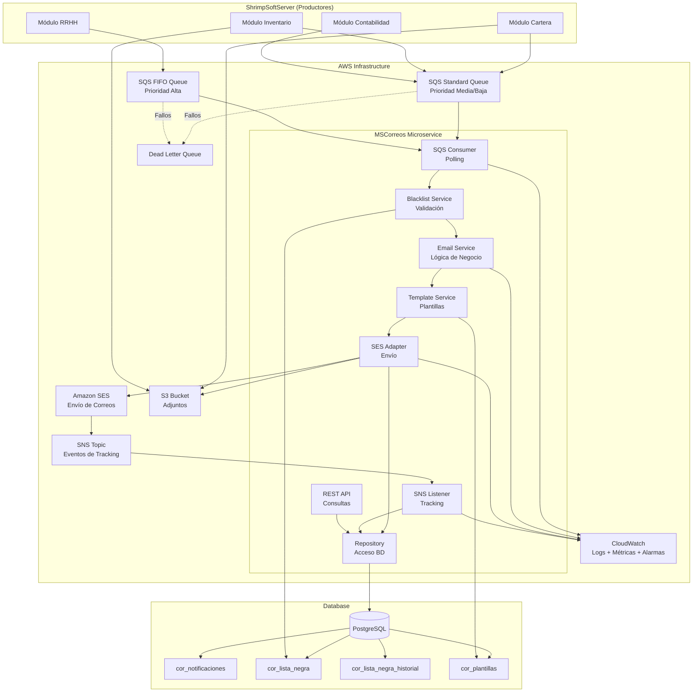
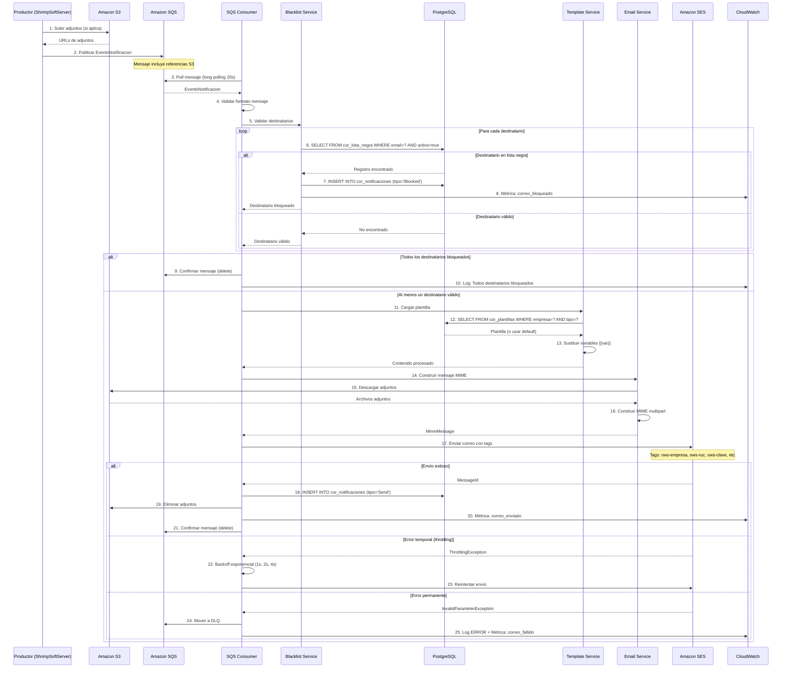
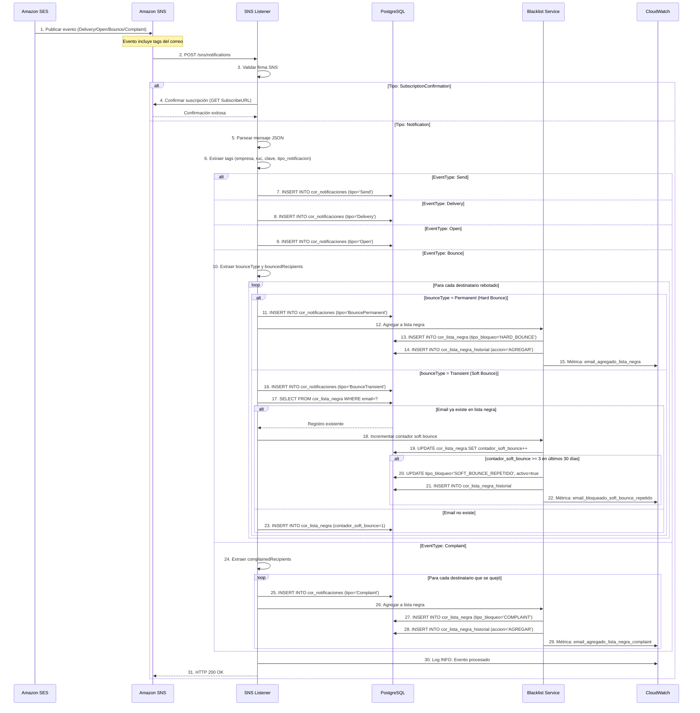
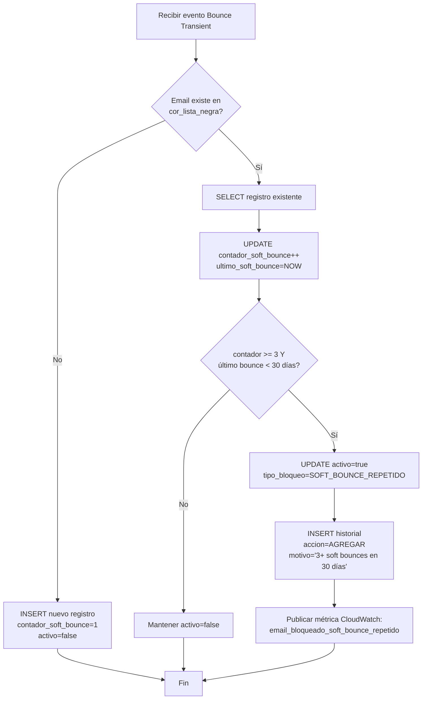
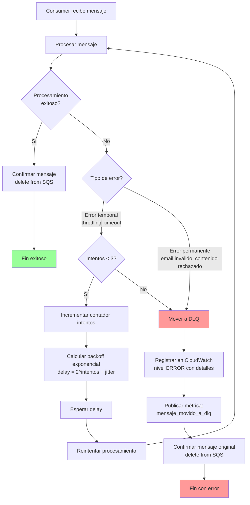
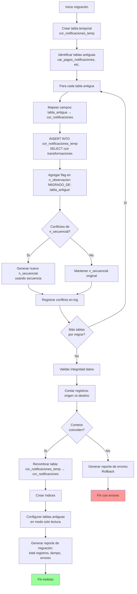
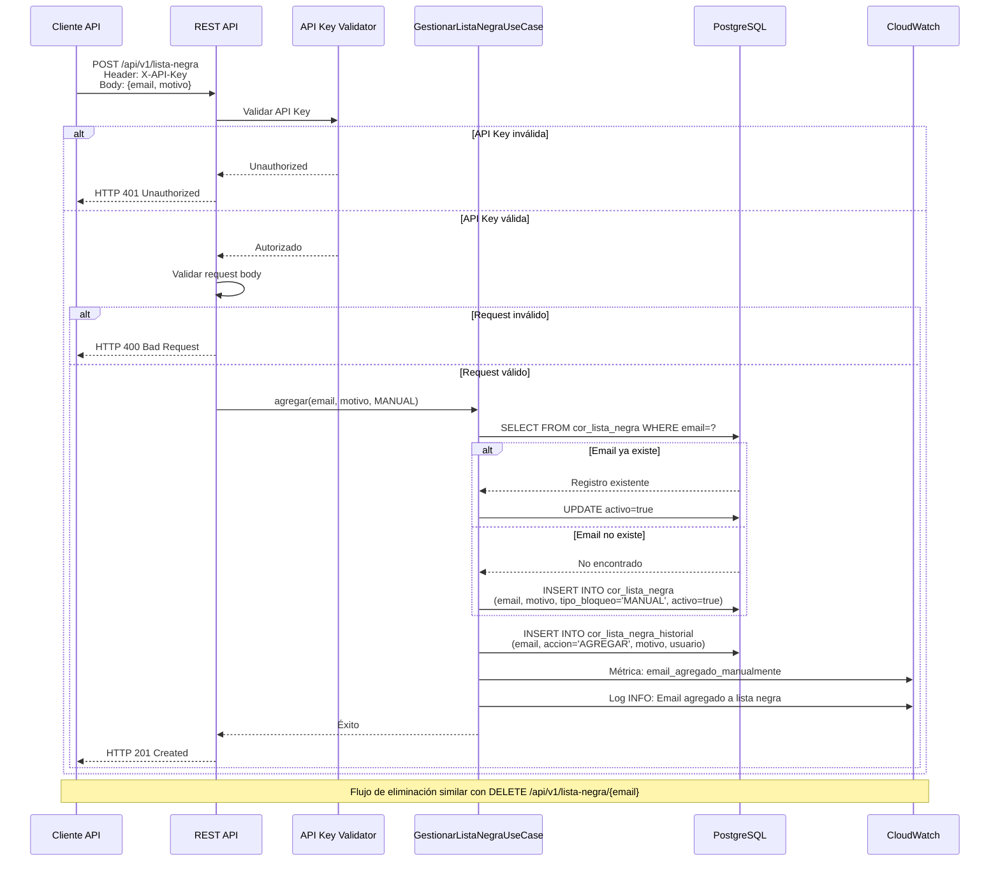

# Documento de Diseño Técnico: Refactorización del Sistema de Notificaciones por Correo Electrónico

## Overview

Este documento describe el diseño técnico completo para la refactorización del sistema de notificaciones por correo electrónico de MSCorreos. El sistema actual presenta problemas de arquitectura: cada módulo gestiona su propia tabla de notificaciones, existe alto acoplamiento con ShrimpSoftServer, no hay sistema de colas robusto, y el manejo de fallos es limitado.

La solución propuesta implementa una arquitectura basada en eventos usando servicios AWS (SQS, SES, SNS, CloudWatch), centraliza todas las notificaciones en una única tabla global (correos.cor_notificaciones), desacopla completamente MSCorreos como microservicio independiente, e implementa un sistema de lista negra para prevenir envíos a correos problemáticos y evitar multas de AWS SES.

### Objetivos del Diseño

1. **Centralización**: Consolidar todas las notificaciones en una única tabla global
2. **Desacoplamiento**: Separar completamente MSCorreos de ShrimpSoftServer mediante arquitectura de eventos
3. **Resiliencia**: Implementar manejo robusto de fallos con reintentos, DLQ y circuit breaker
4. **Escalabilidad**: Permitir escalado horizontal automático basado en carga
5. **Observabilidad**: Proporcionar visibilidad completa mediante logs, métricas y alarmas
6. **Protección**: Implementar lista negra para evitar envíos a correos problemáticos y multas de AWS

### Alcance

El diseño cubre:
- Arquitectura AWS completa (SQS, SES, SNS, CloudWatch, S3, ECS/Lambda)
- Diseño de base de datos (tablas centralizadas, lista negra, plantillas)
- Arquitectura de microservicio MSCorreos (Clean Architecture)
- Modelo de datos y contratos de API
- Flujos de proceso completos
- Estrategia de migración técnica
- Configuración de servicios AWS
- Consideraciones de seguridad y performance


## Architecture

### Arquitectura de Alto Nivel



### Flujo de Datos Completo

1. **Envío de Notificación**:
   - Productor (módulo de ShrimpSoftServer) sube adjuntos a S3 (si aplica)
   - Productor publica Evento_Notificacion en SQS (Standard o FIFO según prioridad)
   - Mensaje incluye referencias a adjuntos en S3, metadatos, destinatarios

2. **Procesamiento de Notificación**:
   - SQS Consumer hace polling de mensajes (long polling, 20 segundos)
   - Consumer valida formato del mensaje y extrae datos
   - Blacklist Service consulta cor_lista_negra para cada destinatario
   - Si destinatario está bloqueado: registra evento "Blocked" y descarta
   - Si destinatario es válido: continúa procesamiento
   - Template Service carga plantilla de cor_plantillas y sustituye variables
   - Email Service construye mensaje MIME con HTML, texto plano y adjuntos
   - SES Adapter descarga adjuntos desde S3
   - SES Adapter envía correo mediante Amazon SES con tags y Configuration Set
   - Repository registra evento "Send" en cor_notificaciones
   - SES Adapter elimina adjuntos de S3 después de envío exitoso
   - Consumer confirma mensaje (delete) de SQS

3. **Manejo de Fallos**:
   - Si falla validación de lista negra: registra error y mueve a DLQ
   - Si falla descarga de adjuntos: registra warning y envía sin adjuntos
   - Si falla envío SES (throttling): reintenta con backoff exponencial (1s, 2s, 4s)
   - Si falla envío SES (error permanente): mueve a DLQ sin reintentos
   - Si falla después de 3 reintentos: mueve a DLQ
   - Circuit Breaker abre si 50% de llamadas a SES fallan en 10 solicitudes

4. **Tracking de Eventos**:
   - Amazon SES publica eventos a SNS Topic (Send, Delivery, Open, Bounce, Complaint)
   - SNS Listener recibe eventos mediante suscripción HTTP/HTTPS
   - SNS Listener extrae tags del evento (empresa, RUC, clave, tipo_notificacion)
   - SNS Listener registra evento en cor_notificaciones con JSON completo
   - Si evento es Bounce (Permanent) o Complaint: agrega email a cor_lista_negra
   - Si email tiene 3+ Soft Bounce en 30 días: agrega a cor_lista_negra

5. **Consulta de Notificaciones**:
   - Cliente invoca API REST con filtros (empresa, RUC, tipo, fechas)
   - API valida API Key en header X-API-Key
   - Repository consulta cor_notificaciones con paginación
   - API retorna resultados en formato JSON

### Componentes Principales

#### SQS Consumer
- **Responsabilidad**: Polling de mensajes desde colas SQS
- **Tecnología**: Spring Cloud AWS Messaging
- **Configuración**: Long polling (20s), batch size 10, visibility timeout 30s
- **Patrón**: Consumer pattern con procesamiento asíncrono

#### Blacklist Service
- **Responsabilidad**: Validar destinatarios contra lista negra
- **Lógica**: Consulta cor_lista_negra WHERE email = ? AND activo = true
- **Acción**: Si bloqueado, registra evento "Blocked" y retorna false
- **Performance**: Cache en memoria (Caffeine) con TTL 5 minutos

#### Email Service
- **Responsabilidad**: Lógica de negocio para envío de correos
- **Funciones**: Validar formato emails, construir mensaje MIME, gestionar adjuntos
- **Patrón**: Service layer con inyección de dependencias

#### Template Service
- **Responsabilidad**: Cargar y procesar plantillas de correo
- **Lógica**: Consulta cor_plantillas por empresa + tipo_notificacion
- **Sustitución**: Reemplaza variables {{variable}} con valores del evento
- **Fallback**: Usa plantilla por defecto si no existe personalizada

#### SES Adapter
- **Responsabilidad**: Envío de correos mediante Amazon SES
- **Tecnología**: AWS SDK for Java 2.x (SesClient)
- **Configuración**: Region us-east-1, Configuration Set para tracking
- **Patrón**: Adapter pattern para abstraer servicio externo

#### SNS Listener
- **Responsabilidad**: Recibir eventos de tracking desde SNS
- **Tecnología**: Spring Web (REST endpoint POST /sns/notifications)
- **Validación**: Verifica firma de mensaje SNS para seguridad
- **Procesamiento**: Extrae datos, registra en BD, actualiza lista negra

#### Repository
- **Responsabilidad**: Acceso a base de datos
- **Tecnología**: Spring Data JPA con PostgreSQL
- **Entidades**: CorreosNotificaciones, ListaNegra, ListaNegraHistorial, Plantilla
- **Patrón**: Repository pattern

#### REST API
- **Responsabilidad**: Exponer endpoints para consultas y gestión
- **Tecnología**: Spring Web MVC
- **Seguridad**: API Key authentication
- **Endpoints**: GET /notificaciones, GET /notificaciones/{id}, GET/POST/DELETE /lista-negra

### Patrones de Diseño

1. **Clean Architecture / Hexagonal Architecture**:
   - Domain: Entidades, Value Objects, Interfaces de repositorio
   - Application: Casos de uso, DTOs, Servicios de aplicación
   - Infrastructure: Adaptadores (SQS, SES, SNS, JPA), Configuración
   - Presentation: Controllers REST, Listeners SNS

2. **Circuit Breaker**:
   - Implementación: Resilience4j
   - Configuración: 50% failure rate, 10 calls minimum, 60s wait duration
   - Acción: Cuando abierto, rechaza llamadas inmediatamente y registra error

3. **Retry con Backoff Exponencial**:
   - Implementación: Resilience4j Retry
   - Configuración: 3 intentos, backoff 1s/2s/4s con jitter aleatorio
   - Aplicable a: Llamadas SES, descargas S3

4. **Repository Pattern**:
   - Abstrae acceso a datos
   - Permite testing con mocks
   - Facilita cambio de tecnología de persistencia

5. **Adapter Pattern**:
   - SES Adapter, SQS Adapter, SNS Adapter
   - Abstraen servicios AWS
   - Facilitan testing y cambio de implementación

6. **Template Method**:
   - Procesamiento de diferentes tipos de eventos de tracking
   - Clase base TrackingEventProcessor con métodos abstractos


## Components and Interfaces

### Domain Layer

#### Entidades

**CorreosNotificaciones**
```java
@Entity
@Table(name = "cor_notificaciones", schema = "correos")
public class CorreosNotificaciones {
    @Id
    @GeneratedValue(strategy = GenerationType.IDENTITY)
    private Integer nSecuencial;
    
    @NotNull
    private String nDestinatario;
    
    @NotNull
    @Temporal(TemporalType.TIMESTAMP)
    private Date nFecha;
    
    @NotNull
    private String nTipo; // Send, Delivery, Open, Bounce, Complaint, Blocked
    
    private String nObservacion;
    
    @NotNull
    @Column(columnDefinition = "TEXT")
    private String nInforme; // JSON completo del evento
    
    @NotNull
    private String nEmpresa;
    
    private String nRuc;
    
    private String nClave;
    
    @NotNull
    private String nTipoNotificacion; // NOTIFICAR_VENTA_ELECTRONICA_EMITIDA, etc.
}
```

**ListaNegra**
```java
@Entity
@Table(name = "cor_lista_negra", schema = "correos")
public class ListaNegra {
    @Id
    @GeneratedValue(strategy = GenerationType.IDENTITY)
    private Long id;
    
    @NotNull
    @Column(unique = true)
    private String email;
    
    @NotNull
    private String motivo;
    
    @NotNull
    @Temporal(TemporalType.TIMESTAMP)
    private Date fechaRegistro;
    
    @NotNull
    @Enumerated(EnumType.STRING)
    private TipoBloqueo tipoBloqueo; // HARD_BOUNCE, SOFT_BOUNCE_REPETIDO, COMPLAINT, MANUAL
    
    @NotNull
    private Boolean activo;
    
    private Integer contadorSoftBounce; // Para tracking de soft bounces
    
    @Temporal(TemporalType.TIMESTAMP)
    private Date ultimoSoftBounce;
}
```

**ListaNegraHistorial**
```java
@Entity
@Table(name = "cor_lista_negra_historial", schema = "correos")
public class ListaNegraHistorial {
    @Id
    @GeneratedValue(strategy = GenerationType.IDENTITY)
    private Long id;
    
    @NotNull
    private String email;
    
    @NotNull
    @Enumerated(EnumType.STRING)
    private AccionListaNegra accion; // AGREGAR, REMOVER
    
    @NotNull
    private String motivo;
    
    private String usuario; // Usuario que realizó la acción (para acciones manuales)
    
    @NotNull
    @Temporal(TemporalType.TIMESTAMP)
    private Date fecha;
}
```

**Plantilla**
```java
@Entity
@Table(name = "cor_plantillas", schema = "correos")
public class Plantilla {
    @Id
    @GeneratedValue(strategy = GenerationType.IDENTITY)
    private Long id;
    
    @NotNull
    private String empresa;
    
    @NotNull
    private String tipoNotificacion;
    
    @NotNull
    @Column(columnDefinition = "TEXT")
    private String asuntoTemplate;
    
    @NotNull
    @Column(columnDefinition = "TEXT")
    private String cuerpoHtmlTemplate;
    
    @NotNull
    @Column(columnDefinition = "TEXT")
    private String cuerpoTextoTemplate;
    
    @Temporal(TemporalType.TIMESTAMP)
    private Date fechaCreacion;
    
    @Temporal(TemporalType.TIMESTAMP)
    private Date fechaModificacion;
}
```

#### Value Objects

**EmailAddress**
```java
public class EmailAddress {
    private final String value;
    
    public EmailAddress(String email) {
        if (!isValid(email)) {
            throw new IllegalArgumentException("Email inválido: " + email);
        }
        this.value = email.toLowerCase().trim();
    }
    
    private boolean isValid(String email) {
        // Validación con regex RFC 5322
        return email != null && email.matches("^[a-zA-Z0-9._%+-]+@[a-zA-Z0-9.-]+\\.[a-zA-Z]{2,}$");
    }
    
    public String getValue() {
        return value;
    }
}
```

**ClaveAcceso**
```java
public class ClaveAcceso {
    private final String value;
    
    public ClaveAcceso(String clave) {
        if (clave == null || clave.length() != 49) {
            throw new IllegalArgumentException("Clave de acceso debe tener 49 dígitos");
        }
        this.value = clave;
    }
    
    public String getTipoComprobante() {
        return value.substring(8, 10); // Posiciones 9-10 (0-indexed)
    }
    
    public String getValue() {
        return value;
    }
}
```

#### Interfaces de Repositorio

```java
public interface NotificacionesRepository extends JpaRepository<CorreosNotificaciones, Integer> {
    Page<CorreosNotificaciones> findByEmpresaAndNTipoNotificacionAndNFechaBetween(
        String empresa, String tipoNotificacion, Date fechaInicio, Date fechaFin, Pageable pageable);
    
    Page<CorreosNotificaciones> findByNDestinatarioContaining(String destinatario, Pageable pageable);
}

public interface ListaNegraRepository extends JpaRepository<ListaNegra, Long> {
    Optional<ListaNegra> findByEmailAndActivoTrue(String email);
    
    List<ListaNegra> findByTipoBloqueoAndActivoTrue(TipoBloqueo tipoBloqueo);
    
    @Query("SELECT ln FROM ListaNegra ln WHERE ln.activo = true AND ln.ultimoSoftBounce >= :fecha")
    List<ListaNegra> findSoftBouncesRecientes(@Param("fecha") Date fecha);
}

public interface ListaNegraHistorialRepository extends JpaRepository<ListaNegraHistorial, Long> {
    List<ListaNegraHistorial> findByEmailOrderByFechaDesc(String email);
}

public interface PlantillaRepository extends JpaRepository<Plantilla, Long> {
    Optional<Plantilla> findByEmpresaAndTipoNotificacion(String empresa, String tipoNotificacion);
}
```

### Application Layer

#### DTOs

**EventoNotificacion** (Mensaje SQS)
```java
public class EventoNotificacion {
    private String messageId; // Para idempotencia
    private List<String> destinatarios; // Separados por ;
    private String asunto;
    private String cuerpoHtml;
    private String cuerpoTextoPlano;
    private List<AdjuntoReferencia> adjuntos;
    private String tipoNotificacion;
    private String empresa;
    private String ruc;
    private String clave;
    private String claveAcceso; // Para comprobantes electrónicos
    private Map<String, String> metadatos; // Variables para plantilla
    private PrioridadNotificacion prioridad; // ALTA, MEDIA, BAJA
    private Date timestamp;
}

public class AdjuntoReferencia {
    private String s3Bucket;
    private String s3Key;
    private String nombreArchivo;
    private String contentType;
}

public enum PrioridadNotificacion {
    ALTA, MEDIA, BAJA
}
```

**TrackingEvent** (Evento SNS)
```java
public class TrackingEvent {
    private String eventType; // Send, Delivery, Open, Bounce, Complaint
    private MailInfo mail;
    private DeliveryInfo delivery;
    private BounceInfo bounce;
    private ComplaintInfo complaint;
    private OpenInfo open;
}

public class MailInfo {
    private String timestamp;
    private String messageId;
    private CommonHeaders commonHeaders;
    private Map<String, List<String>> tags;
}

public class CommonHeaders {
    private List<String> to;
    private String from;
    private List<String> replyTo;
}

public class BounceInfo {
    private String bounceType; // Permanent, Transient, Undetermined
    private String bounceSubType;
    private List<BouncedRecipient> bouncedRecipients;
    private String timestamp;
}

public class BouncedRecipient {
    private String emailAddress;
    private String diagnosticCode;
    private String status;
}

public class ComplaintInfo {
    private List<ComplainedRecipient> complainedRecipients;
    private String timestamp;
    private String complaintFeedbackType; // abuse, fraud, virus, etc.
}
```

**NotificacionDTO** (Response API)
```java
public class NotificacionDTO {
    private Integer id;
    private String destinatario;
    private Date fecha;
    private String tipo;
    private String observacion;
    private String empresa;
    private String ruc;
    private String clave;
    private String tipoNotificacion;
}

public class NotificacionDetalleDTO extends NotificacionDTO {
    private String informeJson; // JSON completo del evento
}
```

**ListaNegraDTO**
```java
public class ListaNegraDTO {
    private Long id;
    private String email;
    private String motivo;
    private Date fechaRegistro;
    private String tipoBloqueo;
    private Boolean activo;
}

public class AgregarListaNegraRequest {
    @NotNull
    private String email;
    
    @NotNull
    private String motivo;
    
    private String tipoBloqueo; // Default: MANUAL
}
```

#### Casos de Uso

```java
public interface EnviarNotificacionUseCase {
    void ejecutar(EventoNotificacion evento) throws NotificacionException;
}

public interface ProcesarTrackingEventUseCase {
    void ejecutar(TrackingEvent evento) throws TrackingException;
}

public interface ConsultarNotificacionesUseCase {
    Page<NotificacionDTO> ejecutar(FiltrosNotificacion filtros, Pageable pageable);
}

public interface GestionarListaNegraUseCase {
    void agregar(String email, String motivo, TipoBloqueo tipo);
    void remover(String email, String motivo, String usuario);
    boolean estaEnListaNegra(String email);
    Page<ListaNegraDTO> consultar(FiltrosListaNegra filtros, Pageable pageable);
}
```


### Infrastructure Layer

#### Adaptadores AWS

**SQSAdapter**
```java
@Component
public class SQSAdapter {
    private final SqsClient sqsClient;
    private final String queueUrlStandard;
    private final String queueUrlFifo;
    
    @SqsListener(value = "${aws.sqs.queue.standard}", deletionPolicy = ON_SUCCESS)
    public void receiveMessageStandard(EventoNotificacion evento) {
        // Procesamiento de mensajes de prioridad media/baja
    }
    
    @SqsListener(value = "${aws.sqs.queue.fifo}", deletionPolicy = ON_SUCCESS)
    public void receiveMessageFifo(EventoNotificacion evento) {
        // Procesamiento de mensajes de prioridad alta
    }
    
    public void sendMessage(EventoNotificacion evento, PrioridadNotificacion prioridad) {
        String queueUrl = (prioridad == PrioridadNotificacion.ALTA) ? queueUrlFifo : queueUrlStandard;
        // Enviar mensaje a SQS
    }
}
```

**SESAdapter**
```java
@Component
public class SESAdapter {
    private final SesClient sesClient;
    private final String configurationSet;
    
    @CircuitBreaker(name = "ses", fallbackMethod = "enviarFallback")
    @Retry(name = "ses", fallbackMethod = "enviarFallback")
    public SendRawEmailResponse enviar(MimeMessage mensaje, Map<String, String> tags) {
        ByteArrayOutputStream outputStream = new ByteArrayOutputStream();
        mensaje.writeTo(outputStream);
        
        RawMessage rawMessage = RawMessage.builder()
            .data(SdkBytes.fromByteArray(outputStream.toByteArray()))
            .build();
        
        List<MessageTag> messageTags = tags.entrySet().stream()
            .map(e -> MessageTag.builder().name(e.getKey()).value(e.getValue()).build())
            .collect(Collectors.toList());
        
        SendRawEmailRequest request = SendRawEmailRequest.builder()
            .rawMessage(rawMessage)
            .configurationSetName(configurationSet)
            .tags(messageTags)
            .build();
        
        return sesClient.sendRawEmail(request);
    }
    
    private SendRawEmailResponse enviarFallback(MimeMessage mensaje, Map<String, String> tags, Exception ex) {
        log.error("Fallback activado para envío SES", ex);
        throw new SESException("No se pudo enviar correo después de reintentos", ex);
    }
}
```

**SNSListener**
```java
@RestController
@RequestMapping("/sns")
public class SNSListener {
    private final ProcesarTrackingEventUseCase procesarTrackingEventUseCase;
    
    @PostMapping("/notifications")
    public ResponseEntity<Void> receiveNotification(@RequestBody String payload) {
        // Validar firma SNS
        if (!validarFirmaSNS(payload)) {
            return ResponseEntity.status(HttpStatus.UNAUTHORIZED).build();
        }
        
        // Parsear mensaje SNS
        Map<String, Object> snsMessage = parseJson(payload);
        String type = (String) snsMessage.get("Type");
        
        if ("SubscriptionConfirmation".equals(type)) {
            // Confirmar suscripción
            String subscribeUrl = (String) snsMessage.get("SubscribeURL");
            confirmarSuscripcion(subscribeUrl);
            return ResponseEntity.ok().build();
        }
        
        if ("Notification".equals(type)) {
            String message = (String) snsMessage.get("Message");
            TrackingEvent evento = parseJson(message, TrackingEvent.class);
            procesarTrackingEventUseCase.ejecutar(evento);
            return ResponseEntity.ok().build();
        }
        
        return ResponseEntity.badRequest().build();
    }
}
```

**S3Adapter**
```java
@Component
public class S3Adapter {
    private final S3Client s3Client;
    
    public File descargarAdjunto(String bucket, String key) {
        GetObjectRequest request = GetObjectRequest.builder()
            .bucket(bucket)
            .key(key)
            .build();
        
        ResponseBytes<GetObjectResponse> objectBytes = s3Client.getObjectAsBytes(request);
        
        File tempFile = File.createTempFile("adjunto-", ".tmp");
        Files.write(tempFile.toPath(), objectBytes.asByteArray());
        
        return tempFile;
    }
    
    public void eliminarAdjunto(String bucket, String key) {
        DeleteObjectRequest request = DeleteObjectRequest.builder()
            .bucket(bucket)
            .key(key)
            .build();
        
        s3Client.deleteObject(request);
    }
}
```

#### Servicios de Infraestructura

**CloudWatchMetricsService**
```java
@Service
public class CloudWatchMetricsService {
    private final CloudWatchClient cloudWatchClient;
    private final String namespace = "MSCorreos";
    
    public void registrarCorreoEnviado(String empresa, String tipoNotificacion) {
        publicarMetrica("CorreosEnviados", 1.0, empresa, tipoNotificacion);
    }
    
    public void registrarCorreoFallido(String empresa, String tipoNotificacion) {
        publicarMetrica("CorreosFallidos", 1.0, empresa, tipoNotificacion);
    }
    
    public void registrarCorreoBloqueado(String empresa, String tipoNotificacion) {
        publicarMetrica("CorreosBloqueados", 1.0, empresa, tipoNotificacion);
    }
    
    public void registrarTiempoProcesamiento(long millis) {
        publicarMetrica("TiempoProcesamiento", (double) millis, null, null);
    }
    
    private void publicarMetrica(String metricName, Double value, String empresa, String tipoNotificacion) {
        List<Dimension> dimensions = new ArrayList<>();
        if (empresa != null) {
            dimensions.add(Dimension.builder().name("Empresa").value(empresa).build());
        }
        if (tipoNotificacion != null) {
            dimensions.add(Dimension.builder().name("TipoNotificacion").value(tipoNotificacion).build());
        }
        
        MetricDatum datum = MetricDatum.builder()
            .metricName(metricName)
            .value(value)
            .unit(StandardUnit.COUNT)
            .timestamp(Instant.now())
            .dimensions(dimensions)
            .build();
        
        PutMetricDataRequest request = PutMetricDataRequest.builder()
            .namespace(namespace)
            .metricData(datum)
            .build();
        
        cloudWatchClient.putMetricData(request);
    }
}
```

### Presentation Layer

#### REST Controllers

**NotificacionesController**
```java
@RestController
@RequestMapping("/api/v1/notificaciones")
public class NotificacionesController {
    private final ConsultarNotificacionesUseCase consultarNotificacionesUseCase;
    
    @GetMapping
    public ResponseEntity<Page<NotificacionDTO>> listar(
            @RequestParam(required = false) String empresa,
            @RequestParam(required = false) String ruc,
            @RequestParam(required = false) String tipoNotificacion,
            @RequestParam(required = false) @DateTimeFormat(iso = DateTimeFormat.ISO.DATE) Date fechaInicio,
            @RequestParam(required = false) @DateTimeFormat(iso = DateTimeFormat.ISO.DATE) Date fechaFin,
            @RequestParam(required = false) String destinatario,
            @RequestParam(defaultValue = "0") int page,
            @RequestParam(defaultValue = "20") int size) {
        
        FiltrosNotificacion filtros = FiltrosNotificacion.builder()
            .empresa(empresa)
            .ruc(ruc)
            .tipoNotificacion(tipoNotificacion)
            .fechaInicio(fechaInicio)
            .fechaFin(fechaFin)
            .destinatario(destinatario)
            .build();
        
        Pageable pageable = PageRequest.of(page, Math.min(size, 100));
        Page<NotificacionDTO> resultado = consultarNotificacionesUseCase.ejecutar(filtros, pageable);
        
        return ResponseEntity.ok(resultado);
    }
    
    @GetMapping("/{id}")
    public ResponseEntity<NotificacionDetalleDTO> obtener(@PathVariable Integer id) {
        // Implementación
    }
}
```

**ListaNegraController**
```java
@RestController
@RequestMapping("/api/v1/lista-negra")
public class ListaNegraController {
    private final GestionarListaNegraUseCase gestionarListaNegraUseCase;
    
    @GetMapping
    public ResponseEntity<Page<ListaNegraDTO>> listar(
            @RequestParam(required = false) String tipoBloqueo,
            @RequestParam(required = false) @DateTimeFormat(iso = DateTimeFormat.ISO.DATE) Date fechaDesde,
            @RequestParam(required = false) @DateTimeFormat(iso = DateTimeFormat.ISO.DATE) Date fechaHasta,
            @RequestParam(defaultValue = "0") int page,
            @RequestParam(defaultValue = "20") int size) {
        
        FiltrosListaNegra filtros = FiltrosListaNegra.builder()
            .tipoBloqueo(tipoBloqueo)
            .fechaDesde(fechaDesde)
            .fechaHasta(fechaHasta)
            .build();
        
        Pageable pageable = PageRequest.of(page, Math.min(size, 100));
        Page<ListaNegraDTO> resultado = gestionarListaNegraUseCase.consultar(filtros, pageable);
        
        return ResponseEntity.ok(resultado);
    }
    
    @PostMapping
    public ResponseEntity<Void> agregar(@Valid @RequestBody AgregarListaNegraRequest request) {
        TipoBloqueo tipo = request.getTipoBloqueo() != null 
            ? TipoBloqueo.valueOf(request.getTipoBloqueo()) 
            : TipoBloqueo.MANUAL;
        
        gestionarListaNegraUseCase.agregar(request.getEmail(), request.getMotivo(), tipo);
        
        return ResponseEntity.status(HttpStatus.CREATED).build();
    }
    
    @DeleteMapping("/{email}")
    public ResponseEntity<Void> remover(
            @PathVariable String email,
            @RequestParam String motivo,
            @RequestParam(required = false) String usuario) {
        
        gestionarListaNegraUseCase.remover(email, motivo, usuario);
        
        return ResponseEntity.noContent().build();
    }
}
```

**HealthController**
```java
@RestController
@RequestMapping("/health")
public class HealthController {
    private final DataSource dataSource;
    private final SqsClient sqsClient;
    
    @GetMapping
    public ResponseEntity<HealthStatus> health() {
        boolean dbHealthy = checkDatabase();
        boolean sqsHealthy = checkSQS();
        
        if (dbHealthy && sqsHealthy) {
            return ResponseEntity.ok(new HealthStatus("UP", "All systems operational"));
        } else {
            return ResponseEntity.status(HttpStatus.SERVICE_UNAVAILABLE)
                .body(new HealthStatus("DOWN", "Some systems are down"));
        }
    }
    
    private boolean checkDatabase() {
        try (Connection conn = dataSource.getConnection()) {
            return conn.isValid(5);
        } catch (Exception e) {
            return false;
        }
    }
    
    private boolean checkSQS() {
        try {
            sqsClient.listQueues();
            return true;
        } catch (Exception e) {
            return false;
        }
    }
}
```


## Data Models

### Esquema de Base de Datos

#### Tabla: correos.cor_notificaciones

```sql
CREATE TABLE correos.cor_notificaciones (
    n_secuencial SERIAL PRIMARY KEY,
    n_destinatario TEXT NOT NULL,
    n_fecha TIMESTAMP WITHOUT TIME ZONE NOT NULL,
    n_tipo TEXT NOT NULL, -- Send, Delivery, Open, Bounce, BounceTransient, BouncePermanent, Complaint, Blocked
    n_observacion TEXT,
    n_informe TEXT NOT NULL, -- JSON completo del evento
    n_empresa TEXT NOT NULL,
    n_ruc TEXT,
    n_clave TEXT,
    n_tipo_notificacion TEXT NOT NULL
);

-- Índices para performance
CREATE INDEX idx_cor_notificaciones_empresa ON correos.cor_notificaciones(n_empresa);
CREATE INDEX idx_cor_notificaciones_tipo_notificacion ON correos.cor_notificaciones(n_tipo_notificacion);
CREATE INDEX idx_cor_notificaciones_fecha ON correos.cor_notificaciones(n_fecha DESC);
CREATE INDEX idx_cor_notificaciones_destinatario ON correos.cor_notificaciones(n_destinatario);
CREATE INDEX idx_cor_notificaciones_ruc_clave ON correos.cor_notificaciones(n_ruc, n_clave);
CREATE INDEX idx_cor_notificaciones_tipo ON correos.cor_notificaciones(n_tipo);

-- Índice compuesto para consultas frecuentes
CREATE INDEX idx_cor_notificaciones_empresa_tipo_fecha 
    ON correos.cor_notificaciones(n_empresa, n_tipo_notificacion, n_fecha DESC);
```

#### Tabla: correos.cor_lista_negra

```sql
CREATE TABLE correos.cor_lista_negra (
    id BIGSERIAL PRIMARY KEY,
    email VARCHAR(255) NOT NULL UNIQUE,
    motivo TEXT NOT NULL,
    fecha_registro TIMESTAMP WITHOUT TIME ZONE NOT NULL DEFAULT CURRENT_TIMESTAMP,
    tipo_bloqueo VARCHAR(50) NOT NULL, -- HARD_BOUNCE, SOFT_BOUNCE_REPETIDO, COMPLAINT, MANUAL
    activo BOOLEAN NOT NULL DEFAULT TRUE,
    contador_soft_bounce INTEGER DEFAULT 0,
    ultimo_soft_bounce TIMESTAMP WITHOUT TIME ZONE
);

-- Índices
CREATE INDEX idx_lista_negra_email_activo ON correos.cor_lista_negra(email, activo);
CREATE INDEX idx_lista_negra_tipo_bloqueo ON correos.cor_lista_negra(tipo_bloqueo) WHERE activo = TRUE;
CREATE INDEX idx_lista_negra_fecha_registro ON correos.cor_lista_negra(fecha_registro DESC);
CREATE INDEX idx_lista_negra_ultimo_soft_bounce ON correos.cor_lista_negra(ultimo_soft_bounce) 
    WHERE tipo_bloqueo = 'SOFT_BOUNCE_REPETIDO' AND activo = TRUE;
```

#### Tabla: correos.cor_lista_negra_historial

```sql
CREATE TABLE correos.cor_lista_negra_historial (
    id BIGSERIAL PRIMARY KEY,
    email VARCHAR(255) NOT NULL,
    accion VARCHAR(20) NOT NULL, -- AGREGAR, REMOVER
    motivo TEXT NOT NULL,
    usuario VARCHAR(100), -- Usuario que realizó la acción (NULL para acciones automáticas)
    fecha TIMESTAMP WITHOUT TIME ZONE NOT NULL DEFAULT CURRENT_TIMESTAMP
);

-- Índices
CREATE INDEX idx_lista_negra_historial_email ON correos.cor_lista_negra_historial(email);
CREATE INDEX idx_lista_negra_historial_fecha ON correos.cor_lista_negra_historial(fecha DESC);
```

#### Tabla: correos.cor_plantillas

```sql
CREATE TABLE correos.cor_plantillas (
    id BIGSERIAL PRIMARY KEY,
    empresa VARCHAR(100) NOT NULL,
    tipo_notificacion VARCHAR(100) NOT NULL,
    asunto_template TEXT NOT NULL,
    cuerpo_html_template TEXT NOT NULL,
    cuerpo_texto_template TEXT NOT NULL,
    fecha_creacion TIMESTAMP WITHOUT TIME ZONE NOT NULL DEFAULT CURRENT_TIMESTAMP,
    fecha_modificacion TIMESTAMP WITHOUT TIME ZONE,
    UNIQUE(empresa, tipo_notificacion)
);

-- Índices
CREATE INDEX idx_plantillas_empresa_tipo ON correos.cor_plantillas(empresa, tipo_notificacion);
```

### Relaciones y Constraints

```sql
-- Constraint para validar tipo_bloqueo
ALTER TABLE correos.cor_lista_negra
ADD CONSTRAINT chk_tipo_bloqueo 
CHECK (tipo_bloqueo IN ('HARD_BOUNCE', 'SOFT_BOUNCE_REPETIDO', 'COMPLAINT', 'MANUAL'));

-- Constraint para validar accion en historial
ALTER TABLE correos.cor_lista_negra_historial
ADD CONSTRAINT chk_accion 
CHECK (accion IN ('AGREGAR', 'REMOVER'));

-- Constraint para validar email format
ALTER TABLE correos.cor_lista_negra
ADD CONSTRAINT chk_email_format 
CHECK (email ~* '^[A-Za-z0-9._%+-]+@[A-Za-z0-9.-]+\.[A-Za-z]{2,}$');
```

### Agregados del Dominio

#### Agregado Notificacion

**Root**: CorreosNotificaciones
**Invariantes**:
- n_destinatario debe ser un email válido
- n_fecha no puede ser futura
- n_tipo debe ser uno de los valores permitidos
- n_informe debe ser JSON válido
- n_empresa no puede estar vacía

#### Agregado ListaNegra

**Root**: ListaNegra
**Invariantes**:
- email debe ser único y válido
- Si tipo_bloqueo es SOFT_BOUNCE_REPETIDO, contador_soft_bounce >= 3
- Si activo es false, debe existir registro en historial con accion REMOVER
- ultimo_soft_bounce debe ser <= fecha_registro + 30 días para SOFT_BOUNCE_REPETIDO

**Comportamientos**:
```java
public class ListaNegra {
    public void incrementarSoftBounce() {
        this.contadorSoftBounce++;
        this.ultimoSoftBounce = new Date();
        
        if (this.contadorSoftBounce >= 3) {
            this.tipoBloqueo = TipoBloqueo.SOFT_BOUNCE_REPETIDO;
            this.activo = true;
        }
    }
    
    public boolean debeSerBloqueado() {
        if (!activo) return false;
        
        if (tipoBloqueo == TipoBloqueo.SOFT_BOUNCE_REPETIDO) {
            // Verificar si han pasado más de 30 días desde último soft bounce
            long diasDesdeUltimoBounce = ChronoUnit.DAYS.between(
                ultimoSoftBounce.toInstant(), 
                Instant.now()
            );
            return diasDesdeUltimoBounce <= 30;
        }
        
        return true;
    }
}
```

### Estrategia de Particionamiento (Futuro)

Para escalar la tabla cor_notificaciones cuando supere 100M de registros:

```sql
-- Particionamiento por rango de fechas (mensual)
CREATE TABLE correos.cor_notificaciones_2024_01 PARTITION OF correos.cor_notificaciones
    FOR VALUES FROM ('2024-01-01') TO ('2024-02-01');

CREATE TABLE correos.cor_notificaciones_2024_02 PARTITION OF correos.cor_notificaciones
    FOR VALUES FROM ('2024-02-01') TO ('2024-03-01');
-- etc.
```


## Flujos de Proceso

### Flujo 1: Envío de Correo con Validación de Lista Negra



### Flujo 2: Tracking de Eventos y Actualización de Lista Negra



### Flujo 3: Bloqueo Automático por Soft Bounce Repetido



### Flujo 4: Reintentos y Dead Letter Queue



### Flujo 5: Migración de Datos Históricos



### Flujo 6: Gestión Manual de Lista Negra vía API




## Configuración AWS

### Amazon SQS

#### Cola Estándar (Prioridad Media/Baja)

```json
{
  "QueueName": "mscorreos-notificaciones-standard",
  "Attributes": {
    "VisibilityTimeout": "30",
    "MessageRetentionPeriod": "1209600",
    "ReceiveMessageWaitTimeSeconds": "20",
    "RedrivePolicy": {
      "deadLetterTargetArn": "arn:aws:sqs:us-east-1:ACCOUNT_ID:mscorreos-notificaciones-dlq",
      "maxReceiveCount": "3"
    }
  },
  "Tags": {
    "Environment": "production",
    "Service": "MSCorreos",
    "Purpose": "email-notifications"
  }
}
```

#### Cola FIFO (Prioridad Alta)

```json
{
  "QueueName": "mscorreos-notificaciones-high-priority.fifo",
  "Attributes": {
    "FifoQueue": "true",
    "ContentBasedDeduplication": "true",
    "VisibilityTimeout": "30",
    "MessageRetentionPeriod": "1209600",
    "ReceiveMessageWaitTimeSeconds": "20",
    "RedrivePolicy": {
      "deadLetterTargetArn": "arn:aws:sqs:us-east-1:ACCOUNT_ID:mscorreos-notificaciones-dlq",
      "maxReceiveCount": "3"
    }
  }
}
```

#### Dead Letter Queue

```json
{
  "QueueName": "mscorreos-notificaciones-dlq",
  "Attributes": {
    "MessageRetentionPeriod": "1209600",
    "ReceiveMessageWaitTimeSeconds": "0"
  }
}
```

### Amazon SES

#### Configuration Set

```bash
aws ses create-configuration-set \
  --configuration-set Name=mscorreos-tracking \
  --region us-east-1
```

#### Event Destination (SNS)

```bash
aws ses create-configuration-set-event-destination \
  --configuration-set-name mscorreos-tracking \
  --event-destination '{
    "Name": "sns-tracking-destination",
    "Enabled": true,
    "MatchingEventTypes": ["send", "delivery", "open", "bounce", "complaint"],
    "SNSDestination": {
      "TopicARN": "arn:aws:sns:us-east-1:ACCOUNT_ID:mscorreos-tracking-events"
    }
  }' \
  --region us-east-1
```

#### Límites de Envío

```bash
# Configurar límite de tasa (14 correos/segundo)
aws ses put-account-sending-attributes \
  --sending-enabled \
  --region us-east-1

# Nota: El límite de 14 correos/segundo es el default de SES
# Para aumentarlo, se debe solicitar a AWS Support
```

#### Identidades Verificadas

```bash
# Verificar dominio
aws ses verify-domain-identity \
  --domain documentos-electronicos.info \
  --region us-east-1

# Verificar email individual (para testing)
aws ses verify-email-identity \
  --email-address notificaciones@documentos-electronicos.info \
  --region us-east-1
```

### Amazon SNS

#### Topic para Tracking Events

```bash
aws sns create-topic \
  --name mscorreos-tracking-events \
  --region us-east-1
```

#### Suscripción HTTP/HTTPS

```bash
aws sns subscribe \
  --topic-arn arn:aws:sns:us-east-1:ACCOUNT_ID:mscorreos-tracking-events \
  --protocol https \
  --notification-endpoint https://mscorreos.acosux.com/sns/notifications \
  --region us-east-1
```

#### Política de Acceso del Topic

```json
{
  "Version": "2012-10-17",
  "Statement": [
    {
      "Effect": "Allow",
      "Principal": {
        "Service": "ses.amazonaws.com"
      },
      "Action": "SNS:Publish",
      "Resource": "arn:aws:sns:us-east-1:ACCOUNT_ID:mscorreos-tracking-events",
      "Condition": {
        "StringEquals": {
          "AWS:SourceAccount": "ACCOUNT_ID"
        }
      }
    }
  ]
}
```

### Amazon S3

#### Bucket para Adjuntos

```bash
aws s3api create-bucket \
  --bucket mscorreos-adjuntos \
  --region us-east-1
```

#### Política de Ciclo de Vida

```json
{
  "Rules": [
    {
      "Id": "DeleteOldAttachments",
      "Status": "Enabled",
      "Prefix": "",
      "Expiration": {
        "Days": 7
      },
      "NoncurrentVersionExpiration": {
        "NoncurrentDays": 1
      }
    }
  ]
}
```

```bash
aws s3api put-bucket-lifecycle-configuration \
  --bucket mscorreos-adjuntos \
  --lifecycle-configuration file://lifecycle-policy.json
```

#### Política de Bucket

```json
{
  "Version": "2012-10-17",
  "Statement": [
    {
      "Sid": "AllowMSCorreosAccess",
      "Effect": "Allow",
      "Principal": {
        "AWS": "arn:aws:iam::ACCOUNT_ID:role/MSCorreosECSTaskRole"
      },
      "Action": [
        "s3:GetObject",
        "s3:DeleteObject"
      ],
      "Resource": "arn:aws:s3:::mscorreos-adjuntos/*"
    },
    {
      "Sid": "AllowProducersUpload",
      "Effect": "Allow",
      "Principal": {
        "AWS": "arn:aws:iam::ACCOUNT_ID:role/ShrimpSoftServerRole"
      },
      "Action": [
        "s3:PutObject"
      ],
      "Resource": "arn:aws:s3:::mscorreos-adjuntos/*"
    }
  ]
}
```

### Amazon CloudWatch

#### Log Groups

```bash
# Crear log group para MSCorreos
aws logs create-log-group \
  --log-group-name /aws/ecs/mscorreos \
  --region us-east-1

# Configurar retención de 30 días
aws logs put-retention-policy \
  --log-group-name /aws/ecs/mscorreos \
  --retention-in-days 30 \
  --region us-east-1
```

#### Métricas Personalizadas

Las métricas se publican mediante CloudWatchMetricsService:

- **Namespace**: MSCorreos
- **Métricas**:
  - CorreosEnviados (COUNT) - Dimensiones: Empresa, TipoNotificacion
  - CorreosFallidos (COUNT) - Dimensiones: Empresa, TipoNotificacion
  - CorreosBloqueados (COUNT) - Dimensiones: Empresa, TipoNotificacion
  - TiempoProcesamiento (MILLISECONDS)
  - MensajesEnCola (COUNT) - Dimensión: QueueName
  - EmailsEnListaNegra (COUNT)
  - MensajesEnDLQ (COUNT)

#### Alarmas

**Alarma: DLQ con muchos mensajes**
```bash
aws cloudwatch put-metric-alarm \
  --alarm-name mscorreos-dlq-high-messages \
  --alarm-description "DLQ tiene más de 10 mensajes" \
  --metric-name ApproximateNumberOfMessagesVisible \
  --namespace AWS/SQS \
  --statistic Average \
  --period 300 \
  --evaluation-periods 1 \
  --threshold 10 \
  --comparison-operator GreaterThanThreshold \
  --dimensions Name=QueueName,Value=mscorreos-notificaciones-dlq \
  --alarm-actions arn:aws:sns:us-east-1:ACCOUNT_ID:ops-alerts
```

**Alarma: Tasa de errores alta**
```bash
aws cloudwatch put-metric-alarm \
  --alarm-name mscorreos-high-error-rate \
  --alarm-description "Tasa de errores > 5% en 5 minutos" \
  --metric-name CorreosFallidos \
  --namespace MSCorreos \
  --statistic Sum \
  --period 300 \
  --evaluation-periods 1 \
  --threshold 5 \
  --comparison-operator GreaterThanThreshold \
  --treat-missing-data notBreaching \
  --alarm-actions arn:aws:sns:us-east-1:ACCOUNT_ID:ops-alerts
```

**Alarma: Tiempo de procesamiento alto**
```bash
aws cloudwatch put-metric-alarm \
  --alarm-name mscorreos-high-processing-time \
  --alarm-description "Tiempo de procesamiento > 5 segundos" \
  --metric-name TiempoProcesamiento \
  --namespace MSCorreos \
  --statistic Average \
  --period 300 \
  --evaluation-periods 2 \
  --threshold 5000 \
  --comparison-operator GreaterThanThreshold \
  --alarm-actions arn:aws:sns:us-east-1:ACCOUNT_ID:ops-alerts
```

**Alarma: Lista negra creciendo**
```bash
aws cloudwatch put-metric-alarm \
  --alarm-name mscorreos-blacklist-growing \
  --alarm-description "Lista negra supera 1000 emails" \
  --metric-name EmailsEnListaNegra \
  --namespace MSCorreos \
  --statistic Maximum \
  --period 3600 \
  --evaluation-periods 1 \
  --threshold 1000 \
  --comparison-operator GreaterThanThreshold \
  --alarm-actions arn:aws:sns:us-east-1:ACCOUNT_ID:ops-alerts
```

### IAM Roles y Políticas

#### Role para ECS Task (MSCorreos)

```json
{
  "Version": "2012-10-17",
  "Statement": [
    {
      "Effect": "Allow",
      "Action": [
        "sqs:ReceiveMessage",
        "sqs:DeleteMessage",
        "sqs:GetQueueAttributes",
        "sqs:ChangeMessageVisibility"
      ],
      "Resource": [
        "arn:aws:sqs:us-east-1:ACCOUNT_ID:mscorreos-notificaciones-standard",
        "arn:aws:sqs:us-east-1:ACCOUNT_ID:mscorreos-notificaciones-high-priority.fifo"
      ]
    },
    {
      "Effect": "Allow",
      "Action": [
        "sqs:SendMessage"
      ],
      "Resource": "arn:aws:sqs:us-east-1:ACCOUNT_ID:mscorreos-notificaciones-dlq"
    },
    {
      "Effect": "Allow",
      "Action": [
        "ses:SendRawEmail",
        "ses:SendEmail"
      ],
      "Resource": "*"
    },
    {
      "Effect": "Allow",
      "Action": [
        "s3:GetObject",
        "s3:DeleteObject"
      ],
      "Resource": "arn:aws:s3:::mscorreos-adjuntos/*"
    },
    {
      "Effect": "Allow",
      "Action": [
        "logs:CreateLogStream",
        "logs:PutLogEvents"
      ],
      "Resource": "arn:aws:logs:us-east-1:ACCOUNT_ID:log-group:/aws/ecs/mscorreos:*"
    },
    {
      "Effect": "Allow",
      "Action": [
        "cloudwatch:PutMetricData"
      ],
      "Resource": "*",
      "Condition": {
        "StringEquals": {
          "cloudwatch:namespace": "MSCorreos"
        }
      }
    },
    {
      "Effect": "Allow",
      "Action": [
        "secretsmanager:GetSecretValue"
      ],
      "Resource": "arn:aws:secretsmanager:us-east-1:ACCOUNT_ID:secret:mscorreos/*"
    }
  ]
}
```

#### Role para Productores (ShrimpSoftServer)

```json
{
  "Version": "2012-10-17",
  "Statement": [
    {
      "Effect": "Allow",
      "Action": [
        "sqs:SendMessage",
        "sqs:GetQueueUrl"
      ],
      "Resource": [
        "arn:aws:sqs:us-east-1:ACCOUNT_ID:mscorreos-notificaciones-standard",
        "arn:aws:sqs:us-east-1:ACCOUNT_ID:mscorreos-notificaciones-high-priority.fifo"
      ]
    },
    {
      "Effect": "Allow",
      "Action": [
        "s3:PutObject"
      ],
      "Resource": "arn:aws:s3:::mscorreos-adjuntos/*"
    }
  ]
}
```

### Amazon ECS (Opción de Deployment)

#### Task Definition

```json
{
  "family": "mscorreos",
  "networkMode": "awsvpc",
  "requiresCompatibilities": ["FARGATE"],
  "cpu": "512",
  "memory": "1024",
  "executionRoleArn": "arn:aws:iam::ACCOUNT_ID:role/ecsTaskExecutionRole",
  "taskRoleArn": "arn:aws:iam::ACCOUNT_ID:role/MSCorreosECSTaskRole",
  "containerDefinitions": [
    {
      "name": "mscorreos",
      "image": "ACCOUNT_ID.dkr.ecr.us-east-1.amazonaws.com/mscorreos:latest",
      "essential": true,
      "portMappings": [
        {
          "containerPort": 8080,
          "protocol": "tcp"
        }
      ],
      "environment": [
        {
          "name": "SPRING_PROFILES_ACTIVE",
          "value": "production"
        },
        {
          "name": "AWS_REGION",
          "value": "us-east-1"
        }
      ],
      "secrets": [
        {
          "name": "DB_PASSWORD",
          "valueFrom": "arn:aws:secretsmanager:us-east-1:ACCOUNT_ID:secret:mscorreos/db-password"
        }
      ],
      "logConfiguration": {
        "logDriver": "awslogs",
        "options": {
          "awslogs-group": "/aws/ecs/mscorreos",
          "awslogs-region": "us-east-1",
          "awslogs-stream-prefix": "ecs"
        }
      },
      "healthCheck": {
        "command": ["CMD-SHELL", "curl -f http://localhost:8080/health || exit 1"],
        "interval": 30,
        "timeout": 5,
        "retries": 3,
        "startPeriod": 60
      }
    }
  ]
}
```

#### Service con Auto Scaling

```json
{
  "serviceName": "mscorreos-service",
  "cluster": "production-cluster",
  "taskDefinition": "mscorreos:1",
  "desiredCount": 2,
  "launchType": "FARGATE",
  "networkConfiguration": {
    "awsvpcConfiguration": {
      "subnets": ["subnet-xxx", "subnet-yyy"],
      "securityGroups": ["sg-xxx"],
      "assignPublicIp": "ENABLED"
    }
  },
  "loadBalancers": [
    {
      "targetGroupArn": "arn:aws:elasticloadbalancing:us-east-1:ACCOUNT_ID:targetgroup/mscorreos/xxx",
      "containerName": "mscorreos",
      "containerPort": 8080
    }
  ],
  "healthCheckGracePeriodSeconds": 60
}
```

#### Auto Scaling Policy

```bash
# Registrar target escalable
aws application-autoscaling register-scalable-target \
  --service-namespace ecs \
  --resource-id service/production-cluster/mscorreos-service \
  --scalable-dimension ecs:service:DesiredCount \
  --min-capacity 1 \
  --max-capacity 10

# Política de escalado basada en mensajes en cola
aws application-autoscaling put-scaling-policy \
  --service-namespace ecs \
  --resource-id service/production-cluster/mscorreos-service \
  --scalable-dimension ecs:service:DesiredCount \
  --policy-name mscorreos-scale-on-queue-depth \
  --policy-type TargetTrackingScaling \
  --target-tracking-scaling-policy-configuration '{
    "TargetValue": 100.0,
    "CustomizedMetricSpecification": {
      "MetricName": "ApproximateNumberOfMessagesVisible",
      "Namespace": "AWS/SQS",
      "Dimensions": [
        {
          "Name": "QueueName",
          "Value": "mscorreos-notificaciones-standard"
        }
      ],
      "Statistic": "Average"
    },
    "ScaleInCooldown": 300,
    "ScaleOutCooldown": 60
  }'
```


## Error Handling

### Estrategia de Manejo de Errores

#### Clasificación de Errores

**Errores Temporales (Retriable)**:
- Throttling de SES (TooManyRequestsException)
- Timeout de red
- Error temporal de base de datos
- S3 temporalmente no disponible
- Circuit breaker abierto

**Errores Permanentes (Non-Retriable)**:
- Email destinatario inválido (InvalidParameterException)
- Contenido del correo rechazado por SES
- Email en lista negra
- Mensaje SQS malformado
- Violación de constraints de BD

#### Estrategia de Reintentos

```java
@Configuration
public class ResilienceConfig {
    
    @Bean
    public Retry sesRetry() {
        RetryConfig config = RetryConfig.custom()
            .maxAttempts(3)
            .waitDuration(Duration.ofSeconds(1))
            .intervalFunction(IntervalFunction.ofExponentialBackoff(
                Duration.ofSeconds(1), 
                2.0,  // multiplier
                Duration.ofSeconds(10) // max wait
            ))
            .retryOnException(e -> 
                e instanceof TooManyRequestsException ||
                e instanceof TimeoutException ||
                e instanceof TransientDataAccessException
            )
            .ignoreExceptions(
                InvalidParameterException.class,
                MessageRejectedException.class
            )
            .build();
        
        return Retry.of("ses", config);
    }
    
    @Bean
    public CircuitBreaker sesCircuitBreaker() {
        CircuitBreakerConfig config = CircuitBreakerConfig.custom()
            .failureRateThreshold(50) // 50% de fallos
            .minimumNumberOfCalls(10)
            .waitDurationInOpenState(Duration.ofSeconds(60))
            .slidingWindowSize(20)
            .permittedNumberOfCallsInHalfOpenState(5)
            .build();
        
        return CircuitBreaker.of("ses", config);
    }
}
```

#### Manejo de Errores por Componente

**SQS Consumer**:
```java
@Component
public class SQSConsumerErrorHandler {
    
    @SqsListener(value = "${aws.sqs.queue.standard}", deletionPolicy = NEVER)
    public void handleMessage(EventoNotificacion evento, Acknowledgment ack) {
        String messageId = evento.getMessageId();
        MDC.put("messageId", messageId);
        
        try {
            procesarNotificacion(evento);
            ack.acknowledge(); // Confirmar mensaje exitoso
            
        } catch (EmailEnListaNegraException e) {
            // Error esperado, registrar y confirmar
            log.warn("Email en lista negra: {}", e.getEmail());
            registrarEventoBloqueado(evento, e.getMotivo());
            ack.acknowledge();
            
        } catch (InvalidEmailException e) {
            // Error permanente, mover a DLQ
            log.error("Email inválido, moviendo a DLQ", e);
            moverADLQ(evento, e);
            ack.acknowledge();
            
        } catch (TooManyRequestsException e) {
            // Error temporal, no confirmar para reintento automático
            log.warn("Throttling de SES, mensaje será reintentado", e);
            // No llamar ack.acknowledge() - SQS reintentará automáticamente
            
        } catch (Exception e) {
            // Error inesperado
            log.error("Error inesperado procesando mensaje", e);
            
            int receiveCount = obtenerReceiveCount(evento);
            if (receiveCount >= 3) {
                moverADLQ(evento, e);
                ack.acknowledge();
            }
            // Si receiveCount < 3, no confirmar para reintento
            
        } finally {
            MDC.clear();
        }
    }
}
```

**SES Adapter**:
```java
@Component
public class SESAdapter {
    
    @CircuitBreaker(name = "ses", fallbackMethod = "enviarFallback")
    @Retry(name = "ses")
    public SendRawEmailResponse enviar(MimeMessage mensaje, Map<String, String> tags) {
        try {
            return sesClient.sendRawEmail(buildRequest(mensaje, tags));
            
        } catch (MessageRejectedException e) {
            log.error("Mensaje rechazado por SES: {}", e.getMessage());
            throw new EmailRechazadoException("SES rechazó el mensaje", e);
            
        } catch (TooManyRequestsException e) {
            log.warn("Throttling de SES, se reintentará");
            throw e; // Permitir retry
            
        } catch (SesException e) {
            log.error("Error de SES: {}", e.awsErrorDetails().errorMessage());
            throw new SESException("Error enviando correo", e);
        }
    }
    
    private SendRawEmailResponse enviarFallback(MimeMessage mensaje, Map<String, String> tags, Exception ex) {
        log.error("Fallback activado después de {} intentos", 3, ex);
        
        if (ex instanceof CallNotPermittedException) {
            throw new CircuitBreakerAbertoException("Circuit breaker abierto para SES", ex);
        }
        
        throw new SESException("No se pudo enviar correo después de reintentos", ex);
    }
}
```

**Blacklist Service**:
```java
@Service
public class BlacklistService {
    
    public void validarDestinatarios(List<String> destinatarios) throws EmailEnListaNegraException {
        List<String> bloqueados = new ArrayList<>();
        
        for (String email : destinatarios) {
            try {
                Optional<ListaNegra> registro = listaNegraRepository
                    .findByEmailAndActivoTrue(email.toLowerCase());
                
                if (registro.isPresent() && registro.get().debeSerBloqueado()) {
                    bloqueados.add(email);
                    log.warn("Email bloqueado: {} - Motivo: {}", 
                        email, registro.get().getMotivo());
                }
                
            } catch (DataAccessException e) {
                log.error("Error consultando lista negra para: {}", email, e);
                // Continuar con otros destinatarios
            }
        }
        
        if (!bloqueados.isEmpty()) {
            throw new EmailEnListaNegraException(
                "Destinatarios bloqueados: " + String.join(", ", bloqueados),
                bloqueados
            );
        }
    }
}
```

**SNS Listener**:
```java
@RestController
@RequestMapping("/sns")
public class SNSListener {
    
    @PostMapping("/notifications")
    public ResponseEntity<Void> receiveNotification(@RequestBody String payload) {
        try {
            if (!validarFirmaSNS(payload)) {
                log.error("Firma SNS inválida");
                return ResponseEntity.status(HttpStatus.UNAUTHORIZED).build();
            }
            
            Map<String, Object> snsMessage = parseJson(payload);
            String type = (String) snsMessage.get("Type");
            
            if ("SubscriptionConfirmation".equals(type)) {
                confirmarSuscripcion((String) snsMessage.get("SubscribeURL"));
                return ResponseEntity.ok().build();
            }
            
            if ("Notification".equals(type)) {
                String message = (String) snsMessage.get("Message");
                TrackingEvent evento = parseJson(message, TrackingEvent.class);
                
                procesarTrackingEventUseCase.ejecutar(evento);
                return ResponseEntity.ok().build();
            }
            
            log.warn("Tipo de mensaje SNS desconocido: {}", type);
            return ResponseEntity.badRequest().build();
            
        } catch (JsonProcessingException e) {
            log.error("Error parseando mensaje SNS", e);
            return ResponseEntity.badRequest().build();
            
        } catch (Exception e) {
            log.error("Error procesando notificación SNS", e);
            // Retornar 200 para evitar reintentos de SNS
            // El error ya fue registrado
            return ResponseEntity.ok().build();
        }
    }
}
```

### Logging Estructurado

```java
@Component
public class StructuredLogger {
    
    public void logEnvioExitoso(EventoNotificacion evento, String messageId) {
        Map<String, Object> logData = Map.of(
            "event", "email_sent",
            "messageId", messageId,
            "empresa", evento.getEmpresa(),
            "tipoNotificacion", evento.getTipoNotificacion(),
            "destinatarios", evento.getDestinatarios().size(),
            "timestamp", Instant.now().toString()
        );
        
        log.info("Correo enviado exitosamente: {}", toJson(logData));
    }
    
    public void logEnvioFallido(EventoNotificacion evento, Exception error) {
        Map<String, Object> logData = Map.of(
            "event", "email_failed",
            "empresa", evento.getEmpresa(),
            "tipoNotificacion", evento.getTipoNotificacion(),
            "error", error.getClass().getSimpleName(),
            "errorMessage", error.getMessage(),
            "timestamp", Instant.now().toString()
        );
        
        log.error("Error enviando correo: {}", toJson(logData), error);
    }
    
    public void logEmailBloqueado(String email, String motivo) {
        Map<String, Object> logData = Map.of(
            "event", "email_blocked",
            "email", email,
            "motivo", motivo,
            "timestamp", Instant.now().toString()
        );
        
        log.warn("Email bloqueado: {}", toJson(logData));
    }
}
```

### Monitoreo de Errores

```java
@Component
public class ErrorMetricsPublisher {
    private final CloudWatchMetricsService metricsService;
    
    @EventListener
    public void onEmailFailed(EmailFailedEvent event) {
        metricsService.registrarCorreoFallido(
            event.getEmpresa(), 
            event.getTipoNotificacion()
        );
        
        // Publicar métrica específica por tipo de error
        String errorType = event.getError().getClass().getSimpleName();
        metricsService.publicarMetrica(
            "ErroresPorTipo", 
            1.0, 
            Map.of("ErrorType", errorType)
        );
    }
    
    @EventListener
    public void onCircuitBreakerOpened(CircuitBreakerOnStateTransitionEvent event) {
        if (event.getStateTransition().getToState() == CircuitBreaker.State.OPEN) {
            log.error("Circuit breaker abierto: {}", event.getCircuitBreakerName());
            
            metricsService.publicarMetrica(
                "CircuitBreakerAbierto",
                1.0,
                Map.of("CircuitBreaker", event.getCircuitBreakerName())
            );
        }
    }
}
```


## Testing Strategy

### Enfoque de Testing

El sistema implementará una estrategia dual de testing que combina:

1. **Unit Tests**: Para validar lógica de negocio, casos específicos y edge cases
2. **Property-Based Tests**: Para validar propiedades universales del sistema con inputs generados aleatoriamente

Esta combinación garantiza:
- Unit tests capturan bugs específicos y validan comportamientos concretos
- Property tests verifican correctness general y descubren edge cases inesperados
- Cobertura completa sin redundancia excesiva

### Unit Testing

#### Alcance de Unit Tests

Los unit tests se enfocarán en:
- Casos específicos de validación (emails válidos/inválidos)
- Lógica de negocio compleja (cálculo de soft bounces, bloqueos)
- Integración entre componentes (mocks de servicios externos)
- Edge cases conocidos (emails vacíos, adjuntos faltantes)
- Manejo de errores específicos

#### Ejemplos de Unit Tests

```java
@SpringBootTest
class BlacklistServiceTest {
    
    @Mock
    private ListaNegraRepository listaNegraRepository;
    
    @InjectMocks
    private BlacklistService blacklistService;
    
    @Test
    void debeBloquearEmailConHardBounce() {
        // Given
        String email = "bounce@example.com";
        ListaNegra registro = new ListaNegra();
        registro.setEmail(email);
        registro.setTipoBloqueo(TipoBloqueo.HARD_BOUNCE);
        registro.setActivo(true);
        
        when(listaNegraRepository.findByEmailAndActivoTrue(email))
            .thenReturn(Optional.of(registro));
        
        // When & Then
        assertThrows(EmailEnListaNegraException.class, () -> {
            blacklistService.validarDestinatarios(List.of(email));
        });
    }
    
    @Test
    void debePermitirEmailNoEnListaNegra() {
        // Given
        String email = "valid@example.com";
        when(listaNegraRepository.findByEmailAndActivoTrue(email))
            .thenReturn(Optional.empty());
        
        // When & Then
        assertDoesNotThrow(() -> {
            blacklistService.validarDestinatarios(List.of(email));
        });
    }
    
    @Test
    void debeIncrementarContadorSoftBounce() {
        // Given
        ListaNegra registro = new ListaNegra();
        registro.setEmail("soft@example.com");
        registro.setContadorSoftBounce(2);
        registro.setActivo(false);
        
        // When
        registro.incrementarSoftBounce();
        
        // Then
        assertEquals(3, registro.getContadorSoftBounce());
        assertEquals(TipoBloqueo.SOFT_BOUNCE_REPETIDO, registro.getTipoBloqueo());
        assertTrue(registro.getActivo());
    }
}
```

```java
@SpringBootTest
class TemplateServiceTest {
    
    @Autowired
    private TemplateService templateService;
    
    @Test
    void debeSustituirVariablesEnPlantilla() {
        // Given
        String template = "Hola {{nombre}}, tu factura {{numero}} está lista.";
        Map<String, String> variables = Map.of(
            "nombre", "Juan Pérez",
            "numero", "001-001-000000123"
        );
        
        // When
        String resultado = templateService.procesarPlantilla(template, variables);
        
        // Then
        assertEquals("Hola Juan Pérez, tu factura 001-001-000000123 está lista.", resultado);
    }
    
    @Test
    void debeUsarPlantillaPorDefectoSiNoExistePersonalizada() {
        // Given
        String empresa = "EMPRESA_SIN_PLANTILLA";
        String tipoNotificacion = "NOTIFICAR_VENTA_ELECTRONICA_EMITIDA";
        
        when(plantillaRepository.findByEmpresaAndTipoNotificacion(empresa, tipoNotificacion))
            .thenReturn(Optional.empty());
        
        // When
        Plantilla resultado = templateService.obtenerPlantilla(empresa, tipoNotificacion);
        
        // Then
        assertNotNull(resultado);
        assertTrue(resultado.getAsuntoTemplate().contains("Comprobante Electrónico"));
    }
}
```

### Property-Based Testing

#### Configuración de Property Tests

```xml
<!-- pom.xml -->
<dependency>
    <groupId>net.jqwik</groupId>
    <artifactId>jqwik</artifactId>
    <version>1.7.4</version>
    <scope>test</scope>
</dependency>
```

```java
@PropertyDefaults(tries = 100) // Mínimo 100 iteraciones por propiedad
public class EmailPropertyTests {
    // Property tests aquí
}
```

#### Property Tests Implementados

Los property tests se escribirán después de completar el análisis de prework de los criterios de aceptación. Cada propiedad del documento de diseño tendrá su correspondiente property test con el tag:

```java
/**
 * Feature: refactorizacion-sistema-notificaciones-email
 * Property 1: [Descripción de la propiedad]
 */
@Property
void propertyTest() {
    // Implementación
}
```

### Integration Testing

```java
@SpringBootTest
@Testcontainers
class NotificacionIntegrationTest {
    
    @Container
    static PostgreSQLContainer<?> postgres = new PostgreSQLContainer<>("postgres:14")
        .withDatabaseName("test_correos")
        .withUsername("test")
        .withPassword("test");
    
    @Container
    static LocalStackContainer localstack = new LocalStackContainer(DockerImageName.parse("localstack/localstack:latest"))
        .withServices(LocalStackContainer.Service.SQS, LocalStackContainer.Service.SES, LocalStackContainer.Service.SNS);
    
    @Autowired
    private EnviarNotificacionUseCase enviarNotificacionUseCase;
    
    @Test
    void debeEnviarNotificacionCompleta() {
        // Given
        EventoNotificacion evento = EventoNotificacion.builder()
            .messageId(UUID.randomUUID().toString())
            .destinatarios(List.of("test@example.com"))
            .asunto("Test")
            .cuerpoHtml("<p>Test</p>")
            .cuerpoTextoPlano("Test")
            .empresa("TEST")
            .tipoNotificacion("NOTIFICAR_VENTA_ELECTRONICA_EMITIDA")
            .build();
        
        // When
        enviarNotificacionUseCase.ejecutar(evento);
        
        // Then
        // Verificar que se registró en BD
        List<CorreosNotificaciones> notificaciones = notificacionesRepository
            .findByNEmpresa("TEST");
        
        assertFalse(notificaciones.isEmpty());
        assertEquals("Send", notificaciones.get(0).getNTipo());
    }
}
```

### Performance Testing

```java
@SpringBootTest
class PerformanceTest {
    
    @Autowired
    private EnviarNotificacionUseCase enviarNotificacionUseCase;
    
    @Test
    @Timeout(value = 2, unit = TimeUnit.SECONDS)
    void debeProcesarNotificacionEnMenosDe2Segundos() {
        // Given
        EventoNotificacion evento = crearEventoNotificacion();
        
        // When
        long inicio = System.currentTimeMillis();
        enviarNotificacionUseCase.ejecutar(evento);
        long fin = System.currentTimeMillis();
        
        // Then
        long duracion = fin - inicio;
        assertTrue(duracion < 2000, "Procesamiento tomó " + duracion + "ms");
    }
    
    @Test
    void debeSoportar100NotificacionesConcurrentes() throws InterruptedException {
        // Given
        int numNotificaciones = 100;
        CountDownLatch latch = new CountDownLatch(numNotificaciones);
        ExecutorService executor = Executors.newFixedThreadPool(10);
        
        // When
        for (int i = 0; i < numNotificaciones; i++) {
            executor.submit(() -> {
                try {
                    enviarNotificacionUseCase.ejecutar(crearEventoNotificacion());
                } finally {
                    latch.countDown();
                }
            });
        }
        
        // Then
        boolean completado = latch.await(30, TimeUnit.SECONDS);
        assertTrue(completado, "No se completaron todas las notificaciones en 30s");
        
        executor.shutdown();
    }
}
```

### Test Data Builders

```java
public class EventoNotificacionBuilder {
    private String messageId = UUID.randomUUID().toString();
    private List<String> destinatarios = List.of("test@example.com");
    private String asunto = "Test Subject";
    private String cuerpoHtml = "<p>Test</p>";
    private String cuerpoTextoPlano = "Test";
    private String empresa = "TEST_EMPRESA";
    private String tipoNotificacion = "NOTIFICAR_VENTA_ELECTRONICA_EMITIDA";
    
    public static EventoNotificacionBuilder builder() {
        return new EventoNotificacionBuilder();
    }
    
    public EventoNotificacionBuilder conDestinatarios(String... emails) {
        this.destinatarios = Arrays.asList(emails);
        return this;
    }
    
    public EventoNotificacionBuilder conEmpresa(String empresa) {
        this.empresa = empresa;
        return this;
    }
    
    public EventoNotificacion build() {
        EventoNotificacion evento = new EventoNotificacion();
        evento.setMessageId(messageId);
        evento.setDestinatarios(destinatarios);
        evento.setAsunto(asunto);
        evento.setCuerpoHtml(cuerpoHtml);
        evento.setCuerpoTextoPlano(cuerpoTextoPlano);
        evento.setEmpresa(empresa);
        evento.setTipoNotificacion(tipoNotificacion);
        return evento;
    }
}
```

### Cobertura de Código

```xml
<!-- pom.xml -->
<plugin>
    <groupId>org.jacoco</groupId>
    <artifactId>jacoco-maven-plugin</artifactId>
    <version>0.8.10</version>
    <executions>
        <execution>
            <goals>
                <goal>prepare-agent</goal>
            </goals>
        </execution>
        <execution>
            <id>report</id>
            <phase>test</phase>
            <goals>
                <goal>report</goal>
            </goals>
        </execution>
        <execution>
            <id>check</id>
            <goals>
                <goal>check</goal>
            </goals>
            <configuration>
                <rules>
                    <rule>
                        <element>PACKAGE</element>
                        <limits>
                            <limit>
                                <counter>LINE</counter>
                                <value>COVEREDRATIO</value>
                                <minimum>0.80</minimum>
                            </limit>
                        </limits>
                    </rule>
                </rules>
            </configuration>
        </execution>
    </executions>
</plugin>
```

Objetivo: 80% de cobertura mínima en todas las capas.


## Correctness Properties

*A property is a characteristic or behavior that should hold true across all valid executions of a system-essentially, a formal statement about what the system should do. Properties serve as the bridge between human-readable specifications and machine-verifiable correctness guarantees.*

### Property Reflection

Después de analizar todos los criterios de aceptación, se identificaron las siguientes redundancias y consolidaciones:

**Redundancias Eliminadas**:
- Propiedades 4.3, 4.4, 4.5, 4.7 (registro de eventos Send, Delivery, Open, Complaint) se consolidan en una sola propiedad sobre registro de eventos de tracking
- Propiedades 2.1 y 1.2 (publicación en SQS) son redundantes, se mantiene una sola
- Propiedades 3.8 y 13.3 (descarga de adjuntos) son la misma, se consolida
- Propiedades 6.1, 6.6 y 14.1 (reintentos con backoff) son redundantes, se consolida
- Propiedades 2.4, 6.2 y 14.2 (mover a DLQ) se consolidan
- Propiedades 11.7 y 11.8 (autenticación API) son redundantes
- Propiedades 12.2 y 12.4 (sustitución de variables) son la misma
- Propiedades 16.5 y 16.6 (agregar a lista negra por eventos) se consolidan

**Propiedades Consolidadas**:
- Validación de estructura de eventos (2.2, 13.2, 15.1) se consolida en una propiedad sobre completitud de eventos
- Registro de métricas (8.2, 8.14, 15.7) se consolida en una propiedad sobre publicación de métricas
- Extracción de tags (3.3, 4.8) se consolida en una propiedad sobre preservación de metadatos

### Property 1: Publicación de Eventos en SQS

*For any* módulo productor y evento de notificación válido, cuando se publica el evento en SQS, el mensaje debe aparecer en la cola correspondiente (Standard o FIFO según prioridad) y contener todos los campos requeridos del evento original.

**Validates: Requirements 1.2, 2.1, 2.2**

### Property 2: Completitud de Eventos de Notificación

*For any* evento de notificación generado, el evento debe contener todos los campos obligatorios: messageId, destinatarios (no vacío), asunto, cuerpoHtml, cuerpoTextoPlano, tipoNotificacion, empresa, y si incluye adjuntos, cada adjunto debe tener s3Bucket, s3Key, nombreArchivo y contentType.

**Validates: Requirements 2.2, 13.2, 15.1**

### Property 3: Idempotencia de Procesamiento

*For any* evento de notificación con un messageId específico, procesarlo múltiples veces debe producir el mismo resultado: el mismo número de registros en cor_notificaciones, el mismo número de llamadas a SES, y el mismo estado final del sistema.

**Validates: Requirements 2.6**

### Property 4: Validación de Lista Negra Antes de Envío

*For any* evento de notificación procesado, la consulta a cor_lista_negra debe ocurrir antes de cualquier llamada a Amazon SES, y si algún destinatario está en lista negra activa, no debe realizarse ninguna llamada a SES para ese destinatario.

**Validates: Requirements 3.1, 16.2, 16.3**

### Property 5: Preservación de Metadatos en Tags SES

*For any* evento de notificación enviado mediante SES, los tags configurados en la llamada a SES deben contener todos los metadatos del evento original: ows-tipo-notificacion, ows-empresa, ows-ruc, ows-clave, y ows-clave-acceso (si aplica).

**Validates: Requirements 3.3, 4.8**

### Property 6: Validación de Formato de Email

*For any* string proporcionado como dirección de correo, la validación debe aceptar solo strings que cumplan con el formato RFC 5322 (usuario@dominio.tld) y rechazar cualquier string que no cumpla con este formato.

**Validates: Requirements 3.7**

### Property 7: Soporte de Múltiples Destinatarios

*For any* evento de notificación con N destinatarios válidos (no en lista negra), el sistema debe generar N llamadas a SES (una por destinatario) y registrar N eventos de tipo "Send" en cor_notificaciones.

**Validates: Requirements 3.6**

### Property 8: Gestión Completa de Adjuntos

*For any* evento de notificación con adjuntos, el sistema debe: (1) descargar cada adjunto desde S3, (2) adjuntarlos al mensaje MIME, (3) enviar el correo con los adjuntos, y (4) eliminar los adjuntos de S3 después de envío exitoso.

**Validates: Requirements 3.8, 13.3, 13.4**

### Property 9: Registro de Eventos de Tracking

*For any* evento de tracking recibido desde SNS (Send, Delivery, Open, Bounce, Complaint), el sistema debe registrar un nuevo registro en cor_notificaciones con n_tipo correspondiente al eventType, n_informe conteniendo el JSON completo del evento, y los metadatos extraídos de los tags.

**Validates: Requirements 4.3, 4.4, 4.5, 4.6, 4.7**

### Property 10: Reintentos con Backoff Exponencial

*For any* mensaje que falla por error temporal (throttling, timeout), el sistema debe reintentar hasta 3 veces con delays que siguen backoff exponencial (aproximadamente 1s, 2s, 4s) más jitter aleatorio, y el contador de reintentos debe incrementarse en cada intento.

**Validates: Requirements 6.1, 6.6, 14.1, 14.3, 14.6**

### Property 11: Movimiento a DLQ por Fallos

*For any* mensaje que falla después de 3 reintentos o que falla por error permanente (email inválido, contenido rechazado), el sistema debe mover el mensaje a la Dead Letter Queue y registrar el error en CloudWatch con nivel ERROR.

**Validates: Requirements 2.4, 6.2, 14.2**

### Property 12: Circuit Breaker para SES

*For any* secuencia de 10 llamadas a SES donde al menos 5 fallan (50%), el circuit breaker debe abrirse y rechazar inmediatamente las siguientes llamadas durante al menos 60 segundos sin intentar llamar a SES.

**Validates: Requirements 6.3, 6.4**

### Property 13: Logging Estructurado Completo

*For any* operación del sistema (envío, error, tracking), debe generarse un log estructurado en CloudWatch que contenga: timestamp, nivel (INFO/WARN/ERROR), mensaje, trace_id, empresa, tipo_notificacion, y no debe contener información sensible (contraseñas, claves de acceso completas).

**Validates: Requirements 8.1, 8.6, 9.5**

### Property 14: Publicación de Métricas

*For any* evento procesado (envío exitoso, fallo, bloqueo), el sistema debe publicar métricas correspondientes en CloudWatch con namespace "MSCorreos" y dimensiones apropiadas (Empresa, TipoNotificacion).

**Validates: Requirements 8.2, 16.14, 15.7**

### Property 15: Validación y Sanitización de Inputs

*For any* input recibido (evento SQS, request API, evento SNS), el sistema debe validar el formato y sanitizar el contenido antes de procesarlo, rechazando inputs que contengan intentos de inyección (SQL, XSS, command injection).

**Validates: Requirements 9.6, 9.7**

### Property 16: Filtros de API de Notificaciones

*For any* consulta a GET /api/v1/notificaciones con filtros específicos (empresa, ruc, tipoNotificacion, fechas, destinatario), todos los registros retornados deben cumplir con todos los filtros aplicados, y no debe retornarse ningún registro que no cumpla con algún filtro.

**Validates: Requirements 11.2**

### Property 17: Paginación de API

*For any* consulta a GET /api/v1/notificaciones con parámetros page=P y size=S (donde S ≤ 100), la respuesta debe contener exactamente S registros (o menos si es la última página), y solicitar page=P+1 debe retornar el siguiente conjunto de S registros sin duplicados ni omisiones.

**Validates: Requirements 11.3**

### Property 18: Estructura de Respuesta API

*For any* respuesta de GET /api/v1/notificaciones, cada elemento del array debe contener los campos: n_secuencial, n_destinatario, n_fecha, n_tipo, n_tipo_notificacion, n_empresa, y para GET /api/v1/notificaciones/{id}, la respuesta debe incluir adicionalmente n_informe con el JSON completo.

**Validates: Requirements 11.4, 11.6**

### Property 19: Autenticación API con API Key

*For any* solicitud a endpoints de API (/api/v1/notificaciones, /api/v1/lista-negra) sin header X-API-Key válido, el sistema debe retornar HTTP 401 Unauthorized sin procesar la solicitud ni acceder a la base de datos.

**Validates: Requirements 11.7, 11.8**

### Property 20: Sustitución de Variables en Plantillas

*For any* plantilla con variables en formato {{variable}} y un mapa de valores, después de procesar la plantilla, el resultado debe contener todos los valores sustituidos y no debe contener ninguna variable sin sustituir ({{...}}).

**Validates: Requirements 12.2, 12.4**

### Property 21: Carga de Plantillas

*For any* notificación enviada, el sistema debe cargar la plantilla correspondiente a (empresa, tipoNotificacion), y si no existe plantilla personalizada, debe usar la plantilla por defecto, garantizando que siempre se usa alguna plantilla.

**Validates: Requirements 12.3, 12.5**

### Property 22: Validación de Sintaxis de Plantillas

*For any* plantilla guardada en cor_plantillas, el sistema debe validar que la sintaxis de variables {{...}} es correcta (variables bien formadas, sin anidamiento, sin caracteres especiales inválidos) antes de permitir el guardado.

**Validates: Requirements 12.6**

### Property 23: Validación de Tamaño de Adjuntos

*For any* evento de notificación con adjuntos, la suma de los tamaños de todos los adjuntos debe ser ≤ 10 MB, y si supera este límite, el sistema debe rechazar el evento con un error de validación.

**Validates: Requirements 13.6**

### Property 24: Priorización de Mensajes

*For any* conjunto de eventos en cola con diferentes prioridades (ALTA, MEDIA, BAJA), los eventos con prioridad ALTA deben procesarse antes que los de prioridad MEDIA o BAJA, manteniendo el orden FIFO dentro de cada nivel de prioridad.

**Validates: Requirements 15.2**

### Property 25: División de Envíos Masivos

*For any* evento de notificación con más de 100 destinatarios, el productor debe dividir el envío en múltiples eventos, cada uno con máximo 100 destinatarios, preservando todos los demás campos del evento original.

**Validates: Requirements 15.5**

### Property 26: Rate Limiting por Empresa

*For any* empresa, el número de correos enviados en cualquier ventana de 1 hora no debe superar 1000, y si se alcanza el límite, los eventos adicionales deben ser rechazados o encolados para la siguiente ventana.

**Validates: Requirements 15.6**

### Property 27: Bloqueo por Email en Lista Negra

*For any* destinatario en cor_lista_negra con activo=true, cualquier intento de envío a ese destinatario debe ser rechazado inmediatamente sin llamar a SES, y debe registrarse un evento con n_tipo="Blocked" en cor_notificaciones.

**Validates: Requirements 16.3, 16.4**

### Property 28: Agregado Automático a Lista Negra

*For any* evento de tracking de tipo Bounce con bounceType="Permanent" o de tipo Complaint, el email del destinatario debe agregarse automáticamente a cor_lista_negra con activo=true y tipo_bloqueo correspondiente (HARD_BOUNCE o COMPLAINT).

**Validates: Requirements 16.5, 16.6**

### Property 29: Bloqueo por Soft Bounces Repetidos

*For any* email que genera 3 o más eventos de Bounce con bounceType="Transient" dentro de una ventana de 30 días, el email debe agregarse a cor_lista_negra con activo=true y tipo_bloqueo="SOFT_BOUNCE_REPETIDO".

**Validates: Requirements 16.8**

### Property 30: Filtrado de Destinatarios en Lista Negra

*For any* evento de notificación con múltiples destinatarios donde algunos están en lista negra y otros no, el sistema debe enviar correos solo a los destinatarios válidos (no bloqueados) y registrar eventos "Blocked" para los destinatarios en lista negra.

**Validates: Requirements 16.13**

### Property 31: Historial de Cambios en Lista Negra

*For any* cambio en cor_lista_negra (agregar o remover email), debe crearse un registro correspondiente en cor_lista_negra_historial con: email, accion (AGREGAR/REMOVER), motivo, usuario (si aplica), y fecha.

**Validates: Requirements 16.16**

### Property 32: Preservación de Datos en Migración

*For any* registro en tablas antiguas de notificaciones (car_pagos_notificaciones, etc.), después de ejecutar la migración, debe existir un registro correspondiente en cor_notificaciones con todos los campos mapeados correctamente y un flag en n_observacion indicando la tabla de origen.

**Validates: Requirements 1.5**


## Consideraciones de Seguridad

### Gestión de Credenciales

**AWS Secrets Manager**:
```java
@Configuration
public class SecretsConfig {
    
    @Bean
    public DataSource dataSource(SecretsManagerClient secretsClient) {
        String secretName = "mscorreos/db-credentials";
        
        GetSecretValueRequest request = GetSecretValueRequest.builder()
            .secretId(secretName)
            .build();
        
        GetSecretValueResponse response = secretsClient.getSecretValue(request);
        String secretString = response.secretString();
        
        Map<String, String> credentials = parseJson(secretString);
        
        HikariConfig config = new HikariConfig();
        config.setJdbcUrl(credentials.get("url"));
        config.setUsername(credentials.get("username"));
        config.setPassword(credentials.get("password"));
        config.setMaximumPoolSize(10);
        
        return new HikariDataSource(config);
    }
}
```

**Variables de Entorno**:
```yaml
# application-production.yml
aws:
  region: us-east-1
  sqs:
    queue:
      standard: ${SQS_QUEUE_STANDARD_URL}
      fifo: ${SQS_QUEUE_FIFO_URL}
      dlq: ${SQS_DLQ_URL}
  ses:
    configuration-set: ${SES_CONFIGURATION_SET}
  s3:
    bucket: ${S3_BUCKET_ADJUNTOS}

spring:
  datasource:
    url: ${DB_URL}
    username: ${DB_USERNAME}
    password: ${DB_PASSWORD}
```

### Cifrado

**En Tránsito**:
- Todas las comunicaciones con AWS usan TLS 1.2+
- API REST expuesta mediante HTTPS con certificado SSL/TLS
- Conexiones a PostgreSQL mediante SSL

```java
@Configuration
public class SecurityConfig {
    
    @Bean
    public SqsClient sqsClient() {
        return SqsClient.builder()
            .region(Region.US_EAST_1)
            .httpClient(ApacheHttpClient.builder()
                .tlsKeyManagersProvider(/* ... */)
                .build())
            .build();
    }
}
```

**En Reposo**:
- Mensajes SQS cifrados con AWS KMS
- Adjuntos en S3 cifrados con SSE-S3 o SSE-KMS
- Base de datos PostgreSQL con cifrado at-rest

```bash
# Habilitar cifrado en SQS
aws sqs set-queue-attributes \
  --queue-url https://sqs.us-east-1.amazonaws.com/ACCOUNT_ID/mscorreos-notificaciones-standard \
  --attributes KmsMasterKeyId=alias/aws/sqs,KmsDataKeyReusePeriodSeconds=300
```

### Validación de Inputs

```java
@Component
public class InputValidator {
    
    private static final Pattern EMAIL_PATTERN = Pattern.compile(
        "^[A-Za-z0-9._%+-]+@[A-Za-z0-9.-]+\\.[A-Za-z]{2,}$"
    );
    
    private static final Pattern SQL_INJECTION_PATTERN = Pattern.compile(
        "('.*(--|;|/\\*|\\*/|xp_|sp_|exec|execute|select|insert|update|delete|drop|create|alter).*')|" +
        "(\\b(union|select|insert|update|delete|drop|create|alter)\\b)",
        Pattern.CASE_INSENSITIVE
    );
    
    private static final Pattern XSS_PATTERN = Pattern.compile(
        "<script|javascript:|onerror=|onload=|<iframe|<object|<embed",
        Pattern.CASE_INSENSITIVE
    );
    
    public void validarEmail(String email) {
        if (email == null || !EMAIL_PATTERN.matcher(email).matches()) {
            throw new InvalidEmailException("Email inválido: " + email);
        }
    }
    
    public void validarContenido(String contenido) {
        if (contenido == null) return;
        
        if (SQL_INJECTION_PATTERN.matcher(contenido).find()) {
            throw new SecurityException("Intento de inyección SQL detectado");
        }
        
        if (XSS_PATTERN.matcher(contenido).find()) {
            throw new SecurityException("Intento de XSS detectado");
        }
    }
    
    public String sanitizar(String input) {
        if (input == null) return null;
        
        // Escapar caracteres HTML
        return input
            .replace("&", "&amp;")
            .replace("<", "&lt;")
            .replace(">", "&gt;")
            .replace("\"", "&quot;")
            .replace("'", "&#x27;")
            .replace("/", "&#x2F;");
    }
}
```

### Rate Limiting

```java
@Component
public class RateLimiter {
    private final Map<String, Bucket> buckets = new ConcurrentHashMap<>();
    
    public boolean permitir(String empresa) {
        Bucket bucket = buckets.computeIfAbsent(empresa, k -> 
            Bucket.builder()
                .addLimit(Bandwidth.simple(1000, Duration.ofHours(1)))
                .build()
        );
        
        return bucket.tryConsume(1);
    }
}

@Service
public class EnviarNotificacionService {
    
    @Autowired
    private RateLimiter rateLimiter;
    
    public void enviar(EventoNotificacion evento) {
        if (!rateLimiter.permitir(evento.getEmpresa())) {
            throw new RateLimitExceededException(
                "Límite de 1000 correos/hora excedido para empresa: " + evento.getEmpresa()
            );
        }
        
        // Continuar con envío
    }
}
```

### Auditoría de Accesos

```java
@Aspect
@Component
public class AuditAspect {
    
    @Around("@annotation(org.springframework.web.bind.annotation.GetMapping) || " +
            "@annotation(org.springframework.web.bind.annotation.PostMapping) || " +
            "@annotation(org.springframework.web.bind.annotation.DeleteMapping)")
    public Object auditarAcceso(ProceedingJoinPoint joinPoint) throws Throwable {
        HttpServletRequest request = ((ServletRequestAttributes) RequestContextHolder
            .currentRequestAttributes()).getRequest();
        
        String usuario = request.getHeader("X-API-Key"); // O extraer de JWT
        String endpoint = request.getRequestURI();
        String metodo = request.getMethod();
        String parametros = request.getQueryString();
        
        log.info("Acceso API: usuario={}, metodo={}, endpoint={}, parametros={}", 
            usuario, metodo, endpoint, parametros);
        
        try {
            Object result = joinPoint.proceed();
            log.info("Acceso exitoso: usuario={}, endpoint={}", usuario, endpoint);
            return result;
        } catch (Exception e) {
            log.error("Acceso fallido: usuario={}, endpoint={}, error={}", 
                usuario, endpoint, e.getMessage());
            throw e;
        }
    }
}
```

### Validación de Firma SNS

```java
@Component
public class SNSSignatureValidator {
    
    public boolean validarFirma(String payload) {
        try {
            Map<String, Object> message = parseJson(payload);
            
            String type = (String) message.get("Type");
            String messageId = (String) message.get("MessageId");
            String timestamp = (String) message.get("Timestamp");
            String signature = (String) message.get("Signature");
            String signingCertURL = (String) message.get("SigningCertURL");
            String signatureVersion = (String) message.get("SignatureVersion");
            
            // Verificar que la URL del certificado es de AWS
            if (!signingCertURL.startsWith("https://sns.") || 
                !signingCertURL.contains(".amazonaws.com/")) {
                return false;
            }
            
            // Descargar certificado
            X509Certificate cert = descargarCertificado(signingCertURL);
            
            // Construir string a firmar según tipo de mensaje
            String stringToSign = construirStringToSign(message, type);
            
            // Verificar firma
            Signature sig = Signature.getInstance("SHA1withRSA");
            sig.initVerify(cert.getPublicKey());
            sig.update(stringToSign.getBytes(StandardCharsets.UTF_8));
            
            byte[] signatureBytes = Base64.getDecoder().decode(signature);
            return sig.verify(signatureBytes);
            
        } catch (Exception e) {
            log.error("Error validando firma SNS", e);
            return false;
        }
    }
}
```

## Consideraciones de Performance

### Connection Pooling

```java
@Configuration
public class DatabaseConfig {
    
    @Bean
    public DataSource dataSource() {
        HikariConfig config = new HikariConfig();
        config.setJdbcUrl(dbUrl);
        config.setUsername(dbUsername);
        config.setPassword(dbPassword);
        
        // Pool configuration
        config.setMaximumPoolSize(20);
        config.setMinimumIdle(5);
        config.setConnectionTimeout(30000); // 30 segundos
        config.setIdleTimeout(600000); // 10 minutos
        config.setMaxLifetime(1800000); // 30 minutos
        
        // Performance tuning
        config.setAutoCommit(true);
        config.addDataSourceProperty("cachePrepStmts", "true");
        config.addDataSourceProperty("prepStmtCacheSize", "250");
        config.addDataSourceProperty("prepStmtCacheSqlLimit", "2048");
        
        return new HikariDataSource(config);
    }
}
```

### Batch Processing

```java
@Component
public class SQSBatchConsumer {
    
    @SqsListener(value = "${aws.sqs.queue.standard}", deletionPolicy = NEVER)
    public void procesarLote(@Payload List<EventoNotificacion> eventos, 
                             Acknowledgment ack) {
        
        List<CompletableFuture<Void>> futures = eventos.stream()
            .map(evento -> CompletableFuture.runAsync(() -> 
                procesarEvento(evento), executor))
            .collect(Collectors.toList());
        
        // Esperar a que todos terminen
        CompletableFuture.allOf(futures.toArray(new CompletableFuture[0]))
            .thenRun(() -> ack.acknowledge())
            .exceptionally(ex -> {
                log.error("Error procesando lote", ex);
                // No confirmar para reintento
                return null;
            });
    }
}
```

### Caching de Lista Negra

```java
@Configuration
public class CacheConfig {
    
    @Bean
    public Caffeine<Object, Object> caffeineConfig() {
        return Caffeine.newBuilder()
            .maximumSize(10000)
            .expireAfterWrite(5, TimeUnit.MINUTES)
            .recordStats();
    }
    
    @Bean
    public CacheManager cacheManager(Caffeine<Object, Object> caffeine) {
        CaffeineCacheManager cacheManager = new CaffeineCacheManager();
        cacheManager.setCaffeine(caffeine);
        return cacheManager;
    }
}

@Service
public class BlacklistService {
    
    @Cacheable(value = "blacklist", key = "#email")
    public boolean estaEnListaNegra(String email) {
        return listaNegraRepository.findByEmailAndActivoTrue(email)
            .map(ListaNegra::debeSerBloqueado)
            .orElse(false);
    }
    
    @CacheEvict(value = "blacklist", key = "#email")
    public void agregarAListaNegra(String email, String motivo, TipoBloqueo tipo) {
        // Agregar a BD
    }
}
```

### Optimización de Queries

```java
@Repository
public interface NotificacionesRepository extends JpaRepository<CorreosNotificaciones, Integer> {
    
    // Query optimizada con índices
    @Query("SELECT n FROM CorreosNotificaciones n " +
           "WHERE n.nEmpresa = :empresa " +
           "AND n.nTipoNotificacion = :tipo " +
           "AND n.nFecha BETWEEN :fechaInicio AND :fechaFin " +
           "ORDER BY n.nFecha DESC")
    Page<CorreosNotificaciones> findOptimized(
        @Param("empresa") String empresa,
        @Param("tipo") String tipo,
        @Param("fechaInicio") Date fechaInicio,
        @Param("fechaFin") Date fechaFin,
        Pageable pageable
    );
    
    // Batch insert para migración
    @Modifying
    @Query(value = "INSERT INTO correos.cor_notificaciones " +
                   "(n_destinatario, n_fecha, n_tipo, n_observacion, n_informe, " +
                   "n_empresa, n_ruc, n_clave, n_tipo_notificacion) " +
                   "VALUES (:#{#n.nDestinatario}, :#{#n.nFecha}, :#{#n.nTipo}, " +
                   ":#{#n.nObservacion}, :#{#n.nInforme}, :#{#n.nEmpresa}, " +
                   ":#{#n.nRuc}, :#{#n.nClave}, :#{#n.nTipoNotificacion})",
           nativeQuery = true)
    void insertBatch(@Param("n") CorreosNotificaciones notificacion);
}
```

### Async Processing

```java
@Configuration
@EnableAsync
public class AsyncConfig {
    
    @Bean(name = "taskExecutor")
    public Executor taskExecutor() {
        ThreadPoolTaskExecutor executor = new ThreadPoolTaskExecutor();
        executor.setCorePoolSize(10);
        executor.setMaxPoolSize(50);
        executor.setQueueCapacity(100);
        executor.setThreadNamePrefix("async-");
        executor.initialize();
        return executor;
    }
}

@Service
public class EmailService {
    
    @Async("taskExecutor")
    public CompletableFuture<Void> enviarAsync(EventoNotificacion evento) {
        try {
            enviar(evento);
            return CompletableFuture.completedFuture(null);
        } catch (Exception e) {
            return CompletableFuture.failedFuture(e);
        }
    }
}
```

### Métricas de Performance

```java
@Component
public class PerformanceMonitor {
    
    @Around("execution(* com.acosux.MSCorreos.service.*.*(..))")
    public Object medirTiempo(ProceedingJoinPoint joinPoint) throws Throwable {
        long inicio = System.currentTimeMillis();
        
        try {
            return joinPoint.proceed();
        } finally {
            long duracion = System.currentTimeMillis() - inicio;
            
            String metodo = joinPoint.getSignature().getName();
            metricsService.registrarTiempoProcesamiento(duracion);
            
            if (duracion > 2000) {
                log.warn("Operación lenta detectada: {}ms en {}", duracion, metodo);
            }
        }
    }
}
```


## Estrategia de Migración Técnica

### Scripts SQL de Creación de Tablas

#### Script 1: Crear Esquema y Tablas Principales

```sql
-- Crear esquema si no existe
CREATE SCHEMA IF NOT EXISTS correos;

-- Tabla principal de notificaciones
CREATE TABLE IF NOT EXISTS correos.cor_notificaciones (
    n_secuencial SERIAL PRIMARY KEY,
    n_destinatario TEXT NOT NULL,
    n_fecha TIMESTAMP WITHOUT TIME ZONE NOT NULL,
    n_tipo TEXT NOT NULL,
    n_observacion TEXT,
    n_informe TEXT NOT NULL,
    n_empresa TEXT NOT NULL,
    n_ruc TEXT,
    n_clave TEXT,
    n_tipo_notificacion TEXT NOT NULL
);

-- Índices para performance
CREATE INDEX IF NOT EXISTS idx_cor_notificaciones_empresa 
    ON correos.cor_notificaciones(n_empresa);
    
CREATE INDEX IF NOT EXISTS idx_cor_notificaciones_tipo_notificacion 
    ON correos.cor_notificaciones(n_tipo_notificacion);
    
CREATE INDEX IF NOT EXISTS idx_cor_notificaciones_fecha 
    ON correos.cor_notificaciones(n_fecha DESC);
    
CREATE INDEX IF NOT EXISTS idx_cor_notificaciones_destinatario 
    ON correos.cor_notificaciones(n_destinatario);
    
CREATE INDEX IF NOT EXISTS idx_cor_notificaciones_ruc_clave 
    ON correos.cor_notificaciones(n_ruc, n_clave);
    
CREATE INDEX IF NOT EXISTS idx_cor_notificaciones_tipo 
    ON correos.cor_notificaciones(n_tipo);
    
CREATE INDEX IF NOT EXISTS idx_cor_notificaciones_empresa_tipo_fecha 
    ON correos.cor_notificaciones(n_empresa, n_tipo_notificacion, n_fecha DESC);

-- Tabla de lista negra
CREATE TABLE IF NOT EXISTS correos.cor_lista_negra (
    id BIGSERIAL PRIMARY KEY,
    email VARCHAR(255) NOT NULL UNIQUE,
    motivo TEXT NOT NULL,
    fecha_registro TIMESTAMP WITHOUT TIME ZONE NOT NULL DEFAULT CURRENT_TIMESTAMP,
    tipo_bloqueo VARCHAR(50) NOT NULL,
    activo BOOLEAN NOT NULL DEFAULT TRUE,
    contador_soft_bounce INTEGER DEFAULT 0,
    ultimo_soft_bounce TIMESTAMP WITHOUT TIME ZONE,
    CONSTRAINT chk_tipo_bloqueo CHECK (tipo_bloqueo IN ('HARD_BOUNCE', 'SOFT_BOUNCE_REPETIDO', 'COMPLAINT', 'MANUAL')),
    CONSTRAINT chk_email_format CHECK (email ~* '^[A-Za-z0-9._%+-]+@[A-Za-z0-9.-]+\.[A-Za-z]{2,}$')
);

-- Índices para lista negra
CREATE INDEX IF NOT EXISTS idx_lista_negra_email_activo 
    ON correos.cor_lista_negra(email, activo);
    
CREATE INDEX IF NOT EXISTS idx_lista_negra_tipo_bloqueo 
    ON correos.cor_lista_negra(tipo_bloqueo) WHERE activo = TRUE;
    
CREATE INDEX IF NOT EXISTS idx_lista_negra_fecha_registro 
    ON correos.cor_lista_negra(fecha_registro DESC);
    
CREATE INDEX IF NOT EXISTS idx_lista_negra_ultimo_soft_bounce 
    ON correos.cor_lista_negra(ultimo_soft_bounce) 
    WHERE tipo_bloqueo = 'SOFT_BOUNCE_REPETIDO' AND activo = TRUE;

-- Tabla de historial de lista negra
CREATE TABLE IF NOT EXISTS correos.cor_lista_negra_historial (
    id BIGSERIAL PRIMARY KEY,
    email VARCHAR(255) NOT NULL,
    accion VARCHAR(20) NOT NULL,
    motivo TEXT NOT NULL,
    usuario VARCHAR(100),
    fecha TIMESTAMP WITHOUT TIME ZONE NOT NULL DEFAULT CURRENT_TIMESTAMP,
    CONSTRAINT chk_accion CHECK (accion IN ('AGREGAR', 'REMOVER'))
);

-- Índices para historial
CREATE INDEX IF NOT EXISTS idx_lista_negra_historial_email 
    ON correos.cor_lista_negra_historial(email);
    
CREATE INDEX IF NOT EXISTS idx_lista_negra_historial_fecha 
    ON correos.cor_lista_negra_historial(fecha DESC);

-- Tabla de plantillas
CREATE TABLE IF NOT EXISTS correos.cor_plantillas (
    id BIGSERIAL PRIMARY KEY,
    empresa VARCHAR(100) NOT NULL,
    tipo_notificacion VARCHAR(100) NOT NULL,
    asunto_template TEXT NOT NULL,
    cuerpo_html_template TEXT NOT NULL,
    cuerpo_texto_template TEXT NOT NULL,
    fecha_creacion TIMESTAMP WITHOUT TIME ZONE NOT NULL DEFAULT CURRENT_TIMESTAMP,
    fecha_modificacion TIMESTAMP WITHOUT TIME ZONE,
    UNIQUE(empresa, tipo_notificacion)
);

-- Índice para plantillas
CREATE INDEX IF NOT EXISTS idx_plantillas_empresa_tipo 
    ON correos.cor_plantillas(empresa, tipo_notificacion);

-- Comentarios en tablas
COMMENT ON TABLE correos.cor_notificaciones IS 'Tabla centralizada de notificaciones por correo electrónico';
COMMENT ON TABLE correos.cor_lista_negra IS 'Lista negra de correos electrónicos bloqueados';
COMMENT ON TABLE correos.cor_lista_negra_historial IS 'Historial de cambios en lista negra';
COMMENT ON TABLE correos.cor_plantillas IS 'Plantillas personalizables de correo por empresa';
```

### Scripts SQL de Migración de Datos

#### Script 2: Migración desde Tablas Antiguas

```sql
-- Script de migración de datos históricos
-- Ejecutar en transacción para permitir rollback

BEGIN;

-- Crear tabla temporal para consolidación
CREATE TEMP TABLE temp_notificaciones_migracion AS
SELECT 
    NULL::INTEGER as n_secuencial,
    NULL::TEXT as n_destinatario,
    NULL::TIMESTAMP as n_fecha,
    NULL::TEXT as n_tipo,
    NULL::TEXT as n_observacion,
    NULL::TEXT as n_informe,
    NULL::TEXT as n_empresa,
    NULL::TEXT as n_ruc,
    NULL::TEXT as n_clave,
    NULL::TEXT as n_tipo_notificacion,
    NULL::TEXT as tabla_origen
WHERE FALSE;

-- Migrar desde cartera.car_pagos_notificaciones (si existe)
DO $$
BEGIN
    IF EXISTS (SELECT 1 FROM information_schema.tables 
               WHERE table_schema = 'cartera' 
               AND table_name = 'car_pagos_notificaciones') THEN
        
        INSERT INTO temp_notificaciones_migracion
        SELECT 
            n_secuencial,
            n_destinatario,
            n_fecha,
            n_tipo,
            CONCAT('MIGRADO_DE: cartera.car_pagos_notificaciones', 
                   CASE WHEN n_observacion IS NOT NULL 
                        THEN ' | ' || n_observacion 
                        ELSE '' END) as n_observacion,
            n_informe,
            n_empresa,
            n_ruc,
            n_clave,
            COALESCE(n_tipo_notificacion, 'NOTIFICAR_CUENTAS_POR_COBRAR') as n_tipo_notificacion,
            'cartera.car_pagos_notificaciones' as tabla_origen
        FROM cartera.car_pagos_notificaciones;
        
        RAISE NOTICE 'Migrados % registros desde cartera.car_pagos_notificaciones', 
            (SELECT COUNT(*) FROM cartera.car_pagos_notificaciones);
    END IF;
END $$;

-- Migrar desde rrhh.rrhh_rol_notificaciones (si existe)
DO $$
BEGIN
    IF EXISTS (SELECT 1 FROM information_schema.tables 
               WHERE table_schema = 'rrhh' 
               AND table_name = 'rrhh_rol_notificaciones') THEN
        
        INSERT INTO temp_notificaciones_migracion
        SELECT 
            n_secuencial,
            n_destinatario,
            n_fecha,
            n_tipo,
            CONCAT('MIGRADO_DE: rrhh.rrhh_rol_notificaciones', 
                   CASE WHEN n_observacion IS NOT NULL 
                        THEN ' | ' || n_observacion 
                        ELSE '' END) as n_observacion,
            n_informe,
            n_empresa,
            n_ruc,
            n_clave,
            COALESCE(n_tipo_notificacion, 'NOTIFICAR_ROL_PAGOS') as n_tipo_notificacion,
            'rrhh.rrhh_rol_notificaciones' as tabla_origen
        FROM rrhh.rrhh_rol_notificaciones;
        
        RAISE NOTICE 'Migrados % registros desde rrhh.rrhh_rol_notificaciones', 
            (SELECT COUNT(*) FROM rrhh.rrhh_rol_notificaciones);
    END IF;
END $$;

-- Migrar desde inventario.inv_compras_notificaciones (si existe)
DO $$
BEGIN
    IF EXISTS (SELECT 1 FROM information_schema.tables 
               WHERE table_schema = 'inventario' 
               AND table_name = 'inv_compras_notificaciones') THEN
        
        INSERT INTO temp_notificaciones_migracion
        SELECT 
            n_secuencial,
            n_destinatario,
            n_fecha,
            n_tipo,
            CONCAT('MIGRADO_DE: inventario.inv_compras_notificaciones', 
                   CASE WHEN n_observacion IS NOT NULL 
                        THEN ' | ' || n_observacion 
                        ELSE '' END) as n_observacion,
            n_informe,
            n_empresa,
            n_ruc,
            n_clave,
            COALESCE(n_tipo_notificacion, 'NOTIFICAR_PROVEEDOR_ORDEN_COMPRA') as n_tipo_notificacion,
            'inventario.inv_compras_notificaciones' as tabla_origen
        FROM inventario.inv_compras_notificaciones;
        
        RAISE NOTICE 'Migrados % registros desde inventario.inv_compras_notificaciones', 
            (SELECT COUNT(*) FROM inventario.inv_compras_notificaciones);
    END IF;
END $$;

-- Resolver conflictos de n_secuencial
-- Si hay duplicados, asignar nuevos secuenciales
WITH duplicados AS (
    SELECT n_secuencial, COUNT(*) as cnt
    FROM temp_notificaciones_migracion
    WHERE n_secuencial IS NOT NULL
    GROUP BY n_secuencial
    HAVING COUNT(*) > 1
)
UPDATE temp_notificaciones_migracion t
SET n_secuencial = nextval('correos.cor_notificaciones_n_secuencial_seq')
WHERE t.n_secuencial IN (SELECT n_secuencial FROM duplicados);

-- Insertar en tabla definitiva
INSERT INTO correos.cor_notificaciones 
    (n_secuencial, n_destinatario, n_fecha, n_tipo, n_observacion, 
     n_informe, n_empresa, n_ruc, n_clave, n_tipo_notificacion)
SELECT 
    COALESCE(n_secuencial, nextval('correos.cor_notificaciones_n_secuencial_seq')),
    n_destinatario,
    n_fecha,
    n_tipo,
    n_observacion,
    n_informe,
    n_empresa,
    n_ruc,
    n_clave,
    n_tipo_notificacion
FROM temp_notificaciones_migracion
ON CONFLICT (n_secuencial) DO NOTHING;

-- Actualizar secuencia al valor máximo
SELECT setval('correos.cor_notificaciones_n_secuencial_seq', 
              (SELECT MAX(n_secuencial) FROM correos.cor_notificaciones));

-- Validación de integridad
DO $$
DECLARE
    total_origen INTEGER;
    total_destino INTEGER;
BEGIN
    SELECT COUNT(*) INTO total_origen FROM temp_notificaciones_migracion;
    SELECT COUNT(*) INTO total_destino FROM correos.cor_notificaciones 
        WHERE n_observacion LIKE 'MIGRADO_DE:%';
    
    IF total_origen != total_destino THEN
        RAISE EXCEPTION 'Error de migración: origen=%, destino=%', total_origen, total_destino;
    END IF;
    
    RAISE NOTICE 'Migración exitosa: % registros migrados', total_destino;
END $$;

-- Si todo está bien, hacer commit
COMMIT;

-- Si hay error, hacer rollback automático
-- ROLLBACK;
```

#### Script 3: Poblar Lista Negra Inicial

```sql
-- Poblar lista negra con correos problemáticos conocidos
-- Ejecutar después de la migración de datos

BEGIN;

-- Identificar correos con múltiples bounces permanentes
INSERT INTO correos.cor_lista_negra (email, motivo, tipo_bloqueo, activo)
SELECT DISTINCT
    n_destinatario as email,
    'Múltiples bounces permanentes detectados en datos históricos' as motivo,
    'HARD_BOUNCE' as tipo_bloqueo,
    TRUE as activo
FROM correos.cor_notificaciones
WHERE n_tipo LIKE 'Bounce%Permanent%'
GROUP BY n_destinatario
HAVING COUNT(*) >= 2
ON CONFLICT (email) DO NOTHING;

-- Identificar correos con complaints
INSERT INTO correos.cor_lista_negra (email, motivo, tipo_bloqueo, activo)
SELECT DISTINCT
    n_destinatario as email,
    'Complaint detectado en datos históricos' as motivo,
    'COMPLAINT' as tipo_bloqueo,
    TRUE as activo
FROM correos.cor_notificaciones
WHERE n_tipo = 'Complaint'
ON CONFLICT (email) DO NOTHING;

-- Identificar correos con múltiples soft bounces recientes
INSERT INTO correos.cor_lista_negra (
    email, motivo, tipo_bloqueo, activo, contador_soft_bounce, ultimo_soft_bounce
)
SELECT 
    n_destinatario as email,
    '3 o más soft bounces en últimos 30 días' as motivo,
    'SOFT_BOUNCE_REPETIDO' as tipo_bloqueo,
    TRUE as activo,
    COUNT(*) as contador_soft_bounce,
    MAX(n_fecha) as ultimo_soft_bounce
FROM correos.cor_notificaciones
WHERE n_tipo LIKE 'Bounce%Transient%'
    AND n_fecha >= CURRENT_TIMESTAMP - INTERVAL '30 days'
GROUP BY n_destinatario
HAVING COUNT(*) >= 3
ON CONFLICT (email) DO NOTHING;

-- Registrar en historial
INSERT INTO correos.cor_lista_negra_historial (email, accion, motivo, usuario)
SELECT 
    email,
    'AGREGAR' as accion,
    'Migración automática desde datos históricos' as motivo,
    'SISTEMA_MIGRACION' as usuario
FROM correos.cor_lista_negra
WHERE fecha_registro >= CURRENT_TIMESTAMP - INTERVAL '1 minute';

-- Reporte de lista negra inicial
DO $$
DECLARE
    total_bloqueados INTEGER;
    hard_bounces INTEGER;
    complaints INTEGER;
    soft_bounces INTEGER;
BEGIN
    SELECT COUNT(*) INTO total_bloqueados FROM correos.cor_lista_negra WHERE activo = TRUE;
    SELECT COUNT(*) INTO hard_bounces FROM correos.cor_lista_negra 
        WHERE activo = TRUE AND tipo_bloqueo = 'HARD_BOUNCE';
    SELECT COUNT(*) INTO complaints FROM correos.cor_lista_negra 
        WHERE activo = TRUE AND tipo_bloqueo = 'COMPLAINT';
    SELECT COUNT(*) INTO soft_bounces FROM correos.cor_lista_negra 
        WHERE activo = TRUE AND tipo_bloqueo = 'SOFT_BOUNCE_REPETIDO';
    
    RAISE NOTICE 'Lista negra inicial creada:';
    RAISE NOTICE '  Total bloqueados: %', total_bloqueados;
    RAISE NOTICE '  Hard bounces: %', hard_bounces;
    RAISE NOTICE '  Complaints: %', complaints;
    RAISE NOTICE '  Soft bounces repetidos: %', soft_bounces;
END $$;

COMMIT;
```

#### Script 4: Configurar Tablas Antiguas en Solo Lectura

```sql
-- Revocar permisos de escritura en tablas antiguas
-- Ejecutar después de validar que el nuevo sistema funciona correctamente

BEGIN;

-- Revocar INSERT, UPDATE, DELETE en tablas antiguas
DO $$
DECLARE
    tabla RECORD;
BEGIN
    FOR tabla IN 
        SELECT table_schema, table_name 
        FROM information_schema.tables 
        WHERE table_name LIKE '%_notificaciones'
            AND table_schema IN ('cartera', 'rrhh', 'inventario', 'contabilidad')
    LOOP
        EXECUTE format('REVOKE INSERT, UPDATE, DELETE ON %I.%I FROM PUBLIC', 
                      tabla.table_schema, tabla.table_name);
        EXECUTE format('REVOKE INSERT, UPDATE, DELETE ON %I.%I FROM app_user', 
                      tabla.table_schema, tabla.table_name);
        
        RAISE NOTICE 'Tabla % configurada en solo lectura', 
            tabla.table_schema || '.' || tabla.table_name;
    END LOOP;
END $$;

-- Agregar comentario indicando que están deprecated
DO $$
DECLARE
    tabla RECORD;
BEGIN
    FOR tabla IN 
        SELECT table_schema, table_name 
        FROM information_schema.tables 
        WHERE table_name LIKE '%_notificaciones'
            AND table_schema IN ('cartera', 'rrhh', 'inventario', 'contabilidad')
    LOOP
        EXECUTE format('COMMENT ON TABLE %I.%I IS %L', 
                      tabla.table_schema, 
                      tabla.table_name,
                      'DEPRECATED: Tabla en solo lectura. Usar correos.cor_notificaciones. ' ||
                      'Fecha de deprecación: ' || CURRENT_DATE::TEXT);
    END LOOP;
END $$;

COMMIT;
```

### Plan de Doble Escritura Temporal

Durante la fase de transición, implementar doble escritura:

```java
@Service
public class NotificacionesDualWriteService {
    
    @Autowired
    private NotificacionesRepository notificacionesRepository; // Nueva tabla
    
    @Autowired
    private LegacyNotificacionesRepository legacyRepository; // Tabla antigua
    
    @Value("${migracion.dual-write.enabled:true}")
    private boolean dualWriteEnabled;
    
    @Transactional
    public void registrarNotificacion(CorreosNotificaciones notificacion) {
        // Siempre escribir en nueva tabla
        notificacionesRepository.save(notificacion);
        
        // Escribir también en tabla antigua si dual-write está habilitado
        if (dualWriteEnabled) {
            try {
                LegacyNotificacion legacy = convertirALegacy(notificacion);
                legacyRepository.save(legacy);
            } catch (Exception e) {
                // Log error pero no fallar - la nueva tabla es la fuente de verdad
                log.warn("Error en dual-write a tabla legacy", e);
            }
        }
    }
}
```

### Plan de Rollback

```sql
-- Script de rollback en caso de problemas críticos

BEGIN;

-- 1. Restaurar permisos de escritura en tablas antiguas
GRANT INSERT, UPDATE, DELETE ON cartera.car_pagos_notificaciones TO app_user;
GRANT INSERT, UPDATE, DELETE ON rrhh.rrhh_rol_notificaciones TO app_user;
GRANT INSERT, UPDATE, DELETE ON inventario.inv_compras_notificaciones TO app_user;

-- 2. Copiar registros nuevos de vuelta a tablas antiguas (si es necesario)
-- Solo registros creados después de la migración
INSERT INTO cartera.car_pagos_notificaciones
SELECT * FROM correos.cor_notificaciones
WHERE n_tipo_notificacion = 'NOTIFICAR_CUENTAS_POR_COBRAR'
    AND n_observacion NOT LIKE 'MIGRADO_DE:%'
    AND n_fecha >= '2024-XX-XX'; -- Fecha de inicio de migración

-- 3. Deshabilitar nueva tabla (opcional)
ALTER TABLE correos.cor_notificaciones RENAME TO cor_notificaciones_backup;

-- 4. Revertir configuración de aplicación
-- Cambiar application.yml para usar tablas antiguas

COMMIT;
```

### Validación Post-Migración

```sql
-- Script de validación después de la migración

-- 1. Verificar conteos
SELECT 
    'Registros en nueva tabla' as descripcion,
    COUNT(*) as cantidad
FROM correos.cor_notificaciones
UNION ALL
SELECT 
    'Registros migrados' as descripcion,
    COUNT(*) as cantidad
FROM correos.cor_notificaciones
WHERE n_observacion LIKE 'MIGRADO_DE:%'
UNION ALL
SELECT 
    'Registros nuevos' as descripcion,
    COUNT(*) as cantidad
FROM correos.cor_notificaciones
WHERE n_observacion NOT LIKE 'MIGRADO_DE:%' OR n_observacion IS NULL;

-- 2. Verificar integridad referencial
SELECT 
    n_empresa,
    n_tipo_notificacion,
    COUNT(*) as cantidad
FROM correos.cor_notificaciones
GROUP BY n_empresa, n_tipo_notificacion
ORDER BY n_empresa, n_tipo_notificacion;

-- 3. Verificar lista negra
SELECT 
    tipo_bloqueo,
    activo,
    COUNT(*) as cantidad
FROM correos.cor_lista_negra
GROUP BY tipo_bloqueo, activo
ORDER BY tipo_bloqueo, activo;

-- 4. Verificar que no hay datos corruptos
SELECT COUNT(*) as registros_con_problemas
FROM correos.cor_notificaciones
WHERE n_destinatario IS NULL 
    OR n_fecha IS NULL 
    OR n_tipo IS NULL 
    OR n_informe IS NULL 
    OR n_empresa IS NULL 
    OR n_tipo_notificacion IS NULL;

-- 5. Verificar performance de índices
EXPLAIN ANALYZE
SELECT * FROM correos.cor_notificaciones
WHERE n_empresa = 'TEST_EMPRESA'
    AND n_tipo_notificacion = 'NOTIFICAR_VENTA_ELECTRONICA_EMITIDA'
    AND n_fecha >= CURRENT_DATE - INTERVAL '30 days'
ORDER BY n_fecha DESC
LIMIT 100;
```


## Conclusión y Próximos Pasos

### Resumen del Diseño

Este documento presenta un diseño técnico completo para la refactorización del sistema de notificaciones por correo electrónico de MSCorreos. El diseño aborda los problemas críticos del sistema actual:

1. **Centralización**: Todas las notificaciones se consolidan en una única tabla global (correos.cor_notificaciones)
2. **Desacoplamiento**: MSCorreos opera como microservicio independiente mediante arquitectura de eventos con SQS
3. **Resiliencia**: Manejo robusto de fallos con reintentos, DLQ, circuit breaker y lista negra
4. **Escalabilidad**: Escalado horizontal automático basado en carga de mensajes
5. **Observabilidad**: Visibilidad completa mediante logs estructurados, métricas y alarmas en CloudWatch
6. **Protección**: Sistema de lista negra para prevenir envíos a correos problemáticos y evitar multas de AWS SES

### Beneficios Clave

**Técnicos**:
- Reducción de acoplamiento entre módulos
- Mejora en mantenibilidad mediante Clean Architecture
- Escalabilidad horizontal automática
- Resiliencia ante fallos con recuperación automática
- Observabilidad completa del sistema

**Operacionales**:
- Reducción de costos de AWS mediante prevención de bounces y complaints
- Menor tiempo de respuesta ante incidentes
- Facilidad para agregar nuevos tipos de notificaciones
- Auditoría completa de todas las notificaciones

**De Negocio**:
- Mayor confiabilidad en entrega de correos
- Protección de reputación del dominio de envío
- Cumplimiento con políticas de AWS SES
- Reducción de riesgo de suspensión de cuenta SES

### Implementación Recomendada

**Fase 1: Infraestructura (Semana 1-2)**
1. Crear tablas en PostgreSQL (cor_notificaciones, cor_lista_negra, cor_plantillas)
2. Configurar servicios AWS (SQS, SNS, S3, CloudWatch)
3. Configurar roles IAM y políticas de seguridad
4. Configurar Configuration Set en SES

**Fase 2: Desarrollo Core (Semana 3-6)**
1. Implementar capas Domain y Application (entidades, casos de uso)
2. Implementar adaptadores AWS (SQS, SES, SNS, S3)
3. Implementar Blacklist Service con validación
4. Implementar Template Service
5. Desarrollar unit tests y property tests (cobertura 80%+)

**Fase 3: API y Observabilidad (Semana 7-8)**
1. Implementar REST API para consultas
2. Implementar API de gestión de lista negra
3. Configurar logging estructurado
4. Configurar métricas y alarmas CloudWatch
5. Implementar health checks

**Fase 4: Migración (Semana 9-10)**
1. Ejecutar scripts de migración en ambiente de pruebas
2. Poblar lista negra inicial desde datos históricos
3. Desplegar MSCorreos en ECS/Lambda
4. Configurar productores para publicar en SQS (modo dual)
5. Validar funcionamiento con casos reales

**Fase 5: Producción (Semana 11-12)**
1. Migrar datos históricos en producción
2. Activar procesamiento de eventos en producción
3. Monitorear métricas y alarmas
4. Ajustar configuración según comportamiento real
5. Desactivar escritura en tablas antiguas

**Fase 6: Consolidación (Semana 13-14)**
1. Eliminar código legacy
2. Configurar tablas antiguas en solo lectura
3. Documentar operación y mantenimiento
4. Capacitar equipo
5. Establecer procedimientos de soporte

### Métricas de Éxito

**Performance**:
- Tiempo de procesamiento < 2 segundos (percentil 95)
- Throughput: 10,000+ correos/hora
- Latencia de cola < 30 segundos

**Confiabilidad**:
- Disponibilidad: 99.5%+
- Tasa de errores < 5%
- Mensajes en DLQ < 10

**Protección**:
- 0 correos enviados a direcciones en lista negra
- Reducción de bounce rate en 80%+
- Reducción de complaint rate en 90%+

**Operacional**:
- Tiempo de detección de incidentes < 5 minutos
- Tiempo de resolución de incidentes < 30 minutos
- Cobertura de tests > 80%

### Riesgos y Mitigaciones

**Riesgo 1: Pérdida de datos durante migración**
- Mitigación: Usar transacciones SQL, validar conteos, mantener backups, plan de rollback

**Riesgo 2: Downtime durante despliegue**
- Mitigación: Despliegue blue-green, modo dual-write temporal, rollback automático

**Riesgo 3: Throttling de SES en producción**
- Mitigación: Circuit breaker, backoff exponencial, rate limiting por empresa

**Riesgo 4: Lista negra demasiado agresiva**
- Mitigación: Monitoreo de métricas, API de desbloqueo manual, revisión periódica

**Riesgo 5: Costos de AWS más altos de lo esperado**
- Mitigación: Configurar alarmas de billing, optimizar batch processing, ajustar auto-scaling

### Mantenimiento Continuo

**Diario**:
- Revisar alarmas de CloudWatch
- Verificar mensajes en DLQ
- Monitorear tasa de errores

**Semanal**:
- Revisar crecimiento de lista negra
- Analizar métricas de performance
- Revisar logs de errores

**Mensual**:
- Revisar y limpiar lista negra (emails antiguos)
- Optimizar queries lentos
- Actualizar plantillas de correo
- Revisar costos de AWS

**Trimestral**:
- Revisar y actualizar documentación
- Capacitación de equipo
- Evaluación de nuevas features
- Optimización de infraestructura

### Documentación Adicional Requerida

1. **Manual de Operación**: Procedimientos para operadores (manejo de DLQ, gestión de lista negra)
2. **Guía de Troubleshooting**: Problemas comunes y soluciones
3. **API Documentation**: Especificación OpenAPI/Swagger de endpoints REST
4. **Runbook**: Procedimientos de emergencia y rollback
5. **Guía de Desarrollo**: Cómo agregar nuevos tipos de notificaciones

### Contactos y Responsables

- **Arquitecto del Sistema**: [Nombre]
- **Líder de Desarrollo**: [Nombre]
- **DevOps/SRE**: [Nombre]
- **DBA**: [Nombre]
- **Product Owner**: [Nombre]

---

**Versión del Documento**: 1.0  
**Fecha de Creación**: [Fecha]  
**Última Actualización**: [Fecha]  
**Estado**: Aprobado para Implementación

